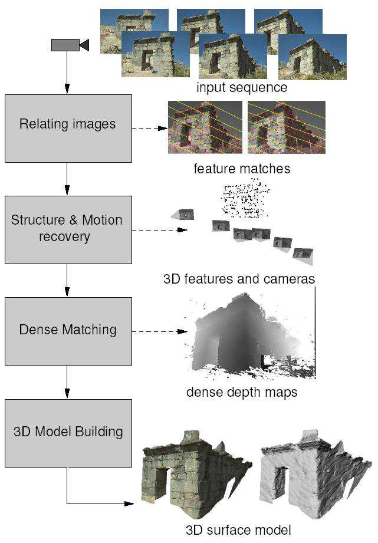
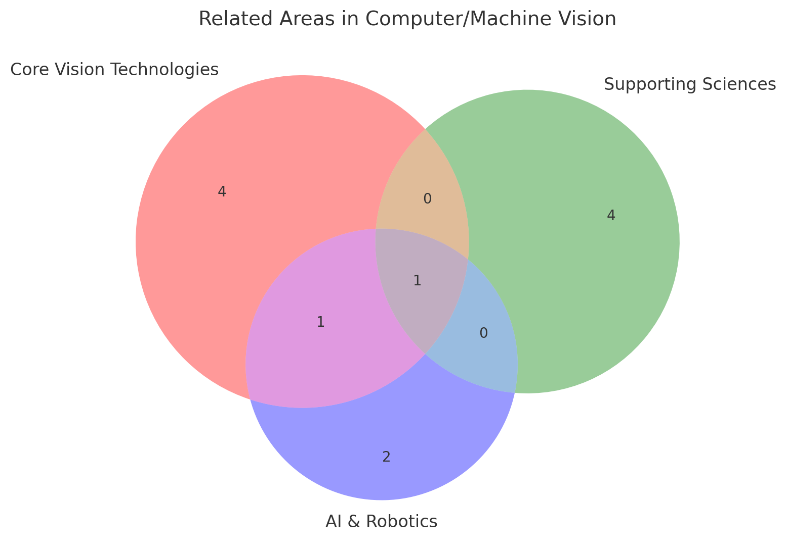
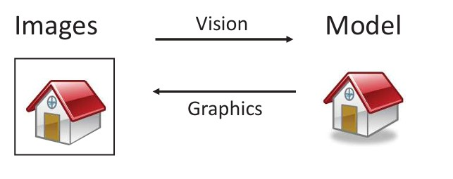
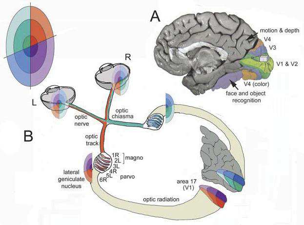

## 1.1  What is Computer/Machine Vision? s. 2–5
These Two concepts related to each other are used, sometimes as synonyms. They mean slightly different things.

**Computer vision** is an interdisciplinary field focused on enabling computers to interpret and derive meaningful, high-level information from digital images or videos. From an engineering standpoint, it aims to automate tasks typically handled by the human visual system. It involves transforming digital images into more abstract, higher-level representations. To enable analysis. It has strong connections to the field of artificial intelligence.(wikipedia)
**Machine vision** is generally considered more application-driven than computer vision.

*) Interdisciplinary explained: involves linking or combining tow or more fields of study (science) to create a synthesized whole, fostering collaboration and integration. 

### Automatic understanding of images and video (3)
Automatic understanding of images and video involves enabling systems to interpret visual content in a meaningful way. This includes computing measurable properties of the three-dimensional world from visual data, a process often referred to as measurement. It also encompasses developing algorithms and representations that allow machines to recognize and interpret objects, people, scenes, and activities. 

**SHORT EXPLANATION**
This diagram shows how a set of 2D photos can be turned into a 3D model using computer vision techniques. First, features such as corners or edges are detected in the images and matched across different views. From these matches, both the 3D positions of points in the scene and the camera viewpoints are estimated, creating a sparse point cloud. Next, denser matches are computed to generate detailed depth maps. Finally, these depth maps are combined to build a complete 3D surface model of the scene or object. This process, known as *Structure-from-Motion* and *Multi-View Stereo*, is widely used in applications such as archaeology, robotics, architecture, and virtual reality.

**LONG EXPLANATION**
This picture illustrates the **pipeline of reconstructing a 3D model from a sequence of 2D images**. The process is often called **Structure-from-Motion (SfM)** and **Multi-View Stereo (MVS)** in computer vision.

Here’s what each step shows:

1. **Input sequence**: Multiple images of the same scene or object are captured from different viewpoints.

2. **Relating images (Feature matching)**: Distinctive points (features) such as corners or edges are detected in each image and matched across views. This shows correspondences between different images.

3. **Structure & Motion recovery**: From these feature matches, both the **3D positions of feature points** and the **camera positions (motion)** are estimated. This produces a sparse 3D point cloud along with camera orientations.

4. **Dense Matching**: Using the estimated camera poses, dense correspondences are found between images to generate **dense depth maps**, which provide more detailed 3D structure.

5. **3D Model Building**: Finally, the dense depth maps are combined into a full **3D surface model** of the object or scene.

👉 In short, the diagram explains how a collection of 2D photos can be transformed into a detailed 3D reconstruction, useful in fields like archaeology, architecture, robotics, and virtual reality.

### **Terminology** (3)

* **Image processing**: Transforming one image into another, often to enhance or extract information. It is frequently used as a supporting step in computer vision.
* **Image understanding**: Interpreting image content to make decisions and create descriptions of a scene.
* **Image recognition**: The ability of software to identify and classify objects, locations, people, text, and actions within images.
* **Machine learning (ML)**: A common approach for addressing computer vision tasks by learning patterns from data.
* **Deep learning / deep neural networks (DNNs)**: A widely used type of machine learning technique, especially effective in complex computer vision applications.

**Core Vision Technologies**

* Computer Vision / Machine Vision
* Image processing
* Imaging
* Computer graphics

**Supporting Sciences**

* Mathematics
* Color science
* Neuroscience
* Optics
* Cognitive science

**AI & Robotics**

* Artificial Intelligence
* Machine learning
* Robotics

This diagram shows the relationship between **vision** and **graphics** as two complementary processes:

* **Vision (Images → Model)**: This is the analysis step. Starting from images (real-world or captured scenes), the goal is to create a model that represents the underlying structure, objects, and their properties. This is what computer vision does—extracting meaningful information from visual data.

* **Graphics (Model → Images)**: This is the synthesis step. Starting from a model (such as a 3D representation of a scene), the goal is to generate images. This is the domain of computer graphics—rendering models into visual form.

The phrase **"Inverse problems: analysis and synthesis"** highlights that these processes are mathematical inverses of each other:

* **Analysis**: Turning image data into an abstract model.
* **Synthesis**: Turning a model back into image data.

In short, vision interprets images to build models, and graphics uses models to produce images.

*) Inverse problem: In simple terms, an **inverse problem** is about working backwards: you start with observed results (data, images, signals) and try to figure out the underlying causes or model that produced them.

* In **computer vision**, the inverse problem is: *given an image, what scene or 3D model produced it?* (analysis).
* In **computer graphics**, the forward problem is solved: *given a scene or model, generate the image* (synthesis).

Inverse problems are often **ill-posed**, meaning they don’t have a unique solution or are very sensitive to small errors in data. For example, many different 3D scenes can generate the same 2D image, so assumptions or constraints are needed to choose the most plausible solution.

Some clear **real-world examples of inverse problems** **outside computer vision:**

1. **Medicine (CT or MRI imaging)**

   * **Forward problem**: X-rays or magnetic fields pass through the body and measurements are recorded by sensors.
   * **Inverse problem**: From these sensor readings, reconstruct an image of the internal structures (organs, bones, tissues).

2. **Geophysics (Earth exploration)**

   * **Forward problem**: Seismic waves travel through the Earth, reflecting and refracting depending on underground layers.
   * **Inverse problem**: From the recorded wave patterns at the surface, infer the structure of the Earth’s subsurface (e.g., oil, gas, or fault lines).

3. **Astronomy**

   * **Forward problem**: Light from distant stars and galaxies is distorted by interstellar dust or lensing.
   * **Inverse problem**: From the distorted measurements, reconstruct the true shape, brightness, or distribution of celestial objects.

4. **Physics (Tomography in materials science)**

   * **Forward problem**: A material scatters radiation in a predictable way.
   * **Inverse problem**: From scattered signals, reconstruct the material’s internal density, cracks, or defects.

👉 In all these cases, the difficulty comes from the fact that **many different hidden structures can explain the same observed data**, so assumptions or models are needed to select the most plausible solution.

### Computer vision vs. humanvisual system 5
Alan Turing proposed that digital computers could one day achieve intelligence and possess the ability to understand visual scenes. While significant advancements have been made in certain areas of research, the capabilities of computer vision systems still fall far short of the remarkable performance of the human visual system. 

