## 1.2  Applications s. 6–11

### **3D structure from 2D images**  6
Inferring three-dimensional structure from two-dimensional images is an ill-posed problem. The human visual system overcomes this challenge by integrating multiple visual cues. For example, **interposition** occurs when closer objects partially block those farther away. **Relative size** provides another cue, as larger objects are generally perceived as being nearer. The **vanishing point** phenomenon arises when parallel lines appear to converge in the distance, while **foreshortening** causes shapes such as rectangles in 3D space to be projected as trapezoids in the image. Together, these cues enable humans to perceive the depth and structure of the 3D world.

A single image can often be interpreted as representing several different three-dimensional scenes. To resolve these ambiguities, the visual system relies on prior assumptions about how the world is typically structured. In most cases, the simplest explanation is chosen as the most likely. However, when these assumptions fail, the result can be a wrong interpretation, which manifests as an optical illusion. 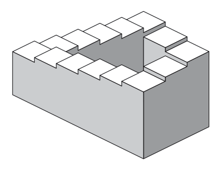 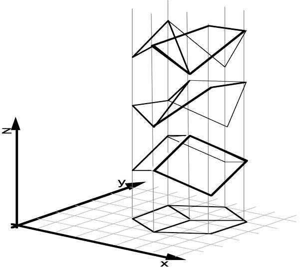 

### **Areas of computervision**, 7 
Topics of CVPR 2018 conference:
* Computer Vision Theory
* 3D Computer Vision
* Action Recognition
* Biometrics
* Big Data and Large-Scale Methods
* Computational Photography, Sensing, and Display
* Deep Learning
* Document Analysis
* RGBD Sensors and Analytics
* Face and Gesture Recognition
* Low-Level Vision and Image Processing
* Medical, Biological, and Cell Microscopy Image Analysis
* Motion and Tracking
* Optimization Methods
* Performance Evaluation and Benchmark Datasets
* Physics-Based Vision and Shape-from-X
* Recognition: Detection, Categorization, Indexing
* Segmentation, Grouping, and Shape Representation
* Statistical Learning
* Video Analytics
* Vision for Graphics
* Vision for Robotics
* Vision for Web Applications

i)CVPR refers to the **IEEE Conference on Computer Vision and Pattern Recognition**, one of the most prestigious annual events in the field of computer vision.

ii) Ill-posed problem: An **ill-posed problem** is one that does not meet the conditions of a *well-posed problem*, as defined by the mathematician Jacques Hadamard. For a problem to be well-posed, it should satisfy three criteria:

1. **A solution exists.**
2. **The solution is unique.**
3. **The solution depends continuously on the input data** (small changes in input should not cause huge changes in the output).

If one or more of these conditions are not satisfied, the problem is **ill-posed**.

🔎 **In computer vision:**
Inferring 3D structure from a single 2D image is ill-posed because:

* There might be no exact solution (the image might not contain enough information).
* Multiple different 3D scenes can produce the same 2D image (no uniqueness).
* Small changes in lighting, shadows, or noise can cause large differences in interpretation (instability).

That’s why vision systems need **additional assumptions, prior knowledge, or constraints** (e.g., assuming objects are solid, smooth, or lit from above) to make the problem solvable in practice.

a simple analogy:

Think of solving a jigsaw puzzle.

If you have all the pieces, one correct solution, and pieces fit together smoothly, that’s like a well-posed problem.

If some pieces are missing (no guaranteed solution), or pieces from different puzzles also fit (no unique solution), or the pieces are flimsy and fall apart with the slightest touch (unstable solution), then you have an ill-posed problem.

In computer vision, trying to recover a 3D scene from a 2D image is like trying to solve a puzzle where some pieces are missing or could fit in several different ways—you need extra hints or assumptions to complete it sensibly.

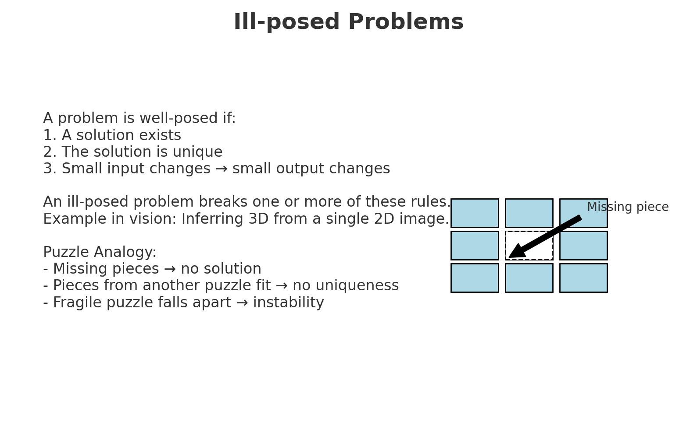

iii) The **CVPR 2018 conference**—held in June 2018 in Salt Lake City, Utah—featured cutting-edge research on topics such as object detection, image segmentation, 3D reconstruction, visual recognition, deep learning methods for vision, video analysis, and many other areas within computer vision and pattern recognition. It attracted researchers, engineers, and industry professionals from around the world to present papers, attend tutorials, and discuss emerging trends.

### Example: multi-viewstereo 7
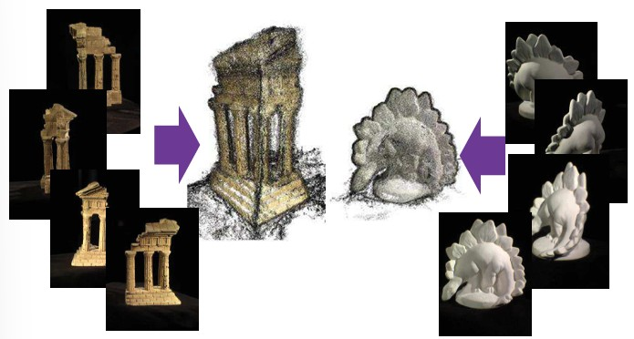
Multi-view stereo is a method in computer vision that creates a 3D model from many photographs of the same object taken from different angles. By comparing the overlapping details across these images, the algorithm can estimate depth and surface structure. The result is a dense 3D reconstruction, shown as a detailed point cloud or surface model, which allows the object to be viewed and rotated from new perspectives not captured in the original photos.
**detailed explanation**: 
This picture illustrates the concept of **multi-view stereo**, a computer vision technique for reconstructing 3D models from multiple 2D images taken at different viewpoints.

* On the left and right, you see sets of images of objects (a temple structure and a dinosaur figurine) captured from different angles.
* In the middle, these images are processed to estimate depth and structure, resulting in dense **3D point clouds** or surface models.
* The output is a **3D reconstruction** of the objects, allowing them to be viewed from any perspective, even those not originally photographed.

👉 In short: **multi-view stereo uses overlapping photos from different viewpoints to create detailed 3D models of real objects.**

### Example: image recognition 8
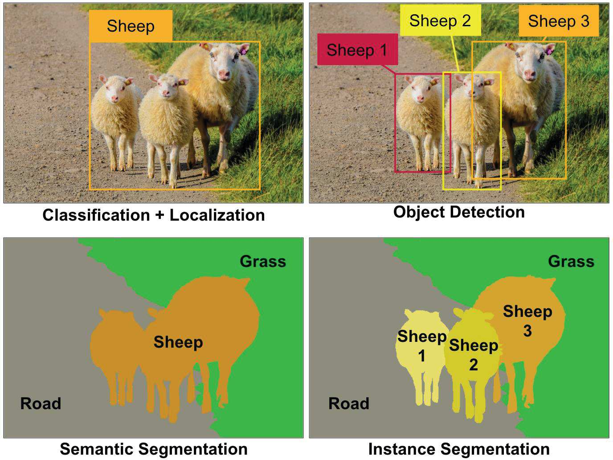
Source: https://www.oreilly.com/ideas/introducing-capsule-network

This example shows four different levels of image recognition in computer vision. In **classification with localization**, the system identifies an object class (sheep) and marks its general position with a bounding box. **Object detection** goes further by finding and labeling each individual sheep separately. **Semantic segmentation** labels every pixel in the image according to its category, such as sheep, grass, or road, but does not distinguish between different sheep. Finally, **instance segmentation** combines both ideas: it labels pixels by category and also separates individual objects, allowing each sheep to be outlined and identified as a distinct instance.

**Detailed explanation**: This image illustrates different approaches to **image recognition in computer vision**, using sheep in a photo as the example:

1. **Classification + Localization** (top left): The system recognizes that there is at least one sheep in the image and places a bounding box around the general location, but it does not separate multiple sheep individually.

2. **Object Detection** (top right): The system identifies and labels each sheep separately (Sheep 1, Sheep 2, Sheep 3), drawing distinct bounding boxes for each object instance.

3. **Semantic Segmentation** (bottom left): The system classifies every pixel in the image, labeling them as “sheep,” “grass,” or “road.” However, it does not distinguish between individual sheep—just the category.

4. **Instance Segmentation** (bottom right): This combines detection and segmentation. Each sheep is not only detected but also separated from the others at the pixel level, allowing the model to outline and label each individual instance precisely.

👉 In short, the diagram shows the progression from simply detecting what is present in an image, to identifying *where* it is, to separating *what pixels belong to it*, and finally distinguishing *individual instances of the same class*.

### Example: natural descriptions  8
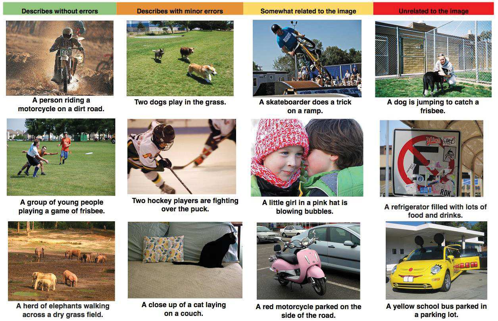
Source: http://googleresearch.blogspot.fi/2014/11/a-picture-is-worth
thousand-coherent.html

This example shows how computer vision systems generate natural language descriptions for images, also known as image captioning. Some captions are completely accurate and match the image well, while others contain small mistakes or only loosely relate to what is shown. In some cases, the system may produce a description that is entirely wrong and unrelated to the picture. These examples demonstrate both the potential and the challenges of teaching AI to describe visual scenes in natural, human-like language.

**detailed explanation:**This figure illustrates how computer vision systems generate **natural language descriptions** (captions) for images, and how accurate or inaccurate those descriptions can be. The examples are organized into four categories:

1. **Describes without errors (left column):** The caption matches the image perfectly. For example, *“A person riding a motorcycle on a dirt road”* accurately describes the photo.

2. **Describes with minor errors (second column):** The caption is mostly correct but slightly inaccurate. For instance, *“Two hockey players are fighting over the puck”* is close to the truth but may miss some context or detail.

3. **Somewhat related to the image (third column):** The caption has some relation to the content but does not correctly describe it. For example, *“A little girl in a pink hat is blowing bubbles”* is related to children, but the image itself shows a different situation.

4. **Unrelated to the image (right column):** The caption is completely wrong and has no meaningful relation to the picture. For example, describing a boy playing frisbee as *“A refrigerator filled with lots of food and drinks.”*

👉 This example highlights the challenge of **image captioning**: while modern AI systems can often produce coherent and natural-sounding sentences, they may not always match the actual content of the image, sometimes introducing minor mistakes or even entirely unrelated descriptions.

### Example: computational photography 9
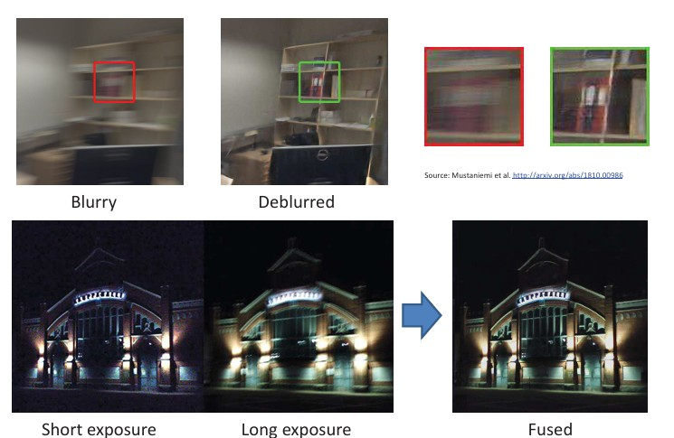
Computational photography uses algorithms to enhance images beyond what a standard camera can capture. For example, blurry photos caused by motion can be processed to restore sharp details, and multiple exposures—such as a dark but sharp short exposure and a bright but blurry long exposure—can be fused into one clear, well-lit image. This allows computers to correct problems and combine the best information from different shots to produce higher-quality pictures.

**Detailed explanation**: This figure demonstrates examples of **computational photography**, where algorithms are used to improve or combine images beyond the limits of traditional cameras.

* **Top row (Deblurring):** A photo that is blurred due to motion or camera shake can be processed with computational methods to restore sharp details. The comparison shows the original blurry image on the left and the deblurred result on the right, where text and edges are much clearer.

* **Bottom row (Exposure fusion):** A short-exposure image captures sharp details but appears dark, while a long-exposure image is brighter but suffers from motion blur. Computational techniques can combine (or *fuse*) the best parts of both exposures, producing a final image that is both sharp and well-lit.

👉 In short, computational photography uses image processing and computer vision techniques to enhance image quality—restoring clarity to blurry photos and combining multiple exposures into a single improved picture.

### Application: visual inspection
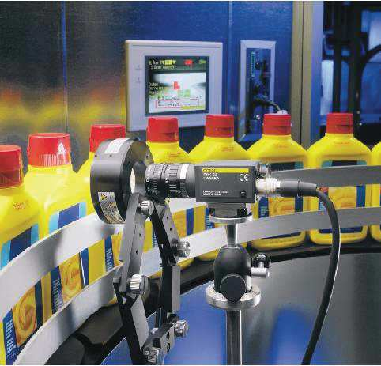
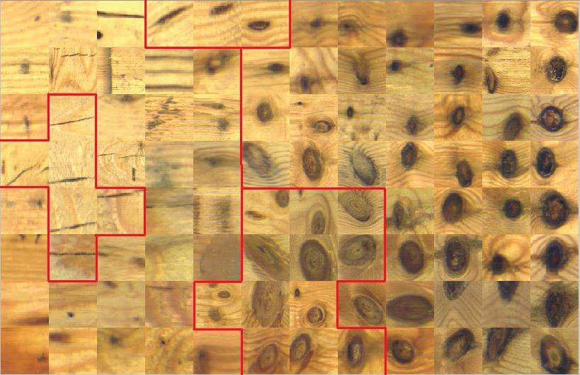

Visual inspection is an industrial application of computer vision where cameras and algorithms automatically check products for defects or irregularities. For example, bottles on a production line can be inspected to ensure correct labeling or fill levels, and wooden surfaces can be scanned to detect flaws such as knots or cracks. This allows for faster, more accurate quality control compared to manual inspection.

**Detailed explanation**
This slide shows the use of **computer vision for visual inspection**, a common industrial application.

* On the **left**, a camera system is monitoring a production line of bottles. The vision system automatically checks whether each bottle meets quality standards, such as correct labeling, shape, or fill level.
* On the **right**, a wooden surface is being inspected. The red boxes highlight defects or irregularities in the material, such as knots or cracks, that the system has detected.

👉 Visual inspection systems use cameras and image analysis to automatically detect errors or defects in products, helping industries ensure quality control more reliably and efficiently than manual inspection.

### Application: content-based retrieval 10
Image search               |  Check if exizts...
:-------------------------:|:-------------------------:
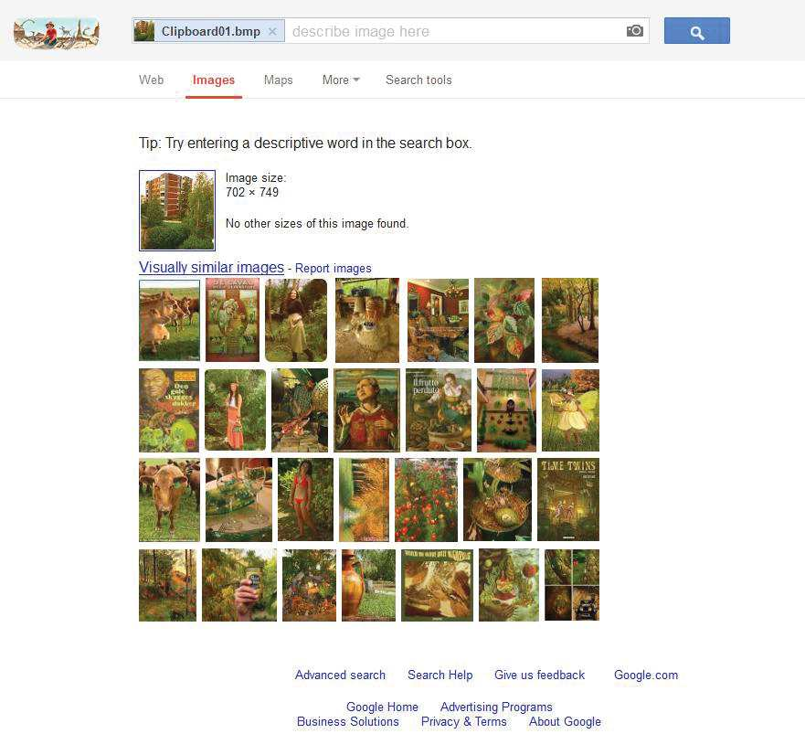 |  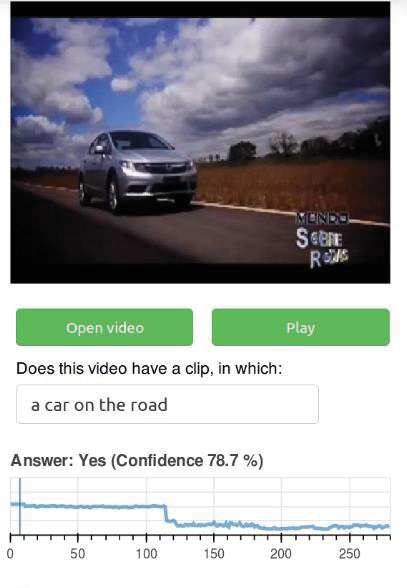

Content-based retrieval is a method of searching images or videos based on their visual content rather than keywords. For example, instead of typing a description, a user can upload a picture and the system will find visually similar images. In video search, the system can analyze frames to check if a specific object or scene, such as a car on the road, appears in the clip. This approach makes it possible to browse large media collections using the actual content of the images and videos.

**Detailed descripition**: This slide shows the application of **content-based retrieval**, where images or videos are searched and matched based on their visual content rather than just keywords or file names.

* On the **left**, an image search system is used: instead of typing text, the user uploads a picture. The system then finds and displays other visually similar images by analyzing patterns, colors, and features in the uploaded photo.
* On the **right**, a video retrieval system is shown: the user enters a query such as *“a car on the road.”* The system analyzes the video’s frames and detects that the video indeed contains this content, returning a positive answer with a confidence score.

👉 Content-based retrieval allows users to search large databases of images or videos using actual visual information—helpful in areas like digital libraries, surveillance, media archives, and online search engines.

### Application: security and biometrics

video surveillance        |   | signing in with your face
:-------------------------:|:-------------------------:|:-------------------------:
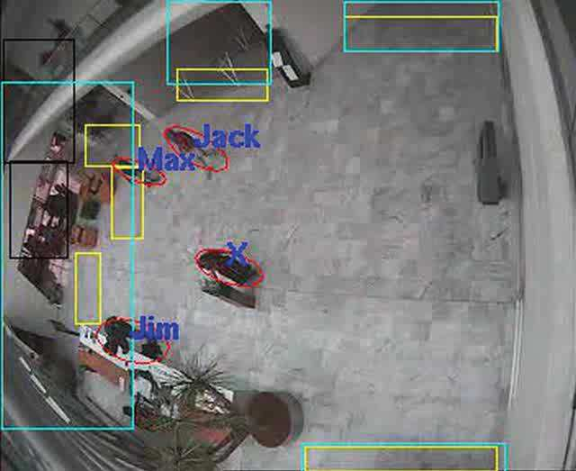 |  | 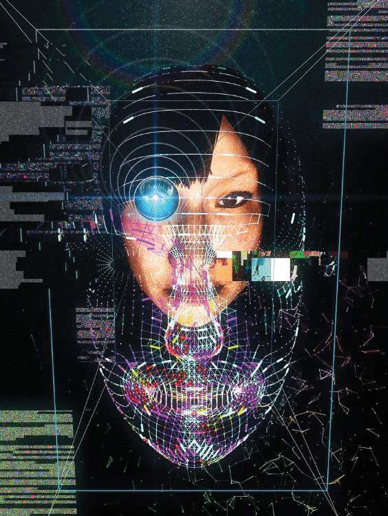
Biometric authentication | Fingerprint | Iris
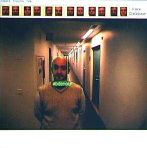 |  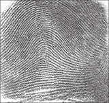| Iris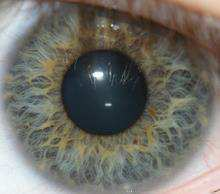

Computer vision is widely used in security and biometrics to automatically recognize and verify people. In video surveillance, systems can detect and track individuals in real time. For authentication, biometric methods such as face recognition, fingerprints, and iris scans are used to confirm identity. New applications even allow users to authorize payments using their face, showing how vision technology is becoming part of everyday security solutions.

**Detailed:** This slide shows applications of computer vision in **security and biometrics**.

* **Video surveillance (top left):** Vision systems can track and identify people in real-time using cameras. Bounding boxes and labels show how individuals are automatically detected and recognized in a monitored area.
* **Biometric authentication (bottom):** Computer vision supports different biometric methods for identity verification, such as face recognition, fingerprint analysis, and iris scanning. These are widely used for secure access control and personal identification.
* **Paying with the face (top right):** An example of how facial recognition can be applied in everyday life, such as authorizing payments. Here, the system matches a user’s face against stored identity data to verify transactions securely.

👉 Overall, vision-based security and biometric systems provide automated, efficient, and reliable ways to monitor environments and confirm identities.

### Application: bio-medical image analysis
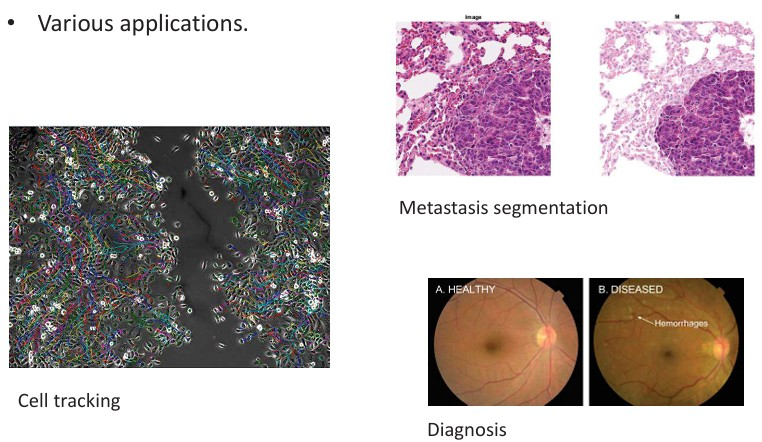

Short: Computer vision is widely used in biomedical image analysis to support healthcare and research. It can track cells in microscope images to study their movement and interactions, segment cancerous regions in tissue samples to help detect metastasis, and analyze medical scans such as retinal images to identify signs of disease. These tools improve the speed and accuracy of diagnosis and provide valuable assistance to medical professionals.

Detailed: This slide shows how computer vision is applied in **bio-medical image analysis**, supporting healthcare and medical research.

* **Cell tracking (left):** Vision algorithms can automatically follow the movement and behavior of cells over time in microscope images, helping researchers study growth, division, and interactions.
* **Metastasis segmentation (top right):** Automated segmentation techniques can identify and outline cancerous regions in tissue samples, assisting pathologists in detecting and measuring tumor spread.
* **Diagnosis (bottom right):** Medical images, such as retinal scans, can be analyzed to detect signs of disease. The example shows the difference between a healthy retina and one with hemorrhages, which may indicate diabetic retinopathy or other conditions.

👉 These applications highlight how computer vision improves accuracy, efficiency, and consistency in medical analysis, ultimately supporting earlier detection and better treatment of diseases.

### Application: augmented reality
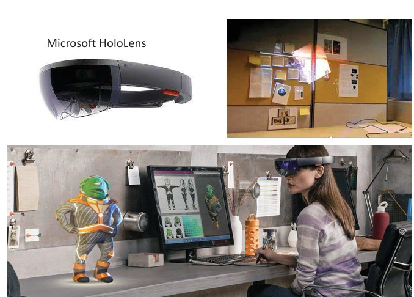

Shortly: Augmented reality (AR) combines the real world with digital content using computer vision. Devices like Microsoft HoloLens can overlay holograms, notes, or 3D characters onto the user’s surroundings, making it possible to interact with virtual objects as if they were real. This technology is used in areas such as design, education, and entertainment to create more immersive and interactive experiences.

Detailed: This slide illustrates the use of **augmented reality (AR)**, where computer vision is used to blend digital content with the real world.

* The **Microsoft HoloLens** headset (top left) is an AR device that allows users to see and interact with digital objects superimposed on their physical surroundings.
* The image on the **top right** shows how virtual content, such as digital notes or holograms, can be placed onto real-world surfaces like a wall or desk, creating an interactive workspace.
* The **bottom image** shows a user wearing AR glasses while working at a desk. A 3D animated character is projected into the real environment, appearing to stand next to the user. This demonstrates how AR can enhance tasks such as design, visualization, and entertainment by mixing virtual models with physical spaces.

👉 In short, augmented reality uses computer vision to track the real environment and overlay digital objects onto it, enabling immersive applications in work, learning, and play.

### Application: self-driving wehicles 12
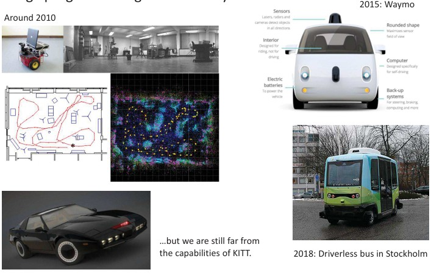

Shortly: Self-driving vehicles have advanced rapidly in the past decade. Early systems around 2010 were limited prototypes with basic sensors and mapping, while by 2015 companies like Waymo had developed cars equipped with lidar, radar, and powerful computers for real-world driving. By 2018, autonomous buses were already being tested in cities such as Stockholm. Despite this progress, today’s systems are still far from the fully intelligent and human-like capabilities imagined in fiction, such as the car KITT from *Knight Rider*.

Detailed: This picture illustrates the application of computer vision in **self-driving vehicles** and the rapid progress made over the last decade.

* **Early systems (around 2010):** Research prototypes used basic cameras, sensors, and mapping software to navigate indoor or controlled environments. These early vehicles relied heavily on predefined routes and had limited autonomy.
* **2015 – Waymo prototype:** A more advanced self-driving car developed by Google (Waymo) integrated multiple sensors such as lidar, radar, and cameras, along with powerful onboard computers and safety backup systems. This vehicle could operate autonomously in real traffic conditions.
* **2018 – Driverless bus in Stockholm:** Autonomous buses began being tested in public transport, showing how self-driving technology was expanding beyond cars into shared mobility solutions.
* **Note on KITT (bottom left):** The fictional self-driving car from the TV series *Knight Rider* symbolizes the idea of fully autonomous, intelligent vehicles. The slide reminds us that despite real progress, current systems are still far from such advanced, human-like capabilities.

👉 In summary, self-driving technology has made huge advances, from early research robots to real-world autonomous cars and buses. However, the ultimate vision of vehicles with human-level perception and reasoning remains a long-term challenge.

