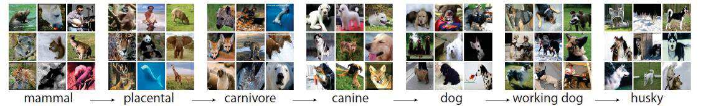
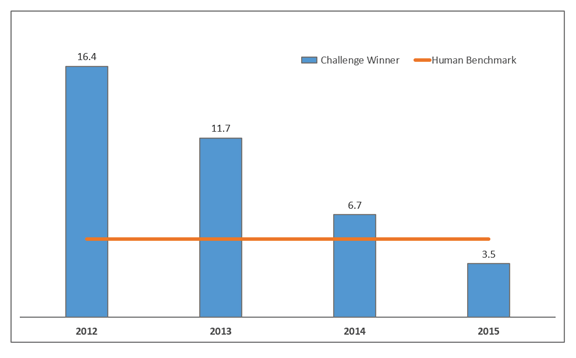
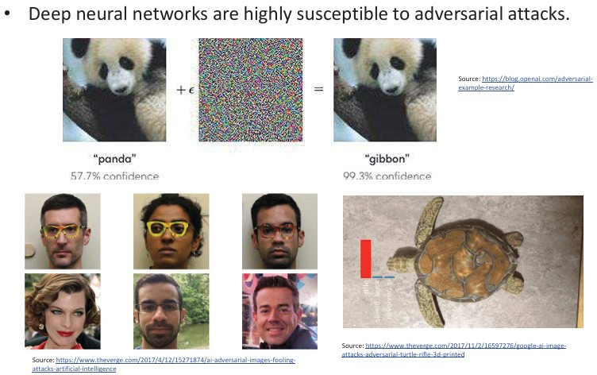

## 1.3  Challenges & Tools s. 12–14
### Imagenet 12

The ImageNet project is a large visual database created to support research in object recognition. It contains over 10 million images, organized into categories based on the WordNet hierarchy.

| Image classification error of the ImageNet Challenge winning systems vs. human benchmark: | !j |
|-------------------------------------------------------------------------------------------|--------|

### Bigdata vs. smalldata 

* Large datasets, such as ImageNet, have enabled major progress in image recognition using deep neural networks (DNNs).
* **End-to-end approach:** Both the feature representation (including low-level features) and the classifier are learned directly from the data.

  * Typically requires thousands of annotated samples.
* **Conventional approach:** Features are handcrafted for the recognition problem, and only the classifier is learned from the data.

  * Needs fewer annotated samples.
  * Usually performs worse than DNNs.
* However, there are many computer vision problems where DNNs are not effective, often due to the lack of large datasets.

i) An **annotated sample** is a data example (such as an image, video, or text) that has been labeled with extra information so it can be used for training or testing machine learning models.

🔎 **In computer vision:**

* An image of a cat with the label *“cat”* is an annotated sample for image classification.
* An image with bounding boxes drawn around cars and pedestrians, each labeled, is an annotated sample for object detection.
* A medical scan where regions of a tumor are outlined and labeled is an annotated sample for segmentation.

👉 In short: annotated samples are **training examples with “ground truth” labels**, which tell the algorithm what is actually in the data. They are essential for supervised learning.

###  Limitations of computer vision 13
Here’s a clearer, more readable version of your text:

---

### Limitations of Computer Vision

* Real-world machine vision problems are difficult to solve.
* **Environmental constraints** can reduce flexibility.

  * For example, lighting in a scene may need to be carefully controlled.
* **Object appearance can vary greatly**, making recognition harder.

  * Variations can come from different viewing angles, positions, lighting changes, shadows, occlusions, or other objects in the scene.
  * Algorithms must learn to capture the essential, invariant features of objects despite these variations.
* **Decisions often require integrating information from many pixels.**

  * Pixels across a wide area must be grouped and organized.
  * While humans do this naturally, creating flexible grouping methods for machine vision remains a major challenge.

---
Summary: Computer vision faces many challenges when applied to real-world problems. Systems are sensitive to environmental factors such as lighting, which may need to be carefully controlled. Objects can look very different depending on angle, position, shadows, or occlusion, so algorithms must learn to capture stable features that remain the same across conditions. In addition, vision tasks often require grouping and integrating information from many pixels, something humans do naturally but which is still very difficult to replicate in machines.

### Adversarial examples

https://www.theverge.com/2017/11/2/16597276/google-ai-imageattacks-adversarial-turtle-rifle-3d-printed
https://www.theverge.com/2017/4/12/15271874/ai-adversarial-images-foolingattacks-artificial-intelligence

This slide explains **adversarial examples**, which show a major weakness of deep neural networks.

* At the **top**, the panda example shows how adding a small, carefully designed pattern of noise (almost invisible to humans) can trick the network. The original image is classified correctly as a *panda* with 57.7% confidence, but after adding the noise, the same image is misclassified as a *gibbon* with 99.3% confidence.
* At the **bottom left**, adversarial accessories like specially designed eyeglass frames can fool face recognition systems, making people look like completely different individuals to the algorithm.
* At the **bottom right**, a 3D-printed turtle is recognized by the AI as a *rifle* due to subtle adversarial modifications in its texture.

👉 In short, adversarial examples are inputs that are intentionally modified in ways that are almost unnoticeable to humans but cause AI systems to make confident mistakes. This highlights a key limitation of deep learning models: they can be easily fooled by small, targeted changes.

**Summary**: Adversarial examples are specially modified inputs that trick AI systems into making mistakes, even though the changes are almost invisible to humans. For example, adding a small noise pattern can make an image of a panda look like a gibbon to a neural network, or special glasses can fool face recognition systems. Even 3D objects, like a turtle, can be designed to be misclassified as something completely different. These examples show that deep learning models can be highly confident in wrong answers when exposed to carefully crafted attacks.

i) confidence explained: In this context, **confidence** refers to how sure the neural network is about its prediction.

When an image is given to a classifier (like a deep neural network), the system outputs probabilities for each possible category. For example, an image might be classified as:

* Panda: **57.7%**
* Gibbon: 40%
* Cat: 2.3%

The label with the highest probability is chosen as the prediction, and the percentage is shown as the model’s **confidence** in that choice.

🔎 Important points:

* High confidence (e.g., 99.3%) means the model is very sure of its prediction.
* However, as adversarial examples show, high confidence does **not** guarantee correctness—the model can still be confidently wrong.

👉 In short: *confidence is the probability the model assigns to its prediction, but it doesn’t always reflect true reliability.*

### Use of computers and software

Here’s a clearer and more readable version of your text:

---

### Use of Computers and Software in Machine Vision

* The development of computers has greatly advanced machine vision:

  * In the early days, special hardware was required.
  * Today, personal computers can handle complex vision tasks.
  * GPUs make parallel computing affordable and efficient.
  * Special hardware is now mainly used for very high production rates or real-time applications.

* Digital cameras and scanners are now inexpensive and versatile.

  * Manufacturers provide drivers and software libraries to help developers create applications.

* Many software packages support image processing and computer vision:

  * Libraries such as **OpenCV** and **Matlab toolboxes**.
  * Deep learning frameworks like **TensorFlow**, **Caffe**, and **Torch**.

* Programming for machine vision is often done in general-purpose languages such as **C** or **Python**.

---

**Summary**: The growth of computer technology has made machine vision much more accessible. Tasks that once required special hardware can now be done on regular PCs, with GPUs providing efficient parallel processing. Cameras and scanners are affordable and come with software support, while widely used libraries like OpenCV, Matlab toolboxes, and deep learning frameworks such as TensorFlow make development easier. Most machine vision applications are programmed in general-purpose languages like C or Python.

