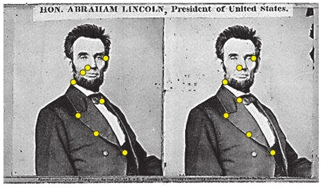
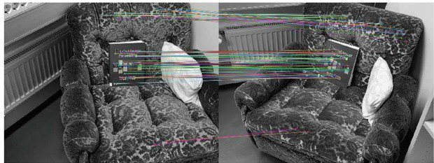
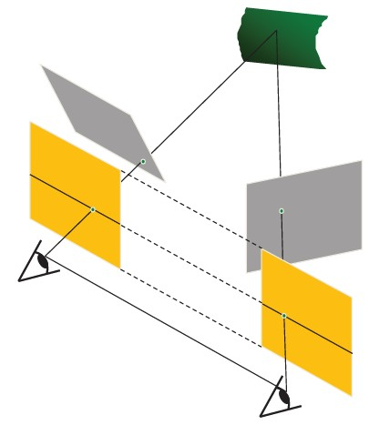
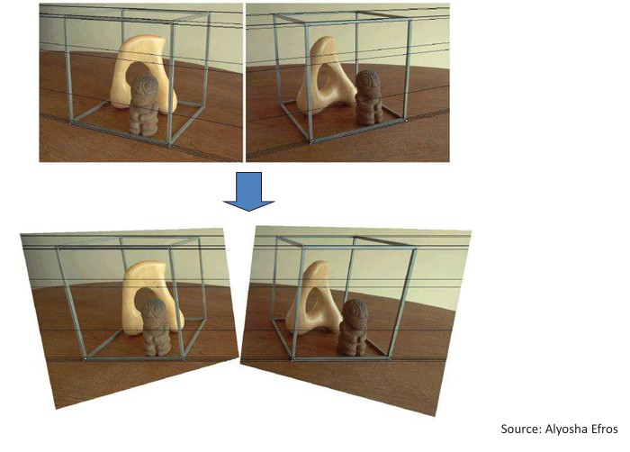

## 43  Sparse Correspondences & Rectification s. 185–187
<!--
### Sparse correspondence search 185
### Sparse correspondences: example \* 186
### Stereo image rectification 186
### Stereo image rectification: example 187
### Stereo image rectification: example \* 187
### 11. 3D transformations and 188
--> 

### Preview

In stereo vision, **sparse correspondence search** reduces the problem of finding matching points between two images to a smaller, carefully selected set of keypoints. Instead of comparing all pixels, we rely on **feature descriptors** (e.g., SIFT, SURF) and measure their similarity using feature distances. This approach is more efficient and robust, especially when combined with **epipolar geometry**.
Once correspondences are found, **rectification** simplifies the geometry by reprojecting images so that epipolar lines align with image scanlines. This makes matching points easier and allows for efficient stereo algorithms.

---

### Sparse correspondence search

* Instead of dense pixel-to-pixel comparison, restrict the search to a sparse set of **detected features** (such as corners or interest points).
* Each feature is described by a **feature descriptor**, which encodes local intensity or texture information.
* Matching is then performed by computing a **feature distance** (e.g., Euclidean distance in descriptor space).
* The search is further constrained by **epipolar geometry**, meaning matches are only sought along epipolar lines.

This reduces computational cost and improves robustness to noise, textureless regions, and illumination changes.

---

### Sparse correspondences: example

* Only matches that lie sufficiently close to the **epipolar lines** are accepted as valid.
* The resulting set of reliable matches is called the **inliers**.
* The figure shows an example where outliers (false matches) are rejected, leaving only the consistent inliers.

---

### Stereo image rectification

* In practice, it is convenient if the **epipolar lines align with image scanlines** (horizontal lines).
* To achieve this, we **reproject both image planes** onto a common plane that is parallel to the baseline between the cameras.
* After rectification, pixel motion is **purely horizontal**, greatly simplifying correspondence search.
* Rectification is performed using two **homographies** (3×3 transforms), one for each image.

---

### Stereo image rectification: example (1)

* The top row shows the original stereo pair, where epipolar lines are not aligned with rows.
* After rectification (bottom row), epipolar lines become horizontal, making correspondence search straightforward.
* This enables easier and more efficient stereo matching.

---

### Stereo image rectification: example (2)

* Another example of a rectified stereo pair.
* Notice how corresponding objects in both images now appear along the **same horizontal lines**.

---

### Recap

* **Sparse correspondences** reduce the problem size by using feature points and descriptors instead of all pixels.
* **Epipolar geometry** still constrains possible matches to epipolar lines.
* **Rectification** simplifies stereo vision by aligning epipolar lines with image scanlines.
* Together, these steps enable robust and efficient 3D reconstruction.

---

### Reflective question

* What are the trade-offs between **sparse correspondence** and **dense correspondence**?

  * Sparse methods are efficient but may miss important details.
  * Dense methods capture full scene geometry but are more computationally demanding.
    How would you choose between them for an application such as autonomous driving versus medical imaging?

---

