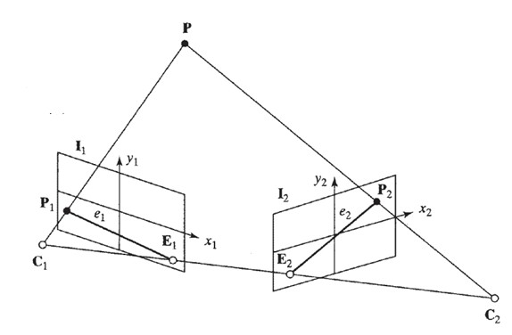

## 42  Epipolar Geometry & Fundamental Matrix

### Preview
This section introduces **epipolar geometry**, a core concept in stereo vision, and explains how the **fundamental matrix** governs the relationship between two views of the same scene. You will learn the definitions of epipolar plane, epipolar lines, and epipoles, as well as how the fundamental matrix is derived and applied. Finally, practical examples illustrate how these concepts are used to constrain stereo matching in real images.

---

### Epipolar constraint
If the relative orientation of two cameras is known, the search for corresponding points can be reduced to a **one-dimensional search** along epipolar lines. This property is called **epipolar geometry**.

Key definitions:
- The **epipolar plane** is formed by a 3D point **P**, the two camera centers **C₁** and **C₂**, and the image projections **P₁** and **P₂**.  
- The lines formed by the intersection of the epipolar plane with the image planes **I₁** and **I₂** are the **epipolar lines** (**e₁**, **e₂**).  
- The **epipole** (**Eᵢ**) of an image **Iᵢ** is the point where all its epipolar lines intersect.  

These definitions allow us to restrict matching to the epipolar geometry of the image pair.

---

### Epipolar constraint: a general image pair
For arbitrary camera positions and orientations:  
- The epipoles **E₁** and **E₂** are known.  
- Given a point **P₁** in the first image, its matching point in the second image **must lie on epipolar line e₂**.  

Thus, the search space for correspondences is reduced to a line.

---

### Fundamental matrix
The **fundamental matrix (F)** encodes the relationship between two points in stereo images:  

$$
[x' \; y' \; 1] \cdot F \cdot [x \; y \; 1]^T = 0
$$  

where  

$$
F =
\begin{bmatrix}
\phi_1 & \phi_2 & \phi_3 \\
\phi_4 & \phi_5 & \phi_6 \\
\phi_7 & \phi_8 & \phi_9
\end{bmatrix}
$$  

The matrix **F** can be estimated from image correspondences.  
- Each correspondence provides a linear equation:  

$$
a_i^T \Phi = 0
$$  

where  

$$
a_i = [x'_i x_i, x'_i y_i, x'_i, y'_i x_i, y'_i y_i, y'_i, x_i, y_i, 1]^T
$$  

and  

$$
\Phi = [\phi_1, \phi_2, \phi_3, \phi_4, \phi_5, \phi_6, \phi_7, \phi_8, \phi_9]^T
$$  

- At least **8 correspondences** are needed (the 8-point algorithm).  

---

### Fundamental matrix: example
- **SIFT feature matches** are first established between two images.  
- Because there may be outliers, **RANSAC** is applied to robustly estimate the fundamental matrix.  

Example output:  

