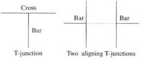
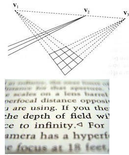
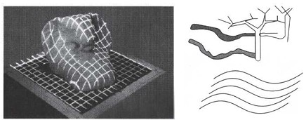
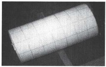
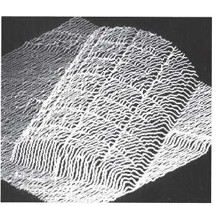
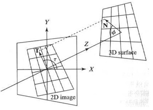
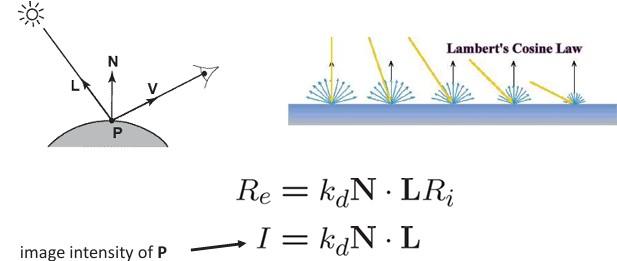
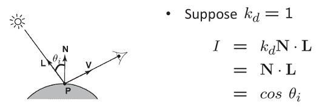
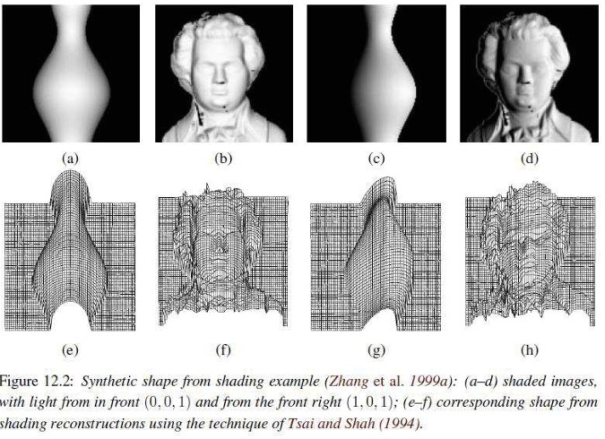

## 38  3D Cues & Shape from X  
-->
### Preview  
Humans and machines can perceive 3D shape from flat 2D images by relying on **visual cues** such as occlusion, perspective, texture, and shading. This section introduces these cues and shows how “Shape from X” methods—like shape from shading, texture, or boundaries—allow recovery of 3D structure from different image features.  

---

### 3D cues available in 2D images (part 1)  
  

- **Interposition (occlusion):** one object blocks another, indicating that the front object is closer.  
  - *T-junctions* indicate occlusion.  
  - Two aligned T-junctions give strong evidence of depth ordering.  
- **Perspective scaling:** distant objects appear smaller. If we know an object’s real size, we can estimate its depth.  
- **Texture gradient:** repeating patterns (like bricks) shrink with distance.  
- **Motion parallax:** as we move, nearby objects shift faster than distant ones.  
- **Shading:** reveals the 3D shape depending on light direction.  

---

### 3D cues available in 2D images (part 2)  
   

- **Vanishing points:** parallel lines in 3D meet at a horizon point in perspective projection.  
- **Defocus:** a lens focuses at one depth; sharpness decreases away from it.  
- **Structured light:** projected or known light patterns bend over a surface. Even shadows can reveal surface shape.  

---

### Shape from X  
    

- **Shape from shading:** reflected light is proportional to the surface normal direction.  
- **Shape from texture:** texture gradients give surface orientation:  
  - *Tilt τ* = orientation of the surface normal projected in the image.  
  - *Slant φ* = angle between the surface normal and line of sight.  
- **Shape from boundary:** object outlines reveal cross-sectional shape. Normals can be propagated smoothly from boundaries into the interior.  

---

### Diffuse reflection (revisited)  
  

- Lambert’s cosine law: brightness is proportional to the angle between surface normal $\mathbf{N}$ and light $\mathbf{L}$.  

$$
R_e = k_d \mathbf{N} \cdot \mathbf{L} R_i \quad \rightarrow \quad I = k_d \mathbf{N} \cdot \mathbf{L}
$$  

**Simplifying assumptions:**  
- $I = R_e$: camera response is linear.  
- $R_i = 1$: light source intensity = 1.  

---

### Shape from shading  
  

- Assume $k_d = 1$, then  

$$
I = k_d \mathbf{N} \cdot \mathbf{L} = \mathbf{N} \cdot \mathbf{L} = \cos \theta_i
$$  

- We can measure the angle between normal and light direction.  
- Not enough to reconstruct surface shape alone, so extra constraints are used:  
  - Some known normals (e.g., silhouettes).  
  - Smoothness constraints (“integrability”).  
  - Neighboring normal consistency.  
- In practice: difficult, since real objects rarely have constant reflectance.  

---

### Examples  
  

*Examples of “shape from shading”: shaded images (a–d) and their reconstructed 3D surfaces (e–h).*  

---

### Recap  
- **Monocular cues** like occlusion, perspective, texture, and shading provide depth.  
- **Shape from X** methods use shading, texture, or boundaries to infer 3D structure.  
- Diffuse reflection and Lambert’s cosine law link image brightness to surface orientation.  
- Reconstructing 3D from shading is powerful but challenging due to real-world variation in reflectance and lighting.  

---

### Stop to think  
Which cue do you find most reliable for depth perception in everyday life: occlusion, perspective, shading, or motion parallax? Why might computers struggle with the same cues?  

