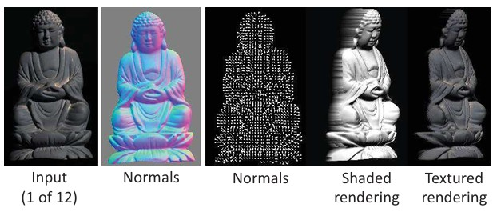
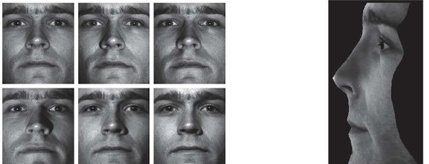

## 39b  Photometric Stereo (part 2)  
-->
### Preview  
Here we look at concrete examples of photometric stereo in action. Starting with simple synthetic objects and moving to real-world cases, you’ll see how multiple illuminated images lead to 3D reconstructions of surfaces such as spheres, statues, and faces.  

---

### Example: Half-sphere reconstruction  
  

- **Input:** synthetic images of a half-sphere under different lights.  
- **Process:** estimate normals, then integrate them to compute depth.  
- **Output:**  
  - Depth map (2D grayscale showing height).  
  - 3D surface reconstruction.  

This demonstrates the pipeline: **multi-light images → normals → depth → 3D model.**  

---

### More examples  
  

- **Buddha statue:**  
  - Input: one of 12 lighting images.  
  - Computed surface normals shown in color or as arrows.  
  - Rendering demonstrates recovered shading and surface texture.  

- **Human face:**  
  - Multiple lighting conditions captured.  
  - Photometric stereo reconstructs fine surface geometry (e.g., nose, wrinkles).  

These examples show that photometric stereo works both for **rigid objects** (statues) and **non-rigid surfaces** like human skin.  

---

### Recap  
- Photometric stereo uses lighting variation to recover **surface normals and depth**.  
- Works well on synthetic and real objects.  
- Produces detailed geometry that can be visualized as depth maps or textured renderings.  

---

### Stop to think  
How might photometric stereo fail when applied to everyday objects—say, a shiny car or a glass cup? What assumptions of the method break down in these cases?  

<!--
