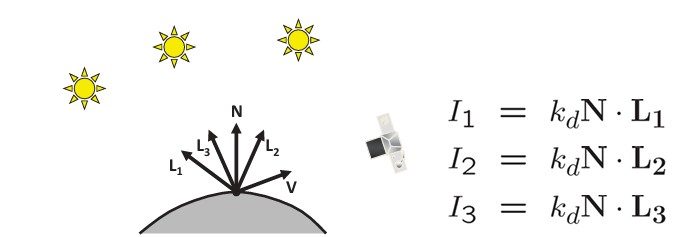
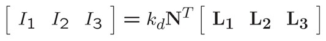
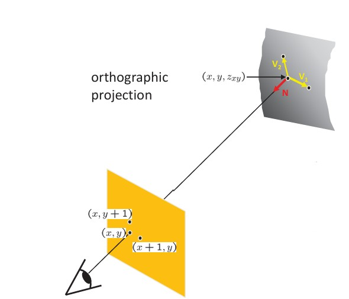

## 39a  Photometric Stereo (part 1)  

### Preview  
Photometric stereo is a technique to recover surface normals (and thus 3D shape) by observing the same object under **different lighting conditions**. Unlike single-image shading, photometric stereo uses multiple images to solve the ambiguities of light, reflectance, and geometry.  

---

### Photometric stereo  
  

- Capture **at least 3 images** of an object under different light directions.  
- For each pixel, the image intensity depends on surface normal $\mathbf{N}$, light direction $\mathbf{L}$, and reflectance $k_d$:  

$$
I_1 = k_d \mathbf{N} \cdot \mathbf{L}_1, \quad
I_2 = k_d \mathbf{N} \cdot \mathbf{L}_2, \quad
I_3 = k_d \mathbf{N} \cdot \mathbf{L}_3
$$  

- Written in matrix form:  

$$
\begin{bmatrix}
I_1 & I_2 & I_3
\end{bmatrix}
= k_d \mathbf{N}^T
\begin{bmatrix}
\mathbf{L}_1 & \mathbf{L}_2 & \mathbf{L}_3
\end{bmatrix}
$$  

---

### Solving the equations  
  

Rearranging gives:  

$$
\mathbf{I} = k_d \mathbf{N}^T \mathbf{L}
$$  

where:  
- $\mathbf{I}$ = measured intensities ($1 \times 3$ vector)  
- $\mathbf{L}$ = matrix of light directions ($3 \times 3$)  
- $\mathbf{G} = k_d \mathbf{N}^T$  

We can solve for $\mathbf{G}$:  

$$
\mathbf{G} = \mathbf{I} \mathbf{L}^{-1}
$$  

Then extract:  
- Reflectance: $k_d = \|\mathbf{G}\|$  
- Surface normal:  

$$
\mathbf{N} = \frac{1}{k_d} \mathbf{G}
$$  

---

### More than three lights  

- Using more than 3 lights improves robustness.  
- General equation:  

$$
\mathbf{I} = k_d \mathbf{N}^T \mathbf{L}
$$  

- Solve with **least squares**:  

$$
\mathbf{G} = (\mathbf{I} \mathbf{L}^T)(\mathbf{L}\mathbf{L}^T)^{-1}
$$  

- Then recover $\mathbf{N}$ and $k_d$ as before.  

---

### Depth from normals  
  

- Once we know normals $(n_x, n_y, n_z)$, we can integrate them to recover depth.  
- Each normal gives two linear constraints on surface $z$:  

For neighbor difference $V_1$:  

$$
V_1 = (1, 0, z_{x+1,y} - z_{xy})
$$  

$$
0 = \mathbf{N} \cdot V_1 = n_x + n_z (z_{x+1,y} - z_{xy})
$$  

- Similar equation for $V_2$ in the $y$ direction.  
- Solve matrix equations to compute consistent $z$ values.  

---

### Recap  
- Photometric stereo uses multiple images under different lights to estimate **surface normals**.  
- With 3 lights, we can solve directly; with more, we use least squares.  
- Normals are then integrated to recover **3D surface depth**.  
- This approach overcomes many limitations of single-image shape-from-shading.  

---

### Stop to think  
Why does using more than 3 light sources make photometric stereo more reliable? What real-world problems (like noise, shadows, or non-uniform reflectance) does this help overcome?  

