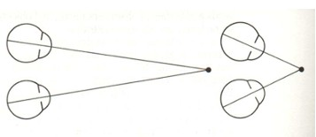
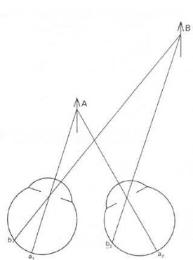
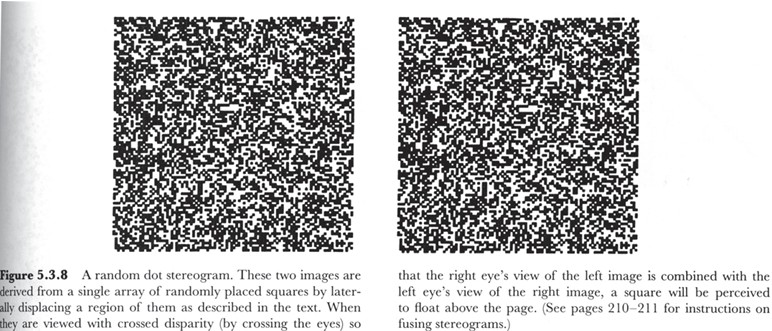
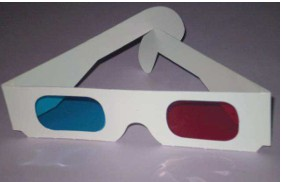
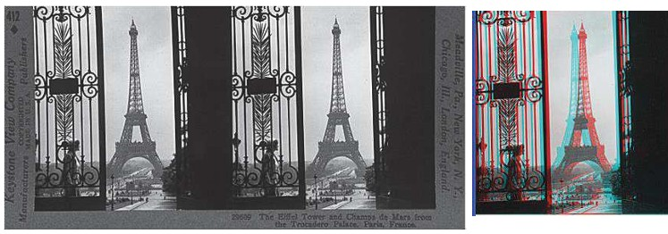
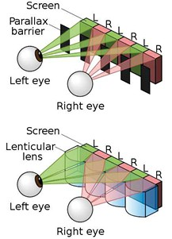
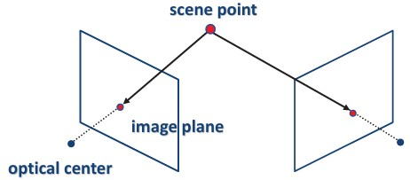
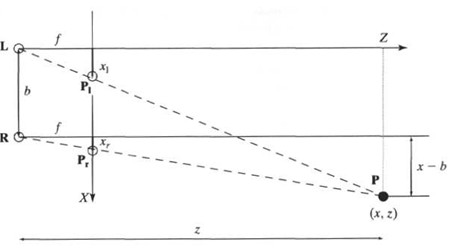

## 40a – Human Stereo & 3D Displays (slides 169–171)  

### Preview  
Humans perceive depth because each eye views the world from a slightly different angle, creating **disparity**. Machines can simulate this through stereograms, anaglyphs, and 3D displays. This section introduces the foundations of stereo vision in humans and the main techniques used in 3D image display.  

---

### Human stereopsis: disparity  
   

- When our eyes **fixate** on one object, the images of other objects fall at different angles on the retinas.  
- This angular difference is called **disparity**.  
- The brain uses disparity to estimate **relative depth** between objects.  
- Fixation and convergence of the eyes ensure the focused object is aligned in both images.  

---

### Stereograms and autostereograms  
  

- **Stereograms:** show two slightly different images, one for each eye. Viewed together (with cross-eye or stereo viewers), the brain perceives 3D.  
- **Autostereograms:** encode both views into a single patterned image. When the eyes defocus in a certain way, hidden 3D shapes appear.  
- These demonstrate how binocular disparity alone is enough for depth perception.  

---

### Random dot stereograms  
  

- Developed to prove that depth can be seen **without recognizable shapes**.  
- Two random-dot images differ only in a displaced region.  
- When viewed with crossed eyes, a shape (e.g., square) “pops out” in depth.  
- Shows that the brain can extract disparity first and shape second.  

---

### Anaglyph images  
  

- Encode each eye’s image using **color filters** (typically red and cyan).  
- Special glasses filter the images so each eye sees only one view.  
- The brain fuses them into a 3D perception.  
- Classic and inexpensive method for 3D movies, though colors are distorted.  

---

### 3D displays  
   

- **Polarization systems (passive glasses):**  
  - Each eye gets light through different polarizing filters.  
- **Active shutter systems:**  
  - Glasses alternate blocking each eye in sync with screen frames.  
- **Autostereoscopy (no glasses):**  
  - Displays direct different images to each eye using lenticular lenses or parallax barriers.  
- All methods rely on delivering **two slightly different images** to the eyes.  

---

### Depth with stereo: basic idea  
  

- Stereo depth relies on **triangulation**:  
  - Two camera rays intersect at the same 3D point.  
- Requirements:  
  - Known **camera calibration** (positions, orientations).  
  - Reliable **point correspondence** (which point in one image matches a point in the other).  

---

### Recap  
- Humans perceive depth through **binocular disparity**.  
- Stereograms, autostereograms, random dot stereograms, and anaglyphs illustrate how disparity creates 3D perception.  
- Modern 3D displays deliver separate images to each eye using polarization, shutters, or autostereoscopy.  
- The **basic principle of stereo** is triangulation, requiring calibration and correspondence.  

---

### Stop to think  
Why do random dot stereograms prove that disparity is the primary cue for stereopsis, rather than object recognition or shading?  

