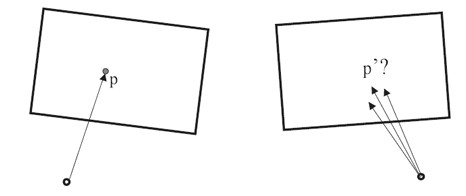
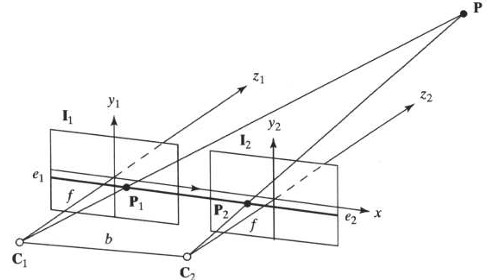
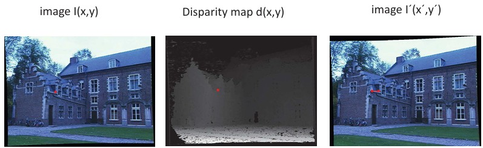
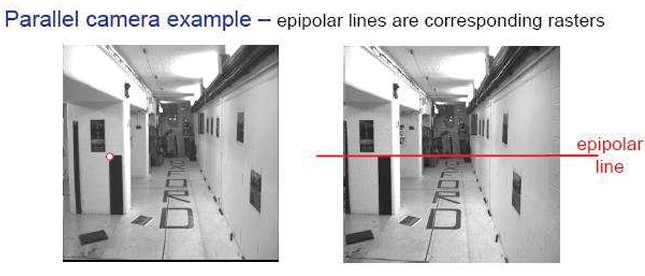
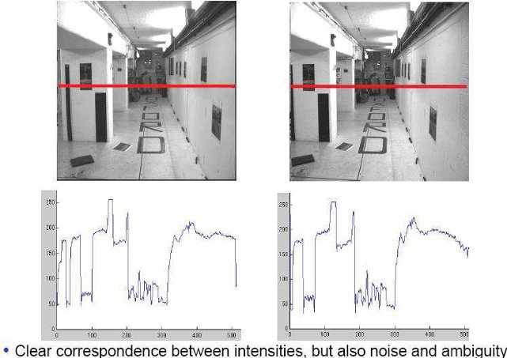

## 40b – Stereo Correspondence & Epipolar Geometry (slides 172–174)

### Preview
This section explores how stereo vision systems compute depth by matching points between two images. The focus is on the **stereo correspondence problem**, **epipolar geometry**, and how disparity maps help reconstruct 3D scenes.  

---

### Simple stereo pair

- In a basic stereo setup, two cameras are aligned so that their X-axes are collinear and Y- and Z-axes are parallel.  
- A 3D point **P** is reconstructed at the intersection of rays from the left and right cameras.  

Formulas for the 3D coordinates:  

\[
z = \frac{fb}{d}, \quad x = \frac{x_l z}{f}, \quad y = \frac{y_l z}{f}
\]

where  
- \(f\) = focal length  
- \(b\) = baseline (distance between cameras)  
- \(d = x_l - x_r\) is the **disparity** between image locations of the same 3D point.  

👉 Greater disparity means closer depth, while smaller disparity means farther depth.  

---

### Stereo correspondence constraints

- The **correspondence problem**: given a point \(p\) in the left image, where is the matching point \(p'\) in the right image?  
- In a parallel stereo setup:  
  - The **y-coordinate is shared** (same row).  
  - Only the x-coordinate changes (disparity).  
- Epipolar geometry generalizes this to non-parallel cameras, restricting the search for matches to epipolar lines.  

---

### Epipolar constraint: a simple image pair

- In ideal stereo geometry, image planes are parallel.  
- The matching point must lie on the **same horizontal line** (epipolar line).  
- This reduces the 2D search to a **1D search along a line**, making correspondence easier.  

---

### Disparity example

- Left: original image.  
- Middle: disparity map \(d(x,y)\) → brighter = closer.  
- Right: reconstructed right image using disparity.  

The formula:  

$$
(x', y') = (x + d(x,y), \; y)
$$

---

### Correspondence problem

- In practice, correspondence is noisy and ambiguous.  
- Example: a corridor with repetitive patterns makes it difficult to identify the correct matching point.  
- **Epipolar lines** guide the search, but repeated textures and occlusions cause errors.  

---

### Intensity profiles

- Intensity values along epipolar lines can help find correspondences.  
- Graphs show how brightness patterns match between the two images.  
- Challenges:  
  - Noise  
  - Textureless regions (low information)  
  - Repetitive patterns causing false matches  

---

### Recap
- Stereo systems reconstruct depth by triangulation.  
- The key challenge is **correspondence**: finding the same point in both images.  
- Epipolar geometry reduces the search space.  
- Disparity maps provide depth: larger disparity = closer object.  

---

### Stop to think
If two objects in an image have very similar textures or repetitive patterns, how might this confuse a stereo matching system? What strategies could be used to resolve this ambiguity?  

<!--
