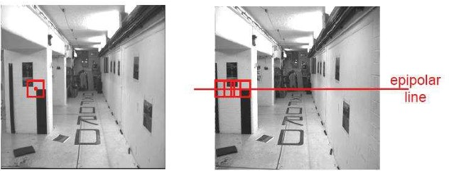
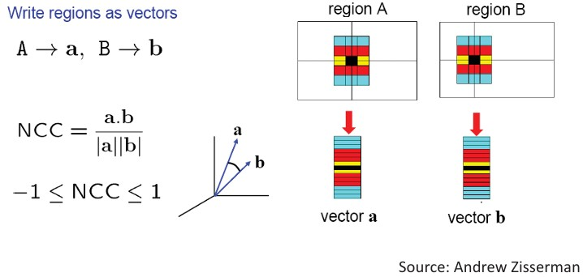
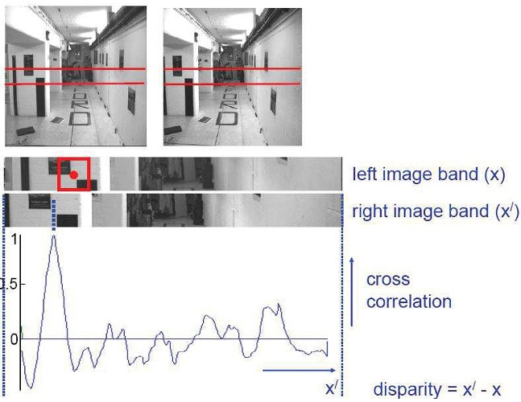
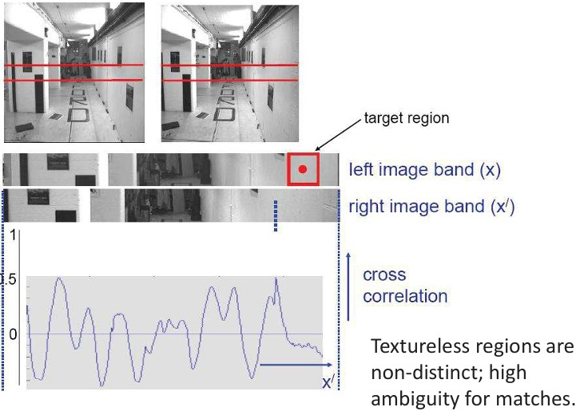
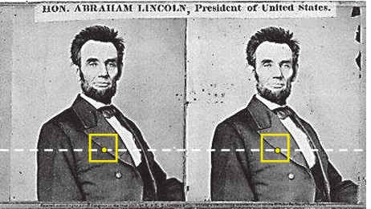
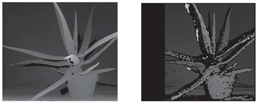
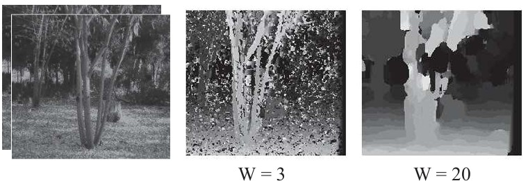

## **41a Stereo Matching & Optimization (part 1) (slides 174–177)**

---

### Preview

This section explores **stereo matching** – how computers figure out which pixels in one image correspond to pixels in another. This is the key step in creating disparity maps and recovering depth from stereo vision. You’ll learn about correspondence problems, similarity measures like normalized cross correlation, block matching, and how window size or scanline processing affects results.

---

### Correspondence problem

To find depth, we must identify which points in the left image correspond to points in the right image.

* Corresponding points must lie along the same **epipolar line**.
* Their neighborhoods (small regions around the pixel) should have **similar intensity patterns**.
* Stereo matching algorithms compare these neighborhoods to find matches.

---

### Normalized cross correlation (NCC)

One way to measure similarity between two regions is **normalized cross correlation (NCC)**.

The formula is:

$$
\text{NCC} = \frac{\sum_i \sum_j A(i,j)B(i,j)}{\sqrt{\sum_i \sum_j A(i,j)^2}\sqrt{\sum_i \sum_j B(i,j)^2}}
$$

If we write the regions as vectors $\mathbf{a}, \mathbf{b}$:

$$
\text{NCC} = \frac{\mathbf{a}\cdot \mathbf{b}}{\|\mathbf{a}\|\|\mathbf{b}\|}
$$

The value of NCC ranges between $-1$ and $1$:

* $1$ means perfect similarity.
* $0$ means no correlation.
* $-1$ means complete opposition.

---

### Correlation-based window matching

A common approach is to compare **windows** (small patches) between left and right images.

* Take a window around a pixel in the left image.
* Slide it along the epipolar line in the right image.
* Compute correlation for each position.
* The position with **maximum correlation** gives the match.

The disparity is then:

$$
d = x' - x
$$

where $x$ is the left image coordinate and $x'$ is the right image coordinate.

---

### Textureless regions

Stereo algorithms can struggle when the region has little or no texture.

* Flat, uniform regions look the same everywhere, so correlation becomes ambiguous.
* Matches may be unreliable or noisy.
* Extra constraints or smoothing are often added to handle this.

---

### Dense correspondence search

Instead of matching just a few points, algorithms can compute disparity for **every pixel**.

For each epipolar line:

1. Take each pixel (or block) in the left image.
2. Compare it with every possible pixel along the epipolar line in the right image.
3. Choose the match with the **minimum cost** (e.g., SSD, correlation).

This produces a **dense disparity map**.

---

### Block matching: example

The top shows a stereo pair of a plant.
The bottom shows:

* **Ground truth disparity map** (left).
* **Disparity map obtained with block matching** (right).

Notice how well-structured areas match correctly, while textureless or repeating patterns create errors.

---

### Effect of window size

The **window size (W)** strongly affects the result.

* **Small window (W=3):** too noisy, not enough variation.
* **Large window (W=20):** oversmooths disparity, may blur across depth boundaries.

Good stereo matching requires a balance: the window should be large enough for variation but small enough to respect depth discontinuities.

---

### Scanline stereo

Another strategy is **scanline optimization**.

* Instead of matching each pixel independently, try to enforce consistency across the **whole scanline**.
* The algorithm ensures that adjacent matches along the line agree more coherently.
* Different scanlines are still processed independently.

---

### Recap

* Stereo matching = finding correspondences between left and right image pixels.
* Similarity measures include **normalized cross correlation** and **SSD**.
* **Block matching** compares local windows to compute disparity.
* **Window size** affects results: too small = noisy, too big = blurred.
* Optimization methods like **scanline stereo** enforce more consistency.

---

### Reflective Question

Why do you think textureless areas are difficult for stereo correspondence, and how might adding constraints (like smoothness) help resolve ambiguities?

---

<!--
