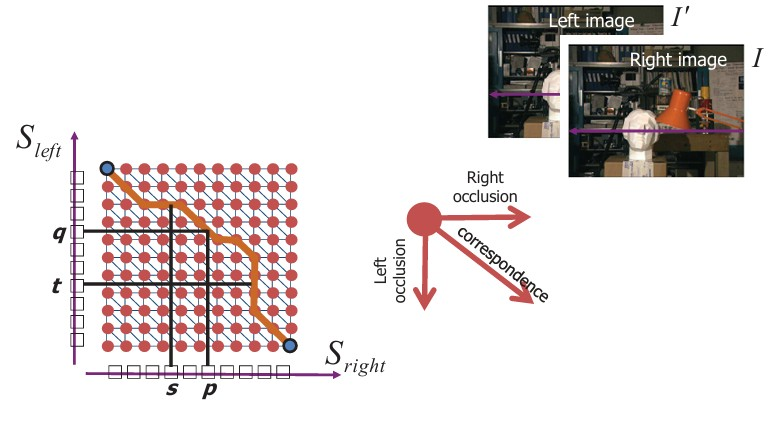
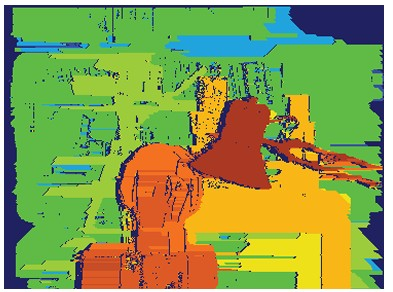
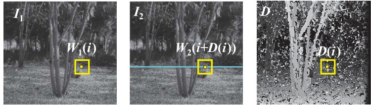
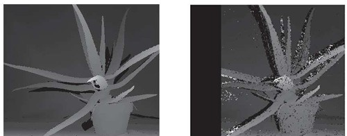
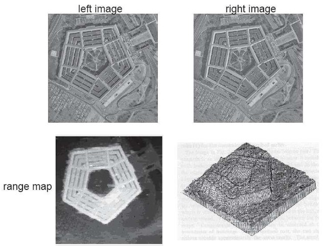
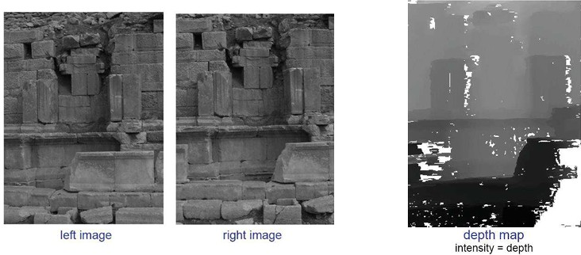

## 41b  Stereo Matching & Optimization (part 2) (slides 178–180)

### Preview

In this section, we look at advanced optimization methods for stereo vision. Basic stereo block matching works, but it has problems like streaking artifacts and difficulty in textureless regions. By using optimization methods such as **dynamic programming**, **energy minimization**, and **graph cuts**, we can achieve more accurate depth maps. We’ll also look at practical examples of disparity maps created with these methods.

---

### “Shortest paths” for scan-line stereo

* Stereo correspondence along a scanline can be thought of as finding the **shortest path** in a graph.
* Each pixel in the left image needs to be matched to a pixel in the right image, while handling **occlusions**.
* Three possibilities:

  * **Correspondence** (match left and right pixels).
  * **Left occlusion** (pixel in left image not visible in right).
  * **Right occlusion** (pixel in right image not visible in left).
* This can be solved using **dynamic programming**, as shown in early works by Ohta & Kanade (1985) and Cox et al. (1996).

---

### Coherent stereo on 2D grid

* While scanline stereo works for 1D scanlines, it produces **streaking artifacts** because each row is processed independently.
* On a full 2D image grid, we need methods that ensure **spatial coherence** of disparities.
* Dynamic programming is not sufficient for this; more advanced optimization is needed.

---

### As energy minimization

Stereo matching can be formulated as an **energy minimization problem**:

$$
E = \alpha E_{\text{data}}(I_1, I_2, D) + \beta E_{\text{smooth}}(D)
$$

* **Data term** ensures pixels match well:

$$
E_{\text{data}} = \sum_i \big(W_1(i) - W_2(i + D(i)) \big)^2
$$

* **Smoothness term** encourages neighboring pixels to have similar disparities:

$$
E_{\text{smooth}} = \sum_{\text{neighbors } i,j} \rho(D(i) - D(j))
$$

These energy functions can be efficiently minimized using **graph cuts**.

---

### Energy minimization: example

* Besides graph cuts, **semi-global matching (SGM)** is another widely used method.
* Both approaches balance **data fidelity** and **smoothness**.
* The figure shows disparity maps: the left is ground truth, the right is the estimated disparity.
* Notice how optimization improves the overall structure of the disparity map.

---

### Other examples

* Stereo matching can reconstruct 3D structures in real-world images.
* Examples include aerial photographs (Pentagon) or historical site reconstructions.
* The outputs are **range maps** or **depth maps**, where brightness encodes depth.

---

### Recap

* Stereo optimization moves beyond simple correlation or block matching.
* **Dynamic programming** can solve scanline stereo but produces streaking artifacts.
* **Energy minimization** with graph cuts or SGM enforces both accurate matches and smooth disparity maps.
* These methods enable practical, high-quality depth reconstruction in computer vision.

---

### Reflective Question

Why is it important to include a **smoothness constraint** in stereo matching, and what might happen if we only used the data term without it?

---

<!--## 42a  Epipolar Geometry & Fundamental Matrix (part 1) s. 181–182
### Epipolar constraint 182
### Epipolar constraint: a general image pair 182
### Fundamental matrix 183
### Fundamentalmatrix: example* 183
### Epipolar line 184
### Epipolar lines: example \* 184
-->
