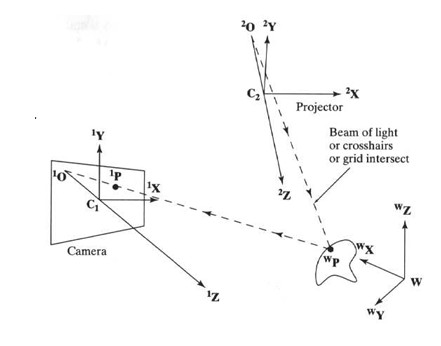
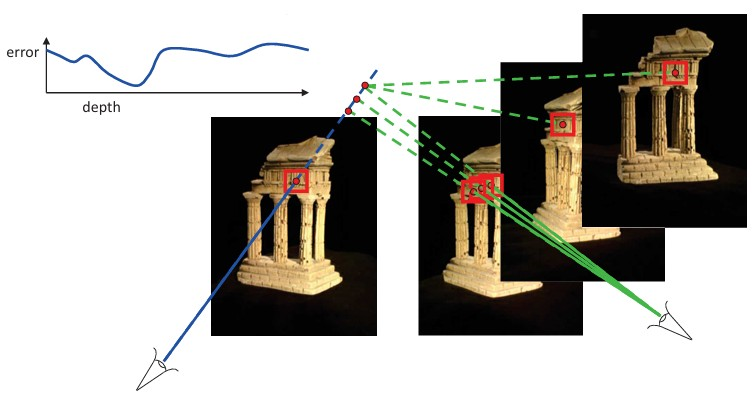
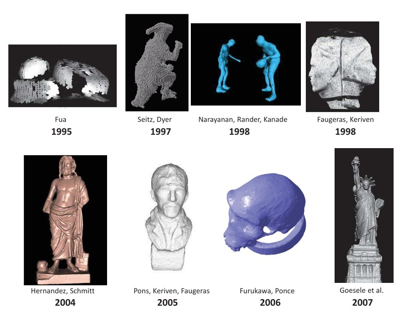
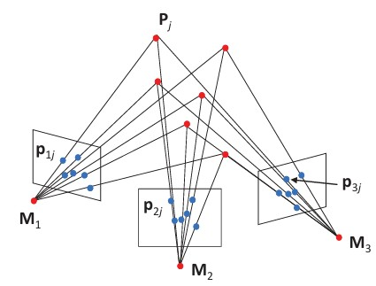

## 47a Triangulation & Structured Light

### Preview
In this section, we explore **structured light**, **multi-view stereo**, and **structure from motion (SfM)**, all of which extend triangulation ideas to more complex setups. These methods allow precise 3D reconstruction by combining projections, multiple viewpoints, or known illumination patterns. We will see how projectors can replace cameras, how stereo reconstruction scales up to multiple views, and how SfM estimates both 3D structure and camera motion simultaneously.

---

### Structured Light
One of the cameras in a stereo setup can be replaced by a **projector**:

- The projector illuminates surface points with a beam of light or a specific pattern (e.g., crosshairs or grids).  
- The geometry remains equivalent to a stereo system.  
- Advantage: enables measuring surface points even when the surface lacks distinct features.  
- This method is called **structured light**.  
- The projector itself can be calibrated, just like a camera.  

---

### Multi-view Stereo: Basic Idea
- Using more than two images allows more accurate **3D reconstruction**.  
- **Input**: calibrated images from multiple viewpoints.  
- **Output**: a dense 3D object model.  
- The process seeks depth values that minimize error across all viewpoints.  

---

### Multi-view Stereo: Results
Multi-view stereo has been applied since the 1990s, with increasingly detailed results:

- **1995** – Fua  
- **1997** – Seitz, Dyer  
- **1998** – Narayanan, Rander, Kanade; Faugeras, Keriven  
- **2004** – Hernandez, Schmitt  
- **2005** – Pons, Keriven, Faugeras  
- **2006** – Furukawa, Ponce  
- **2007** – Goesele et al.  

---

### Structure from Motion (SfM)
SfM generalizes triangulation by estimating both **camera motion** and **3D structure** simultaneously.

- Given: $m$ images of $n$ fixed 3D points.  
- Each image point is denoted:  

  $$
  p_{ij} = M_i P_j, \quad i = 1, \ldots, m, \quad j = 1, \ldots, n
  $$

  where $M_i$ are camera matrices, $P_j$ are 3D points, and $p_{ij}$ are image correspondences.

- Goal: estimate all $M_i$ and $P_j$ from the set of correspondences.  

- **Bundle adjustment**:  
  - Minimizes reprojection error between observed and predicted image points.  
  - Uses nonlinear least-squares optimization.  

- **Scale ambiguity**: If the scene is scaled by $k$ and the camera matrices by $1/k$, the projections remain identical:

  $$
  p = M P = \left(\frac{1}{k} M\right)(kP)
  $$

- Therefore, **absolute scale cannot be recovered**.  

---

### Recap
- Structured light replaces one camera with a projector, enabling precise measurements of textureless surfaces.  
- Multi-view stereo increases accuracy by using many calibrated viewpoints.  
- SfM solves for both camera motion and 3D structure but suffers from scale ambiguity.  

---

### Reflective Question
How might combining **structured light** and **multi-view stereo** improve the robustness of 3D reconstruction, especially in scenes with repetitive textures or low feature contrast?

