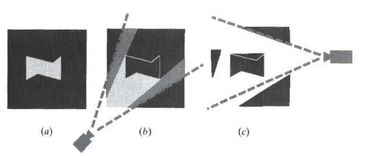
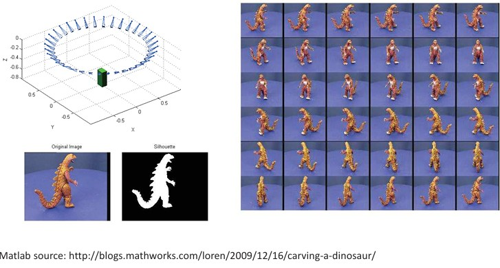
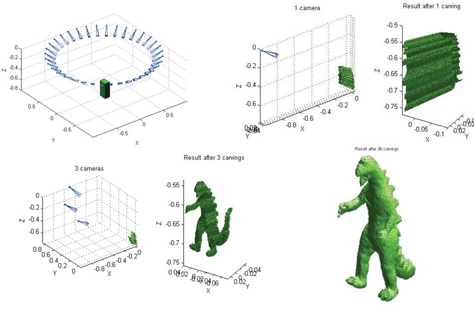
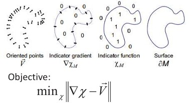
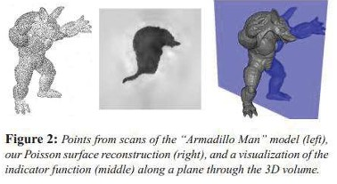
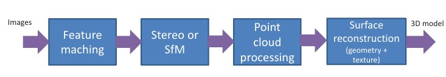
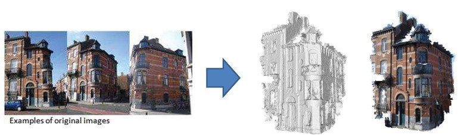

## 48b  Structure from Motion & Reconstruction Pipeline (part 2)

### Preview
In this section, we focus on how space-carving and silhouette-based methods contribute to **3D reconstruction**, and how they lead into **mesh generation** and **surface reconstruction techniques** like Poisson reconstruction. Finally, we summarize the complete **3D reconstruction pipeline**, illustrating how raw images are transformed into textured 3D models.

---

### Space-carving

Space-carving algorithms divide the scene into cubes (voxels) and process them one by one:

- If a cube lies **between the sensor and the range data**, it must be outside the object → discard.  
- If a cube lies **behind the range data**, it must be inside the object.  
- If a cube is partly in front and behind, it is assumed to intersect the surface.  

---

### Space-carving: Cube Labeling

- Project cube → convex hull on the image, usually a hexagon.  
- Sensor rays form a truncated cone enclosing the cube.  
- If all projected points fall **behind** the cone → cube is outside.  
- If all are closer than the cube → inside.  
- Otherwise → boundary cube.  
- Multiple sensors are needed; labeling is repeated for each.  

---

### Example: Space-carving from Silhouettes

- 36 images are captured from different viewpoints.  
- Their silhouettes are extracted.  
- These silhouettes define which voxels belong inside or outside.  

---

### Example: Silhouette-based Carving Results

- With **1 camera**: result is rough and incomplete.  
- With **3 cameras**: better approximation.  
- With **36 cameras**: detailed reconstruction of the dinosaur.  

  

---

### 3D Mesh Models

- A **mesh** consists of polygons with 3D points as vertices.  
- **Regular meshes** consist of uniform polygons; most common is the **triangular mesh**.  
- Widely used in computer graphics and 3D reconstruction.  
- Mesh resolution can be adjusted (higher polygons = more detail).  

---

### Poisson Surface Reconstruction

- Produces smooth and watertight meshes from oriented point clouds.  
- Objective:  

  $$
  \min_\chi \|\nabla \chi - \vec{V}\|

  $$

- Equivalent to solving Poisson’s equation:  

  $$

  \nabla \cdot (\nabla \chi) = \nabla \cdot \vec{V} \quad \Leftrightarrow \quad \Delta \chi = \nabla \cdot \vec{V}
  $$

This transforms noisy point data into coherent surfaces.

  
  

---

### 3D Reconstruction Pipeline

Steps of a modern reconstruction system:

1. **Feature matching** – detect keypoints across images.  
2. **Stereo or Structure from Motion (SfM)** – estimate geometry and camera poses.  
3. **Point cloud processing** – combine 3D points into dense data.  
4. **Surface reconstruction** – build a mesh and add textures.  

Example: ARC3D, a web-based system for automatic 3D reconstruction.  https://ww5.arc3d.be/

---

### Recap

- **Space-carving** uses voxel labeling to classify regions as inside, outside, or surface.  
- **Silhouettes** can guide reconstruction with multiple viewpoints.  
- **Meshes** provide a flexible representation; triangular meshes are standard.  
- **Poisson reconstruction** refines raw points into watertight surfaces.  
- The **reconstruction pipeline** integrates all these steps into a practical system.  

---

### Reflective Question

Why might silhouette-based space-carving fail for objects with **concave structures**, and how could you complement it with other techniques to capture those details?

