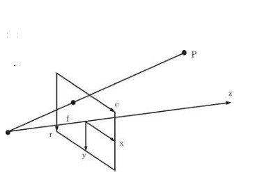
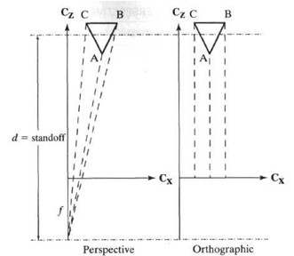
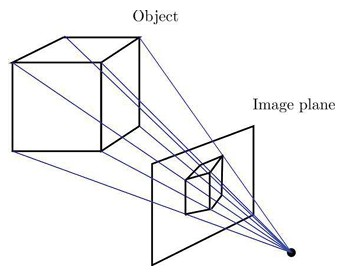

## 44b  3D Transformations & Camera Models (part 2)

### Preview
In this section we dive deeper into how **camera models** and **mathematical matrices** are used in 3D computer vision.  
We will study the **camera matrix**, the **essential matrix**, simplified projection models such as **orthographic and weak perspective projection**, and finally how these tools allow **3D pose estimation**.  
Each concept builds toward understanding how 2D images can be used to reconstruct and reason about 3D geometry.

---

### Camera matrix
The **projection matrix** $M$ can be decomposed into two parts:

$$
M = [K \; 0][R \; t]
$$

Here:
- $K$ is the **camera matrix** defined as:

$$
K = 
\begin{bmatrix}
f_c & 0 & c_0 \\
0 & f_r & r_0 \\
0 & 0 & 1
\end{bmatrix}
$$

where:
- $f_c$ and $f_r$ are the horizontal and vertical focal lengths,  
- $(c_0, r_0)$ is the principal point (the projection of the camera center on the image plane).

If pixels are square-shaped, then $f_c = f_r = f$.

- When $R = I$ (identity) and $t = 0$, the projection simplifies to:

$$
M = [K \; 0]
$$

giving the pixel coordinates:

$$
c = \frac{f_c x}{z} + c_0, \quad r = \frac{f_r y}{z} + r_0
$$

This matches the perspective projection geometry shown below:

---

### Essential matrix
The **epipolar constraint** relates point correspondences between two images:

$$
x'^T F x = 0
$$

where $F$ is the **fundamental matrix**.  

For calibrated cameras, we know $K$, so we can normalize the image coordinates:

$$
y = K^{-1}x
$$

and the epipolar constraint becomes:

$$
y'^T E y = 0
$$

where:

$$
E = K'^T F K
$$

is the **essential matrix**.  

The essential matrix can be decomposed into relative **rotation** $R$ and **translation** $t$ between cameras:

$$
E = [t]_\times R
$$

where $[t]_\times$ is a **skew-symmetric matrix**:

$$
[t]_\times =
\begin{bmatrix}
0 & -t_z & t_y \\
t_z & 0 & -t_x \\
-t_y & t_x & 0
\end{bmatrix}
$$

---

### Orthographic and weak perspective projections
Perspective projection can be approximated for special cases.

1. **Orthographic projection** (linear approximation):

$$
\begin{bmatrix} c \\ r \end{bmatrix} 
= M_o 
\begin{bmatrix} x \\ y \\ z \\ 1 \end{bmatrix}
=
\begin{bmatrix}
1 & 0 & 0 & 0 \\
0 & 1 & 0 & 0
\end{bmatrix}
\begin{bmatrix} x \\ y \\ z \\ 1 \end{bmatrix}
$$

2. **Weak perspective projection** (applies uniform scaling $s$):

$$
\begin{bmatrix} c \\ r \end{bmatrix} 
= M_w 
\begin{bmatrix} x \\ y \\ z \\ 1 \end{bmatrix}
=
\begin{bmatrix}
s & 0 & 0 & 0 \\
0 & s & 0 & 0
\end{bmatrix}
\begin{bmatrix} x \\ y \\ z \\ 1 \end{bmatrix}
$$

The scale factor $s$ is chosen as $s = f/d$,  
where $d$ is the average scene depth (rule of thumb: $d > 20 \times$ object size).

---

### 3D pose estimation
The **pose** of a camera (its position and orientation) is defined by **rotation $R$** and **translation $t$**.

- A **3D pose** has **6 degrees of freedom**:  
  3 for translation, 3 for rotation.
- If the camera is calibrated (matrix $K$ known), pose can be estimated from a 2D image of a 3D object.

At least **3 point correspondences** are required.  
This is known as the **Perspective-3-Point Problem (P3P)**.  

In general, estimating pose from $n$ points is called the **PnP problem (Perspective-n-Point)**.

---

### Recap
- The **camera matrix $K$** defines intrinsic camera parameters such as focal length and principal point.  
- The **essential matrix $E$** relates two calibrated camera views and encodes relative pose.  
- **Orthographic and weak perspective** projections are useful approximations in certain conditions.  
- **3D pose estimation** uses correspondences to recover camera position and orientation (PnP problem).

---

### Reflective question
Why do we often approximate perspective projection with orthographic or weak perspective models?  
What benefits do these approximations provide, and in which situations might they fail?

<!--## 45a  Pose Estimation & P3P (part 1) s. 192
### Perspective 3 Point Problem (P3P) 193-->
