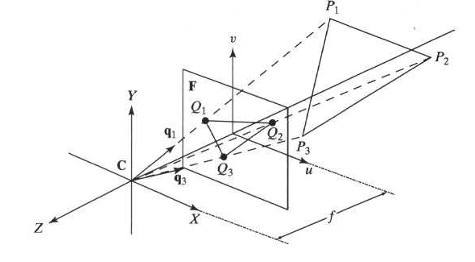

## 45a Pose Estimation & P3P (part 1)

### Preview
This section introduces **Pose Estimation** using the **Perspective-3-Point Problem (P3P)**. Pose estimation is the task of determining the position and orientation of a camera relative to a 3D scene. With as few as three 3D-to-2D correspondences, one can compute the pose of the camera. This is a fundamental step in computer vision tasks like augmented reality, robotics, and 3D reconstruction.

---

### Perspective 3 Point Problem (P3P)

Three 3D scene points $P_i$ are observed in the 2D image plane as $Q_i$.

- The **world coordinate system** is assumed to be the same as the camera coordinate system.  
- The distances $d_{ij}$ between the 3D points are known.  
- The task is to determine the pose (rotation and translation) of the object containing the three points with respect to the camera.  

The figure shows three 3D points $P_1, P_2, P_3$ projected to the 2D image plane at $Q_1, Q_2, Q_3$. The camera pose must be solved so that the geometry of the projections aligns.

---

### P3P Equations

The locations of the 3D points can be expressed as:

$$
P_i = a_i q_i
$$

where:
- $q_i$ is a unit vector (known, direction from camera to the point),  
- $a_i$ is a scalar (unknown distance to the point).  

---

The squared distance between two points $i$ and $j$ becomes:

$$
d_{ij}^2 = \|a_i q_i - a_j q_j\|^2 = a_i^2 - 2a_i a_j (q_i \cdot q_j) + a_j^2
$$

---

There are **three known distances**: $d_{12}, d_{23}, d_{13}$, which yield the following system of polynomial equations:

$$
a_1^2 - 2a_1 a_2 (q_1 \cdot q_2) + a_2^2 - d_{12}^2 = 0
$$

$$
a_2^2 - 2a_2 a_3 (q_2 \cdot q_3) + a_3^2 - d_{23}^2 = 0
$$

$$
a_1^2 - 2a_1 a_3 (q_1 \cdot q_3) + a_3^2 - d_{13}^2 = 0
$$

---

The three unknowns $a_i$ (the distances from the camera to the points) can be solved **analytically or numerically** from these equations. Once $a_i$ values are found, the 3D point positions are reconstructed, and thus the camera pose can be determined.

---

### Recap

- Pose estimation aims to recover camera position and orientation.  
- The **P3P problem** uses **3 known 3D points** and their **2D image projections**.  
- The solution involves solving three polynomial equations for the unknown distances.  
- Once solved, the pose (rotation and translation) is determined.  

---

### Reflective Question
Why is it possible to solve the full 6 degrees of freedom pose (rotation + translation) with only **three 3D-to-2D correspondences** in the P3P problem, but in general more correspondences are often used in practice?

<!--## 46 Camera calibration
