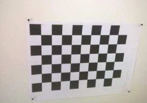
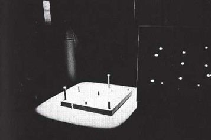
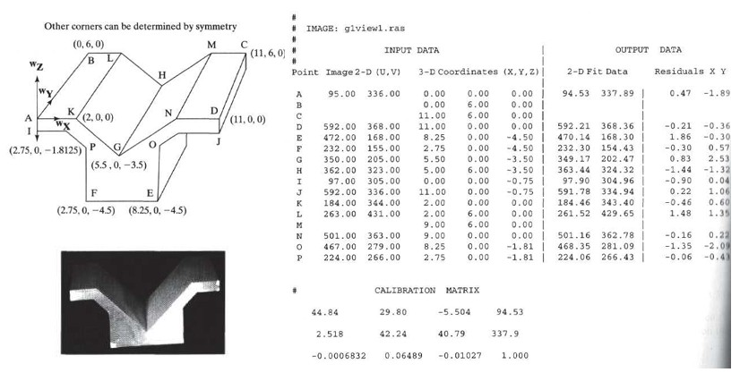
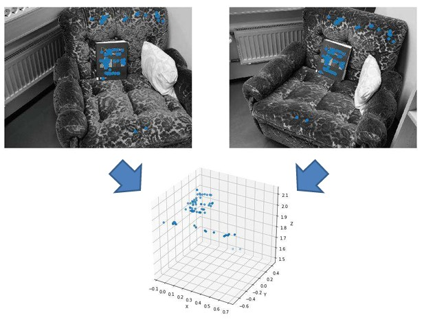

## 46a Camera Calibration

### Preview
In this section, we study how to calibrate a camera so that its internal and external parameters can be determined. Calibration is essential for accurate 3D reconstruction, pose estimation, and correction of distortions. We will also see how two calibrated cameras can be used to compute 3D points and reconstruct a scene.

---

### Camera Calibration
The **goal of camera calibration** is to determine the **camera matrix K** using calibration images and known objects.

- **Internal parameters:** focal length $(f_c, f_r)$ and principal point $(c_0, r_0)$  
- **External parameters:** rotation $R$ and translation $t$  
- **Lens distortion** can be modeled and corrected  
- **Checkerboard pattern** is often used:
  - Known 3D to 2D correspondences simplify calibration  
- If no known object is available → **self-calibration**  
- Calibration requires **non-linear optimization** to minimize error between observed image points and points predicted by the camera model  

---

### Camera Calibration: Setup
A simplified (but not optimal) approach is:

- Use **least-squares fitting** to estimate 11 camera parameters $a_{11} - a_{33}$ (normalize $a_{34} = 1$).  
- A **calibration object (jig)** with known 3D measurement points is placed in the scene:  
  - It is located in the world coordinate system and defines it.  
- Collect a set of $n$ data tuples $\langle p_j, P_j \rangle$:  
  - $p_j = [c_j, r_j]$ = pixel in the image  
  - $P_j = [x_j, y_j, z_j]$ = known 3D point  

Example of a jig with markers:  

---

### Camera Calibration: Solution
For each calibration point $j$, the following equations are derived:

$$
c_j = (a_{11} - a_{31} c_j)x_j + (a_{12} - a_{32} c_j)y_j + (a_{13} - a_{33} c_j)z_j + a_{14}
$$

$$
r_j = (a_{21} - a_{31} r_j)x_j + (a_{22} - a_{32} r_j)y_j + (a_{23} - a_{33} r_j)z_j + a_{24}
$$

Rearranging yields a linear system:

$$
A \mathbf{x} = \mathbf{b}
$$

where $\mathbf{x} = [a_{11} \; a_{12} \; a_{13} \; a_{14} \; a_{21} \; a_{22} \; a_{23} \; a_{24} \; a_{31} \; a_{32} \; a_{33}]^T$

- This is called the **Direct Linear Transformation (DLT)**.  
- Least-squares solution:  

$$
\hat{\mathbf{x}} = (A^T A)^{-1} A^T \mathbf{b}
$$

- At least **6 calibration points** are needed.  

---

### Camera Calibration: Example
The example below shows how measured 2D image points and their corresponding 3D object coordinates are used to compute the calibration matrix.

---

### Computing 3D Points Using Two Cameras
If two calibrated cameras are available, a 3D point $[x, y, z]$ can be reconstructed from its projections:

For camera 1:

$$
\begin{bmatrix}
 s\,c_1 \\ s\,r_1 \\ s
\end{bmatrix}
=
\begin{bmatrix}
 a_{11} & a_{12} & a_{13} & a_{14} \\
 a_{21} & a_{22} & a_{23} & a_{24} \\
 a_{31} & a_{32} & a_{33} & a_{34}
\end{bmatrix}
\begin{bmatrix}
 x \\ y \\ z \\ 1
\end{bmatrix}
$$

For camera 2:

$$
\begin{bmatrix}
 t\,c_2 \\ t\,r_2 \\ t
\end{bmatrix}
=
\begin{bmatrix}
 b_{11} & b_{12} & b_{13} & b_{14} \\
 b_{21} & b_{22} & b_{23} & b_{24} \\
 b_{31} & b_{32} & b_{33} & b_{34}
\end{bmatrix}
\begin{bmatrix}
 x \\ y \\ z \\ 1
\end{bmatrix}
$$

Eliminating scale factors $s$ and $t$ gives linear equations for $c_1, r_1, c_2, r_2$ in terms of $(x, y, z)$, from which the unknown 3D point can be solved (e.g., via least squares).

---

### 3D Reconstruction: Example
Example: two camera views are combined, and corresponding points are reconstructed into 3D space. The resulting reconstruction is shown as a 3D point cloud.

---

### Recap
- Calibration determines **internal** ($f_c, f_r, c_0, r_0$) and **external** ($R, t$) parameters.  
- Uses **checkerboard patterns** or known 3D-to-2D correspondences.  
- Requires **Direct Linear Transformation (DLT)** and **non-linear optimization**.  
- Two calibrated cameras enable **3D reconstruction**.  

---

### Reflective Question
Why do we need **at least two views** (or one moving camera) to recover 3D information from 2D images?

