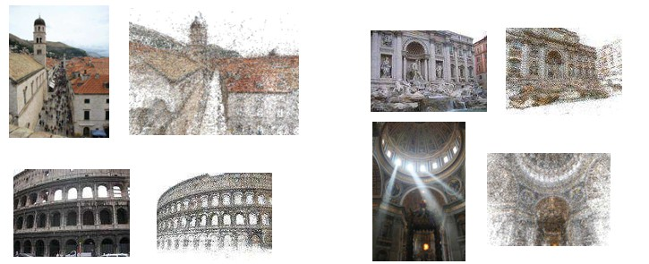
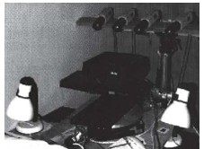
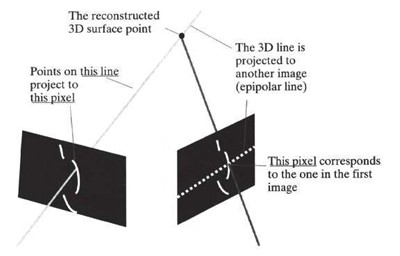
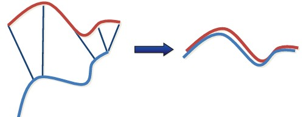
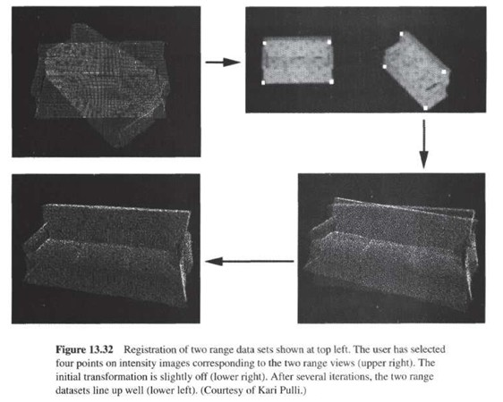
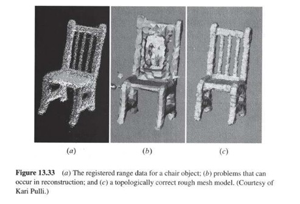

## 48a  Structure from Motion & Reconstruction Pipeline (part 1)

### Preview
This section introduces the **3D object reconstruction pipeline**. The process involves acquiring multiple views of an object, aligning them into a single coordinate system, constructing a 3D surface, and refining the model through optimization. We also look at **data acquisition**, **registration of views**, and the **Iterative Closest Point (ICP) algorithm** for alignment.

---

### 3D Object Reconstruction
The reconstruction process has four major steps:

1. **3D data acquisition**
   - Range data is collected from multiple viewpoints covering the surface of the object.
   - Each range image covers a portion of the object.
   - Often 8–10 views are sufficient.

2. **Registration**
   - Combines range data into a single 3D coordinate system.
   - Intensity data can help with alignment.

3. **Surface construction**
   - A 3D model is created, e.g., using **space carving**.

4. **Optimization**
   - Simplifies the model and refines it to better fit the acquired data.

---

### Data Acquisition
An example of an **active stereo vision system**:
- Uses **four color cameras**.
- A **slide projector** emits a vertical stripe of white light.
- The intersection of the light stripe with an epipolar line gives stereo matching points.
- Using more than two cameras increases reliability.
- Accuracy can be improved by averaging.

---

### Registration of Views
The goal is to transform all views into a **common coordinate system**.
- If precise mechanical positioning (e.g., robot, measurement device) is not available:
  - Use **image correspondences**.
  - Can be done automatically using **3D features** or manually by selecting points.
- Initial alignment may be imperfect.
- Iterative methods refine the alignment (e.g., ICP).

---

### Iterative Closest Point (ICP) Algorithm
- Assumes **closest points correspond** across two scans.
- Iteratively refines alignment by minimizing distances between point sets.
- Converges if the initial guess is sufficiently close.

---

### Registration Example
Example of aligning two 3D scans:
- Top: raw misaligned point clouds.
- Middle: manual or automatic feature correspondences.
- Bottom: final aligned result after ICP iterations.

---

### Surface Reconstruction
- The reconstructed object should:
  - Preserve overall **shape**.
  - Maintain **topology**.
- Range data often contains **noise**, which complicates reconstruction.
- Example: reconstruction of a chair.

---

### Example: Surface Model
- Range scans can be merged into a surface.
- Example images show:
  - (a) raw noisy data
  - (b) intermediate model
  - (c) refined surface reconstruction

---

### Recap
- Reconstruction involves **acquisition, registration, surface construction, optimization**.  
- Data acquisition can use **active stereo with projected light**.  
- Registration aligns multiple views, often with **ICP**.  
- Noise is a challenge during surface reconstruction.

---

### Reflective Question
Why is **iterative refinement (e.g., ICP)** often necessary in multi-view reconstruction, instead of relying on initial feature correspondences alone?

