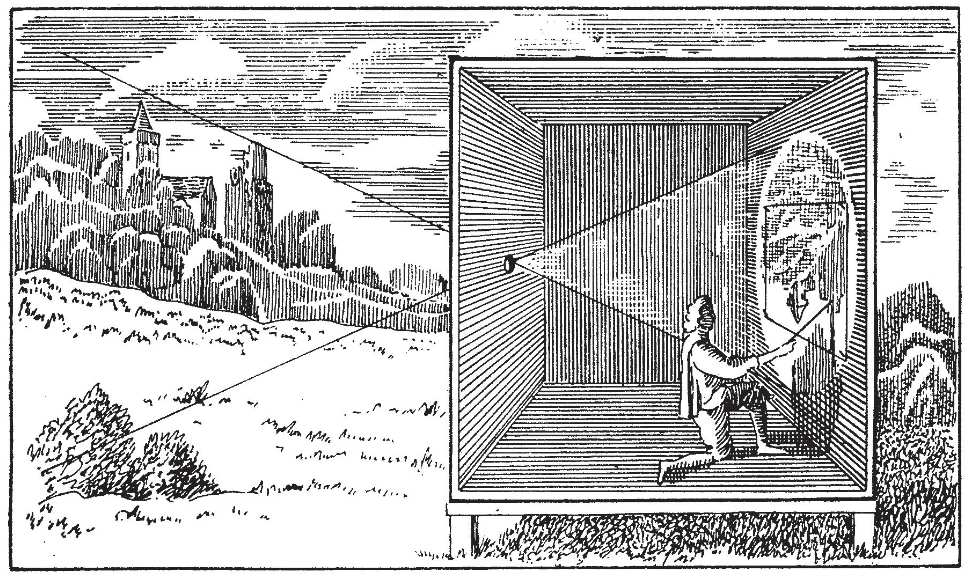
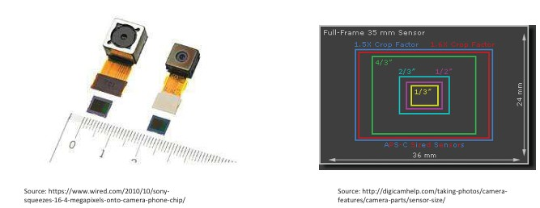
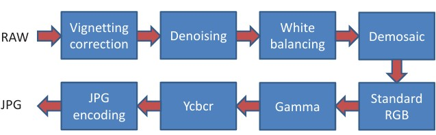
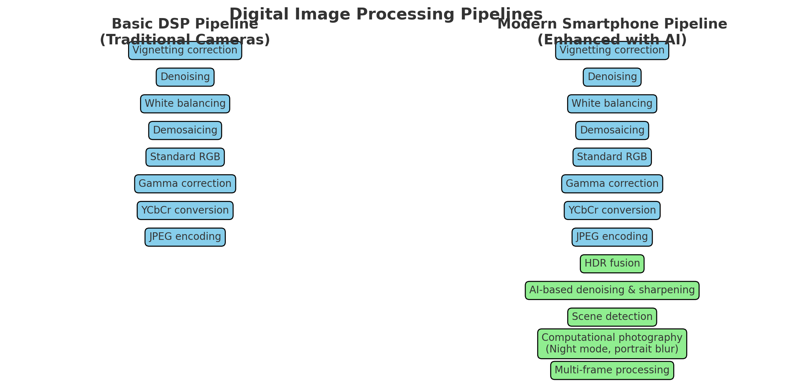
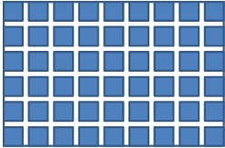

## 4  Camera Types & Sensors s. 15–17
### Camera Obscura 15

This illustration shows the **camera obscura**, an early optical device that laid the foundation for modern cameras.

The principle is simple: light from the outside scene passes through a small hole in one wall of a darkened box or room. Because light travels in straight lines, the rays form an **inverted image** of the scene on the opposite wall. Artists and scientists used the camera obscura for centuries, both as a drawing aid and as a tool to study optics and vision.

👉 This historical example is a perfect introduction to **Theme 2 – Imaging and Image Representations**, because it demonstrates one of the earliest methods of projecting and capturing visual information, a concept that later evolved into photography and today’s digital imaging systems.

**Summary**: The **camera obscura** is an early optical device that projects an inverted image of the outside world through a small hole onto the opposite wall of a darkened box or room. It was used by artists as a drawing aid and by scientists to study light and vision. This simple principle of projecting images laid the groundwork for photography and modern digital cameras, making it a fitting historical introduction to imaging and image representations.

### Imaging with cameras 16

There are many different types of cameras, each designed for specific purposes:

* **General use cameras:**

  * Photographic cameras
  * Video cameras
  * Web cameras

* **Monitoring and observation cameras:**

  * Surveillance cameras
  * Astronomical cameras

* **Specialized cameras for industry and science:**

  * Industrial or machine vision cameras
  * Spectral cameras (e.g., infrared, X-ray, hyperspectral)
  * RGB-D or depth cameras
  * Line scan cameras

**Digital cameras** are now the most common, used widely across these categories for capturing and processing images electronically.

---

**Summary**:Cameras come in many forms, each serving different needs. Everyday examples include photographic, video, and web cameras, while surveillance and astronomical cameras are used for monitoring and observation. In industry and science, specialized devices such as machine vision cameras, spectral cameras (infrared, X-ray, hyperspectral), depth cameras (RGB-D), and line scan cameras are common. Today, most of these are digital, allowing images to be captured and processed electronically.

### Digital Camera 16

A digital camera consists of several main components:

* **Camera body**

  * Shutter
  * Flash

* **Optics**

  * Lenses
  * Aperture
  * Focusing

* **Image sensor**

  * CCD or CMOS technology
  * Gain (ISO setting)
  * Analog-to-digital (A/D) conversion

* **Digital image processing pipeline (DSP)**

  * Processes the raw sensor data into the final digital image

---

**Summary** A digital camera is made up of several key parts. The camera body contains the shutter and flash, while the optics include the lens system, aperture, and focusing mechanism. The image sensor, usually CCD or CMOS, captures incoming light, with settings like ISO controlling sensitivity and an A/D converter turning the signal into digital form. Finally, the digital signal processing pipeline (DSP) transforms the raw sensor data into the finished image.

### Image Sensor

* Source: https://www.wired.com/2010/10/sony
squeezes-16-4-megapixels-onto-camera-phone-chip/

* Source: http://digicamhelp.com/taking-photos/camera
features/camera-parts/sensor-size/
* Uses **CCD** or **CMOS** technology to capture light.
* Comes in **different sizes** depending on the device:

  * Professional DSLR cameras often use **full-frame sensors** (large size, high quality).
  * Mobile phones typically use **smaller sensors**, ranging from **1/6” to 1/2.5”**.

Larger sensors usually provide better image quality because they capture more light, while smaller sensors are more compact and suitable for mobile devices.

---

Summary: An image sensor, built with CCD or CMOS technology, is the part of a camera that captures light. Sensor sizes vary: professional DSLR cameras often use large full-frame sensors for high image quality, while mobile phones rely on much smaller sensors (typically 1/6” to 1/2.5”). In general, larger sensors capture more light and produce better images, while smaller sensors are more compact and practical for portable devices.

### Digital image processing pipeline 17
DSP is needed for producing the final image from the raw sensor image.

This picture shows the **digital image processing pipeline**, which is the sequence of steps that convert the raw signal from a camera’s sensor into the final usable image (such as a JPG).

* The process begins with the **RAW image** captured by the sensor.
* Several corrections and enhancements are applied:

  * **Vignetting correction** removes darkening near the edges of the image.
  * **Denoising** reduces random noise from the sensor.
  * **White balancing** adjusts colors so that whites look neutral under different lighting.
  * **Demosaicing** reconstructs full-color pixels from the sensor’s color filter array.
* The image is then transformed into a standard color space:

  * Converted into **Standard RGB**.
  * Adjusted with **Gamma correction** to match human brightness perception.
  * Converted to **YCbCr** format for compression.
* Finally, the image is **JPEG encoded** to create the compressed photo file.

👉 In short: this pipeline takes raw, unprocessed sensor data and step by step refines it into the high-quality images we see on cameras and phones.

**Summary** The digital image processing pipeline converts the raw signal from a camera’s sensor into the final photo. Starting from the RAW image, the system applies corrections such as vignetting removal, noise reduction, white balance, and demosaicing to recover accurate colors. The image is then transformed into a standard color space, adjusted with gamma correction, and converted into formats like YCbCr before being compressed into JPEG.

📌 This diagram reflects the **actual type of processing pipeline used inside cameras and smartphones**. While the details may vary between manufacturers, almost all modern devices perform these steps (often with additional ones such as sharpening, HDR fusion, or AI-based enhancements) before saving or displaying an image.

### Digital Image Processing Pipelines these days (extra)

**1. Basic DSP Pipeline (traditional cameras):**

* Vignetting correction
* Denoising
* White balancing
* Demosaicing
* Color conversion to Standard RGB
* Gamma correction
* YCbCr conversion
* JPEG encoding

**2. Modern Smartphone Pipeline (enhanced with AI):**

* All the basic DSP steps above
* **HDR fusion** – combines multiple exposures for balanced lighting
* **AI-based denoising and sharpening** – improves clarity in low light
* **Scene detection** – automatically adjusts colors and contrast for landscapes, portraits, food, etc.
* **Computational photography** – e.g., night mode, portrait blur, sky replacement
* **Multi-frame processing** – merges information from multiple frames for better detail

👉 **Key difference:** While traditional cameras mostly relied on DSP, modern smartphones integrate **machine learning and computational photography** to enhance images far beyond what the sensor alone captures.

---

### Digital image 18

* Light rays from a scene pass through the lens and reach the image sensor.
* The sensor is made up of an **M × N array of pixels**.
* Each pixel captures incoming photons and converts them into an electronic signal.
* The signal is **quantized** into **L bits**, giving $2^L$ possible intensity levels.
* A grayscale image typically uses **8 bits per pixel**, allowing for **256 shades of gray**.
 
**Same in one paragraph**: A digital image is formed when light passes through the lens and strikes the camera’s sensor, which is made up of millions of tiny pixels. Each pixel captures light and converts it into an electronic signal that is then quantized into discrete levels. The number of levels depends on the bit depth—for example, an 8-bit grayscale image can represent 256 different shades of gray.   

