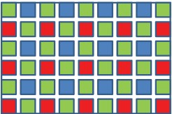
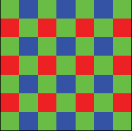
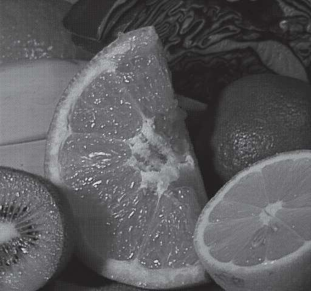
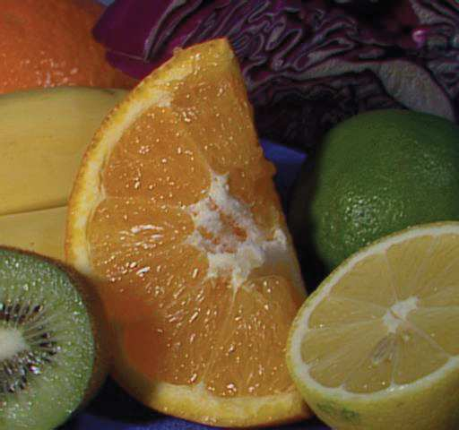
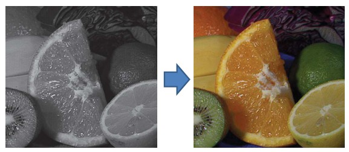
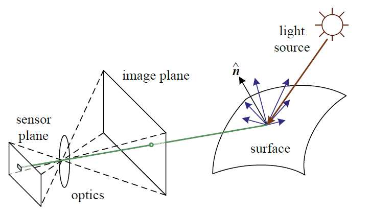

## 5a  Color Imaging & Geometric Models (part 1) s. 18
### Color image 18
* A color image is made up of **three channels**:

  * **R** = Red
  * **G** = Green
  * **B** = Blue

* It is typically represented with **24 bits per pixel** (8 bits for each channel).

* There are two main ways to capture color:

  1. Using **three separate sensors**, one for each color channel.
  2. Using **a single sensor with a Color Filter Array (CFA)**, such as the Bayer pattern, which captures color information through filters placed over individual pixels.

---

**In one paragraph**: A color image is created by combining three channels—red, green, and blue—each usually stored with 8 bits, giving 24 bits per pixel in total. Cameras can capture this in two ways: either by using three separate sensors, one for each color, or by using a single sensor with a color filter array (such as the Bayer pattern) that assigns different colors to different pixels and reconstructs the full image.

### Color Filter Array (CFA) 19  
<!-- 

 -->

* Most cameras use a **Bayer pattern** as the color filter array.
* A CFA places tiny red, green, or blue filters over individual pixels, so each pixel only captures one color.
* To create a full-color image, a process called **demosaicing** is used. This algorithm estimates the missing colors for each pixel by combining information from neighboring pixels.
* The result is a reconstructed color image from the raw sensor data.

---

**Summary** Most digital cameras use a **color filter array (CFA)**, usually the Bayer pattern, where each pixel only records red, green, or blue light. To form a full-color picture, the missing color information is filled in using a process called **demosaicing**, which combines data from neighboring pixels. This allows the raw sensor data to be turned into a complete color image.

### Simplified imaging model 19

A camera can be described using three models:

* **Geometric model:** Describes how light rays from a 3D scene are projected through the optics onto the image plane.
* **Optical model:** Explains how the lens bends and focuses light to form a sharp image.
* **Sensor model:** Describes how the sensor converts incoming light into electronic signals (pixels).

The diagram shows how light from a **source** (e.g., the sun) reflects from a **surface**, passes through the **camera optics**, and is projected onto the **sensor plane**, where the image is formed.

Light and color (explored further with theme 3) are also essential parts of this model, since the way surfaces reflect light determines how they appear in the final image.

---
**Recap**: A simplified imaging model explains how a camera captures an image. Light from a source, such as the sun, reflects off a surface and enters the camera through its optics. The **geometric model** describes how the scene is projected onto the image plane, the **optical model** explains how the lens focuses light, and the **sensor model** shows how the sensor converts light into electronic signals. Together, these models describe how light and color from the real world are transformed into a digital image.

