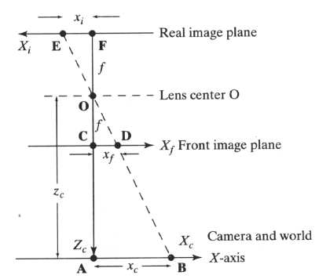
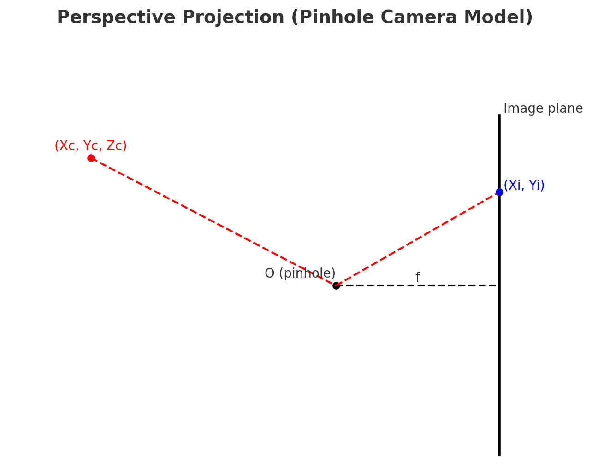
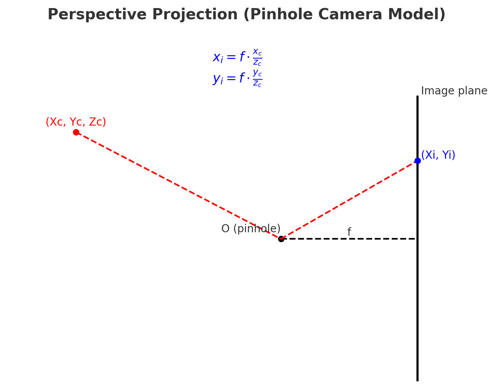
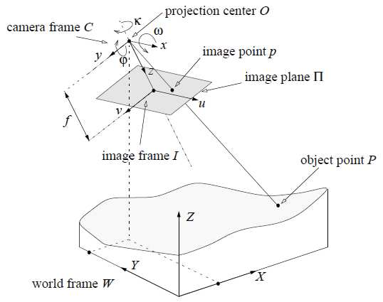
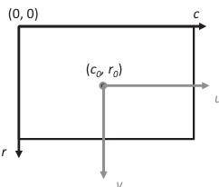
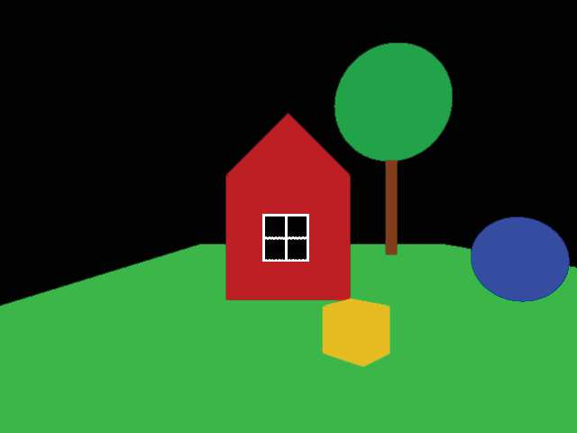
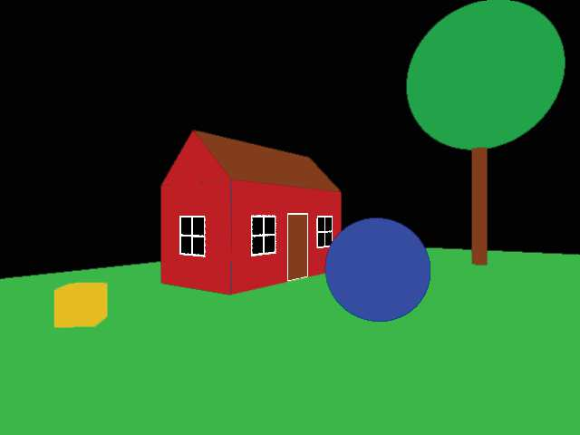

## 5b  Color Imaging & Geometric Models (part 2) s. 19–20

### Perspective projection

The **pinhole camera model** is a simple but common way to describe how a 3D scene is projected onto a 2D image plane.

* Light rays from a point in the scene pass through the pinhole (or lens center) and hit the image plane.
* This forms an **inverted (upside down) image**. To simplify calculations, we often use a **virtual front image plane** so that the image appears upright.
* The relationship between a 3D point in the world $(x_c, y_c, z_c)$ and its 2D projection $(x_i, y_i)$ on the image plane is given by:

  $$
  xᵢ = f * (x_c / z_c)
  $$

and 

$$
yᵢ = f * (y_c / z_c)

$$

where **f** is the focal length of the camera.

👉 In short: perspective projection mathematically describes how depth ($z_c$) affects the size and placement of objects in an image. Objects farther away appear smaller, while closer objects appear larger, just like in human vision.

---

**ANOTHER TAKE/EXPLANATION ON**

Here’s a **clean** of the **pinhole camera perspective projection model**.

* The **scene point** $(X_c, Y_c, Z_c)$ (red) projects through the **pinhole** (O) onto the **image plane**.
* The image coordinates $(X_i, Y_i)$ (blue) are found using the focal length $f$.
* The dashed lines show how light rays travel through the pinhole to the image plane.

this mirrors earlier picture but is simpler and visually clear.

---

#### Perspective Projection (Pinhole Camera Model)

$$

x_i = f \cdot \frac{x_c}{z_c}, \quad y_i = f \cdot \frac{y_c}{z_c}
$$

**Explanation:**
The pinhole camera model shows how a 3D point $(x_c, y_c, z_c)$ in the scene is projected through the pinhole (O) onto the image plane at coordinates $(x_i, y_i)$. The projection depends on the **focal length (f)** and the **depth (z\_c)**. Objects farther away project to smaller image coordinates, which explains why distant objects look smaller — just like in human vision.

---
📷 Pinhole Camera Model

Takeaway: A simple geometric model: 3D points project to 2D by dividing by depth.

###  Imaging geometry 20
Explanation of the **Imaging geometry**:
Imaging geometry describes how a 3D point in the real world is mapped to a 2D point on the image plane.

* The **camera projects** an object point $P$ in 3D space onto the **image plane $\Pi$** at point $p$. This process follows the rules of perspective projection.
* The resulting image can be represented as an **M × N matrix** of pixels, where $M$ is the number of rows and $N$ is the number of columns.
* In image coordinates, the top-left corner is usually defined as $(0,0)$.
* The **principal point** $(c_0, r_0)$ is the intersection of the optical axis with the image plane. It acts as the reference center of the image.

👉 In short: imaging geometry provides the link between **world coordinates** (X, Y, Z) and their corresponding **image coordinates** (u, v), making it possible to mathematically describe how cameras capture 3D scenes in 2D form.

---

**re-cap**: Imaging geometry explains how a 3D point in the real world is projected onto a 2D image plane. The image is represented as an $M \times N$ pixel grid, with coordinates typically starting at $(0,0)$ in the top-left corner. The **principal point** $(c_0, r_0)$ marks where the optical axis intersects the image plane and serves as the image’s center reference. This framework connects world coordinates $(X, Y, Z)$ with image coordinates $(u, v)$, making it possible to model how cameras capture 3D scenes as 2D images.

* A typical convention to represent image coordinates ((c0, r0) is the principal point.): 

🔄 Perspective Distortion

Takeaway: Two viewpoints = more depth information.

### Geometric camera model 21

The geometric camera model describes how 3D points in the world are projected into 2D image coordinates using perspective projection.

* The mapping can be expressed with a **matrix equation**, where world coordinates $(X, Y, Z)$ are transformed into image coordinates $(c, r)$.
* This equation combines:

  * **Intrinsic parameters** (focal length $f$, principal point $(c_0, r_0)$), which describe the internal geometry of the camera.
  * **Extrinsic parameters** (rotation matrix $R$ and translation vector $t$), which describe the camera’s position and orientation in the world.
* The tilde symbol ($\sim$) indicates **direct proportionality**, since the coordinates are usually normalized by depth.

This model provides a good approximation of how cameras capture images. In practice, it can be extended with **non-linear components** (e.g., lens distortion) to make it more accurate.

---

#### Geometric Camera Model (Short Explanation)

The geometric camera model shows how a 3D world point $(X, Y, Z)$ is mapped to a 2D image point $(c, r)$ using perspective projection. The model combines **intrinsic parameters** (like focal length $f$ and the principal point $(c_0, r_0)$) with **extrinsic parameters** (a rotation matrix $R$ and a translation vector $t$) to describe both the internal camera geometry and its position in the world. While this provides a good approximation, real cameras often require corrections for effects like lens distortion.

#### Matrix equation of above.
---

$$
\begin{bmatrix}
c \\
r \\
1
\end{bmatrix}
\sim
\begin{bmatrix}
f & 0 & c_0 & 0 \\
0 & f & r_0 & 0 \\
0 & 0 & 1 & 0
\end{bmatrix}
\begin{bmatrix}
R & t \\
0 & 1
\end{bmatrix}
\begin{bmatrix}
X \\
Y \\
Z \\
1
\end{bmatrix}
$$

---

A **simplified version of this equation** (just showing how projection depends on $f, X, Y, Z$) if you are not yet comfortable with matrix notation?

#### Simplified Geometric Camera Model

A 3D point $(X, Y, Z)$ in the world is projected to image coordinates $(c, r)$ as:

$$
c = f \cdot \frac{X}{Z} + c_0
$$

$$
r = f \cdot \frac{Y}{Z} + r_0
$$

* $f$: focal length of the camera
* $(c_0, r_0)$: coordinates of the principal point (the image center)
* $Z$: depth (distance from the camera)

👉 This form makes it clear that the **image coordinates shrink with depth** ($1/Z$), which is why distant objects appear smaller.

---

📐 Geometric Camera Model

Takeaway: Intrinsic + extrinsic parameters link the 3D world to 2D images.

### Perspective distortion 21

* Changing the **viewpoint** alters the way objects are projected, creating **nonlinear distortions** between different images of the same scene.
* By comparing two images taken from different viewpoints, we can infer **3D information** about the objects, such as their **shape, depth, and relative positions**.
* What can we infer about the scene based on this image pair?

 first pic       |   second pic 
:-------------------------:|:-------------------------:
  |      
OTSIKKO | otsikko2 
 |   

* The **yellow cube** looks flat in the first image but reveals its side in the second, showing it is 3D.
* The **house** changes from a flat facade view to one that shows the side walls, giving a sense of depth.
* The **sphere** and **tree** look round in both views, but their relative positions become clearer when seen from multiple perspectives.

👉 Perspective distortion is not just an artifact — it provides valuable **clues about 3D structure**.

