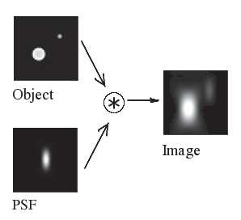

## 6a  Optical & Lens Effects (part 1) s. 21

### Optical model 22

- A simple **pinhole model** can approximate how a lens works.  
- Real lenses are not perfect: they can introduce **blur, smear, distortion, aberration, and attenuation**.  
- The **Optical Transfer Function (OTF)** or **Modulation Transfer Function (MTF)** describes how optics project light from the scene to the sensor.  
- The **Point Spread Function (PSF)** is the inverse Fourier transform of the OTF and shows how a single point of light spreads in the image.  
- Often simpler models are used: for example, out-of-focus blur PSF is often approximated by a **Gaussian kernel**.  

#### Explanation  
In theory, lenses can be modeled using the pinhole model, but real lenses always introduce imperfections such as blur and distortion. To analyze how well a lens system transmits detail from the scene to the sensor, scientists use the Optical Transfer Function (OTF) or its counterpart, the Point Spread Function (PSF). These describe how a point of light is spread out in the image. Since the math can be complex, simpler approximations like the Gaussian blur are often used in practice.  

#### Example (from picture)  
- The diagram shows how a single **object point** becomes blurred into a wider spot in the image due to imperfections.  
- The **PSF** illustrates this spreading, and when applied to an object, it produces a blurred image.  
(Object * PSF -> image)

#### Formula / Diagram (if needed)  
- OTF ↔ Fourier domain description  
- PSF = inverse Fourier transform of OTF  
- Simplified PSF example: Gaussian kernel  

---

#### ✅ Takeaway  
*Real lenses blur and distort light, and models like OTF/PSF help us describe and approximate these effects.*  

#### STOP to think/ponder  
*If your project needs sharp images, how could lens imperfections or blur affect the performance of your computer vision system?*  

### Thin lens model 22

- **Basic lens equation:**  

  $$
  \frac{1}{z_o} + \frac{1}{z_i} = \frac{1}{f}

  $$  

  where $z_o$ = object distance, $z_i$ = image distance, and $f$ = focal length.  

- **Misfocus** is measured by the *circle of confusion* $c$.  
- **Depth of field** depends on the focus distance and aperture size.  
- The **F-number (aperture ratio)** is defined as:  

  $$

  f/\# = N = \frac{f}{d}

  $$  

  where $d$ is the lens diameter.  

#### Explanation  
The thin lens model is a simplified way to describe how lenses form images. It relates the object distance, image distance, and focal length with a simple formula. When the lens is not perfectly focused, points in the scene become blurred into small circles called the *circle of confusion*. The sharpness and depth of field (how much of the scene appears in focus) depend on the aperture size and focus setting. The F-number describes how "fast" or "bright" a lens is—smaller values mean more light enters the lens, producing a shallower depth of field.  

#### Example (from picture)  
- The diagram shows light rays converging through a lens.  
- The *circle of confusion* $c$ appears when focus is slightly off.  
- A larger aperture (small F-number) increases blur, while a smaller aperture (large F-number) increases depth of field.  

#### Formula / Diagram  
- Thin lens equation:  

  $$

  \frac{1}{z_o} + \frac{1}{z_i} = \frac{1}{f}

  $$  

- F-number:  

  $$

  N = \frac{f}{d}

  $$  

---

#### ✅ Takeaway  
*The thin lens model links object distance, image distance, and focal length. Aperture size (F-number) controls focus sharpness and depth of field.*  

#### STOP to think/ponder  
*If your camera has a small aperture (high F-number), how would that affect your project’s ability to detect objects clearly at different distances?*  

