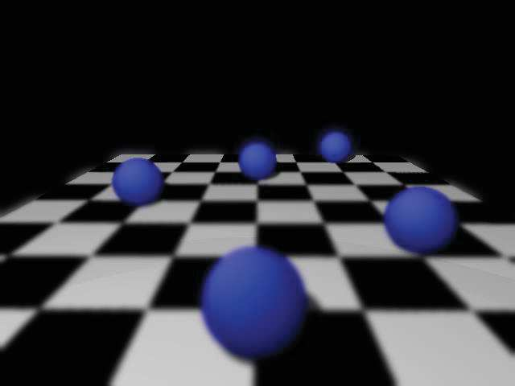
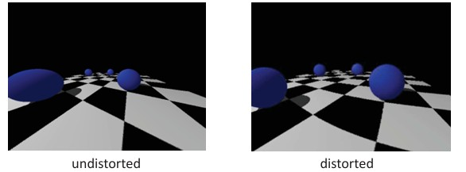
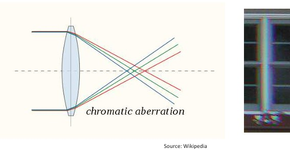
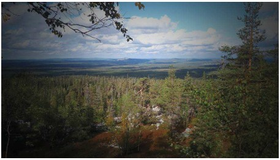

## 6b  Optical & Lens Effects (part 2) s. 22–23

### Depth of field* 23

- **Depth of field (DoF)** = the range of distances that looks acceptably sharp in the image.  
- **Large aperture (small f-number)** → **shallow DoF** (only a thin slice is sharp).  
- **Small aperture (large f-number)** → **deep DoF** (more of the scene is sharp).  
- DoF also changes with **focus distance** (farther focus → deeper DoF) and the **circle of confusion** threshold.

#### Explanation  
Depth of field describes how much of the scene appears in focus around the chosen focus distance. Opening the aperture (small f-number) lets in more light but narrows the sharp zone, creating strong background/foreground blur. Stopping down (large f-number) widens the sharp zone so near and far objects look clearer.

#### Example (from picture)  
- **Left image:** foreground spheres are sharp; background is blurred → **shallow DoF**.  
- **Right image:** focus is farther away; near objects blur while mid/background become sharp.

#### Formula / Diagram (if needed)  
**Hyperfocal distance (when far DoF limit reaches infinity):**  

$$

H=\frac{f^2}{N\,c}+f

$$

**Near / far DoF limits (for focus distance \(u\)):**  

$$

D_{\text{near}}=\frac{H\,u}{H+(u-f)}, \qquad
D_{\text{far}}=\frac{H\,u}{H-(u-f)} \;\; (\text{if } u<H;\ \text{else } \infty)

$$

Where \(f\) = focal length, \(N\) = f-number (aperture), \(c\) = circle of confusion.

---

#### ✅ Takeaway  
*Small f-number → shallow DoF; large f-number → deep DoF.*

#### STOP to think/ponder  
*In your project, do you want to isolate a subject (shallow DoF) or keep the whole scene sharp (deep DoF)? What aperture choice supports that goal?*

Picture 1        | Picture 2  
:-------------------------:|:-------------------------:
  |   
 |  
 |   

###  Lens distortion* 23

- **Wide-angle (short focal length) lenses** often show strong **radial distortion** because they use more of the lens periphery, where projection deviates most from the ideal pinhole model.  
- Distortion bends straight lines (barrel or pincushion) and changes how objects scale with distance from the image center.  
- We can **model and correct** this effect with a simple radial formula.

#### Explanation  
Real lenses do not project points perfectly. The farther a point is from the image center, the more its position is pulled inward or pushed outward. Wide-angle lenses capture a large field of view using the lens edges, so this non-linear “pull/push” is more visible. By estimating a few distortion parameters, we can map distorted image coordinates back to undistorted ones.

#### Example (from picture)  

- **Left:** undistorted view—checkerboard lines remain straight.  
- **Right:** distorted view—lines bow outward (**barrel distortion**), typical for wide-angle lenses.

#### Formula / Diagram (if needed)  
Let $(x_c, y_c)$ be **normalized image coordinates** (after subtracting the principal point and dividing by focal length), $r_c^2 = x_c^2 + y_c^2$. 
Radial distortion (2-term model):

$$

\hat{x}_c = x_c\left(1 + \kappa_1 r_c^2 + \kappa_2 r_c^4\right), \qquad
\hat{y}_c = y_c\left(1 + \kappa_1 r_c^2 + \kappa_2 r_c^4\right),

$$

where $(\hat{x}_c,\hat{y}_c)$ are **distorted** coordinates and $\kappa_1,\kappa_2$ are radial distortion parameters.  
*(Optionally, tangential terms $p_1,p_2$ can be added for decentering/tilt, but are not shown here.)*

---

#### ✅ Takeaway  
*Wide-angle lenses exaggerate radial distortion, but a simple radial model lets us estimate and correct it.*

#### STOP to think/ponder  
*If your system uses a wide-angle camera, how would uncorrected distortion affect tasks like line detection, calibration, or metric measurements?*

### Chromatic aberration 24 

- **Cause:** glass refracts different wavelengths differently (dispersion), so the **focal length depends on color**.  
- **Effects:**  
  - **Longitudinal CA:** colors focus at different distances (blue closer, red farther) → colored halos in front/behind focus.  
  - **Lateral CA:** colors have slightly different magnification off-axis → red/green/blue **fringes** at high-contrast edges.  
- **Mitigation:** **compound lenses** (e.g., achromatic/apochromatic doublets) and **software correction** (per-channel scaling/deconvolution).

#### Explanation  
In a simple lens the refractive index varies with wavelength, so rays of different colors do not meet at the same image point. This shows up as colored fringes and loss of sharpness, especially toward the image edges or at high-contrast boundaries. Lens designers combine elements with different glass dispersions to cancel the color spread, and modern cameras can also correct residual errors digitally.

#### Example (from picture)  
- The ray diagram shows blue, green, and red rays focusing at **different planes** behind the lens (longitudinal CA).  
- The photo crop shows **color fringing** along a bright window edge—typical lateral CA artifact.

#### Formula / Diagram (if needed)  
Thin-lens intuition: the focal length depends on wavelength via the refractive index \(n(\lambda)\):  

$$

f(\lambda) \propto \frac{1}{\,n(\lambda)-1\,}

$$

Since \(n(\lambda)\) decreases with wavelength, \(f_{\text{blue}} < f_{\text{green}} < f_{\text{red}}\) → color-dependent focus/magnification.

---

#### ✅ Takeaway  
*Chromatic aberration is color-dependent focusing/magnification from dispersion; use compound optics or software to reduce it.*

#### STOP to think/ponder  
*In your setup, would chromatic fringes bias feature detection or calibration? Which is more practical for you—better (achromatic) optics or software correction?*

### Vignetting* 24

- **Definition:** brightness falls off toward the image edges (dark corners).  
- **Main causes:**  
  - **Natural fall-off** given by the **cos⁴ law** as the ray angle from the optical axis increases.  
  - **Optical/mechanical shading** from lens elements, hoods, or filters.  
  - **Sensor angular response** (microlenses less efficient at oblique incidence).  
- **When it’s strongest:** wide-angle lenses, large apertures (small f-numbers), thick filter stacks.  
- **Fixes:** per-channel **lens-shading (flat-field) correction** in the ISP/DSP, stop down the aperture, or correct in post.

#### Explanation  
Vignetting happens because light hitting the sensor at oblique angles contributes less illumination and may be partially blocked by the lens mechanics. The result is darker edges even when the scene is evenly lit. Modern cameras estimate this fall-off and compensate digitally so brightness stays uniform across the frame.

#### Example (from picture)  
- The landscape shows **darker corners** compared to the center—classic vignetting.  
- After lens-shading correction, the sky and ground would appear **more even** across the image.

#### Formula / Diagram (if needed)  
**Cos⁴ law of illumination fall-off:**  

$$

E = L \,\frac{\pi}{4}\!\left(\frac{d}{f}\right)^2\!\cos^4\!\alpha

$$

where \(E\) is irradiance on the sensor, \(L\) is scene radiance, \(d\) is aperture diameter, \(f\) is focal length, and $\alpha$ is the off-axis angle.  
*(As \(\alpha\) grows toward the corners, $\cos^4\!\alpha$ drops ⇒ darker edges.)*

---

#### ✅ Takeaway  
*Vignetting = edge darkening; it follows the cos⁴ law and is commonly corrected by lens-shading calibration or by stopping down.*

#### STOP to think/ponder  
*Will brightness fall-off bias your measurements (e.g., thresholding, photometry)? Do you need a flat-field calibration step in your pipeline?*

