## 7  Image Quality & Depth Sensing s. 24–28
### Image noise* 25
* **Shot (Poisson) noise:** photon arrivals are random.

  * Mean = λ, variance = σ² = λ → **SNR = μ/σ = √λ**.
  * Dominant at **low light**; as λ grows, distribution ≈ Gaussian.
* **Quantization noise:** comes from A/D rounding; if step is Δ, variance ≈ **Δ²/12**.
* **Read / electronic noise:** sensor + amplifier noise (often modeled Gaussian).
* **Thermal (dark) noise:** charge generated by heat during exposure; increases with exposure time and temperature.
* **Total noise (independent sources):**

  * **σ²\_total = σ²\_shot + σ²\_read + σ²\_thermal + σ²\_quant**.
* **Denoising:** filters or learned models reduce noise but can blur details; better SNR from **more light** (longer exposure, larger aperture, brighter scene) since SNR for shot noise scales as **√(photons)**.

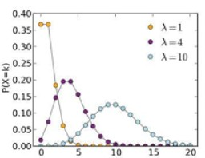
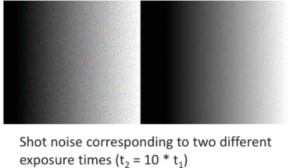

#### Explanation

An image sensor never measures a perfectly clean signal. Even if the scene is constant, the number of photons that hit each pixel fluctuates—this is *shot noise*. Its strength grows with the signal (variance = mean), so at very low light it dominates. Other sources add fixed noise regardless of signal: rounding during digitization (quantization), electronics (read noise), and thermal generation during long exposures. If these noises are independent, their variances add. You can improve SNR by gathering more photons (exposure/aperture/ISO strategy) or by post-processing denoising—each with trade-offs.

**Handy formulas (Markdown/LaTeX ready):**

* Shot noise:
  $\mu=\lambda,\qquad \sigma_{\text{shot}}^2=\lambda,\qquad \text{SNR}=\frac{\mu}{\sigma}=\sqrt{\lambda}$
* Quantization noise (uniform quantizer, step $\Delta$):
  $\sigma_{\text{quant}}^2=\frac{\Delta^2}{12}$
* Combine noises (assumed independent):
  $\sigma_{\text{total}}^2=\sigma_{\text{shot}}^2+\sigma_{\text{read}}^2+\sigma_{\text{thermal}}^2+\sigma_{\text{quant}}^2$

#### Example (from the slide)

Two grayscale ramps with different exposure times: the longer exposure collects \~10× photons → SNR improves by **√10 ≈ 3.16**, so the ramp looks smoother (less grainy).

#### Diagrams (optional, if you want to add)

* Mini plot showing Poisson PMFs for $\lambda=\{1,4,10\}$.
* Side-by-side crops: short vs. long exposure illustrating √(photons) SNR gain.

---

#### ✅ Takeaway

*More photons = better SNR: shot-noise-limited images improve with exposure; other noises set a floor that denoising can only partially reduce.*

#### Stop & Ponder

In your project, are you noise-limited by photons (shot noise) or by the camera (read/thermal/quantization)? Which is cheaper: change capture settings to get more light, or rely on denoising?

### Color transformations 25
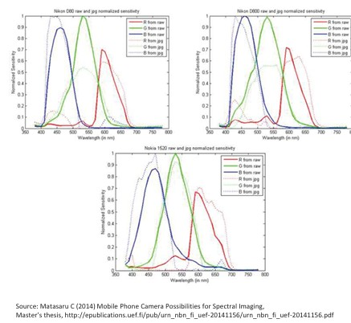

* Camera sensors differ in their **spectral sensitivities** — their “R, G, B” filters don’t match exactly across brands or models.
* To make colors consistent, the raw sensor RGB values are **converted to a standard color space** like **sRGB**, which your screen also expects.
* For storage efficiency, **JPEG** doesn’t keep colors in RGB. Instead, it uses **YCbCr color space**, separating brightness (Y) from color difference signals (Cb, Cr), since the eye is more sensitive to brightness than color detail.

---

#### Explanation

Each camera sees color slightly differently, because its red, green, and blue filters overlap in unique ways (see the plots on the right). To make sure photos look the same across devices, a mathematical transformation maps the sensor’s native RGB to a standard space like sRGB. Additionally, when compressing images (e.g., JPEG), colors are converted again into YCbCr, where the brightness channel is stored in higher detail than the color channels—this allows efficient compression with little visible quality loss.

---

#### Example (from the slide)

The graphs show the spectral sensitivity curves of different cameras. Notice that the “red,” “green,” and “blue” curves are not the same for every device. That’s why transformations are needed before the image can be displayed consistently.

---

#### ✅ Takeaway

*Every camera sees colors differently. Standard color spaces like sRGB ensure your photo looks the same on all devices.*

#### Stop & Ponder

If two cameras capture the same scene but have different spectral sensitivities, how might their images look different before color correction?

### White balance* 26
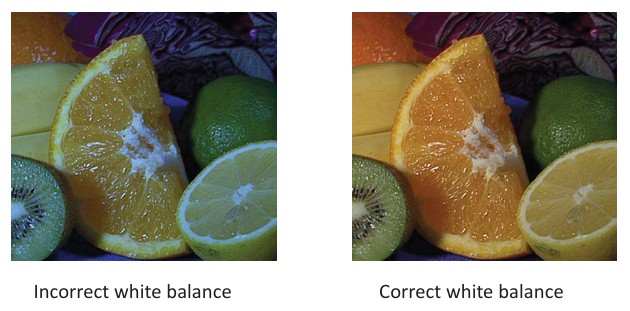

* The **color we perceive** depends on both the object’s surface and the light source spectrum.
* **White balance** (or color balance) adjusts the image so that colors appear as they should, making whites look truly white and all other colors natural.
* Without correction, images may look too blue, yellow, or green depending on the lighting conditions.

---

#### Explanation

Different light sources (sunlight, fluorescent bulbs, LED lamps) emit light with different color temperatures. Our eyes automatically adjust, but cameras don’t. White balance is the camera’s way of compensating for lighting so that the colors in the scene appear accurate. For example, a white sheet of paper should look white whether photographed under the sun or in a room lit by warm incandescent bulbs.

---

#### Example (from the slide)

* On the **left**, incorrect white balance makes the orange fruit appear bluish.
* On the **right**, correct white balance restores the natural orange and green colors, making the image look realistic.

---

#### ✅ Takeaway

*White balance ensures that colors in an image look natural under different lighting conditions.*

#### Stop & Ponder

Have you ever noticed your photos looking too blue indoors or too orange outdoors? How might proper white balance adjustment fix that?

###  Gamma pre-correction* 26
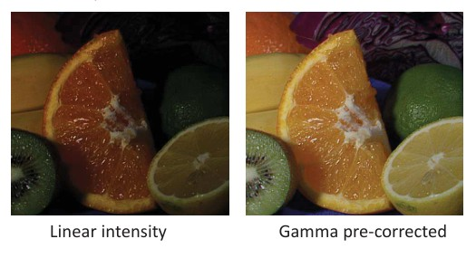
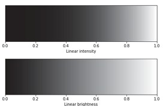

* Human eyes do not perceive brightness on a linear scale.
* Camera sensors capture light linearly, but this raw signal looks unnatural to us.
* To correct for human vision, a **gamma pre-correction** is applied:

$I_\text{corrected} = I_\text{linear}^{\gamma}$

where typically $\gamma \approx 0.45$.

---

#### Explanation

Imagine you double the light falling on a sensor. The sensor records exactly double the intensity. But to our eyes, the brightness does not appear to double—it increases less noticeably. To match how we see, cameras and displays use gamma correction. This compresses the intensity values so dark regions are brightened and highlights are controlled, making the image appear more natural to humans.

---

#### Example (from the slide)

* The **left image** shows linear intensity from the sensor: colors appear too dark and unnatural.
* The **right image** shows gamma-corrected intensity: the fruit looks more like how we see it in real life.

The grayscale bars (top) also illustrate this: linear intensity looks uneven, while gamma correction spreads the tones in a way that fits human perception.

---

#### ✅ Takeaway

*Gamma correction adjusts sensor data to match how human eyes perceive brightness.*

#### Stop & Ponder

Why do you think almost all cameras, TVs, and monitors apply gamma correction by default? What would images look like if they didn’t?

### Another representation: depth* 27
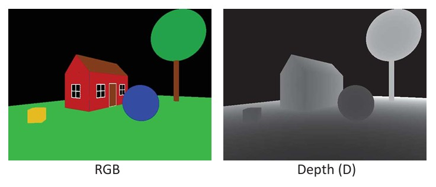

* Depth cameras can capture not just color (RGB) but also **distance information**.
* They produce **depth images** or combined **RGB-D images**.
* In an RGB-D image:

  * The RGB channels show the color.
  * The D channel shows how far each point in the scene is from the camera.

---

#### Explanation

Ordinary cameras only record color. Depth cameras (like Microsoft Kinect or LiDAR-based sensors) also measure how far objects are from the camera. This creates a "depth map," where each pixel stores distance instead of color. By combining both, an RGB-D image provides much richer information, useful for 3D modeling, robotics, and augmented reality.

---

#### Example (from the slide)

* **Left image (RGB):** shows normal color view of a house, tree, and objects.
* **Right image (Depth):** brighter areas are closer to the camera, darker areas are farther away. The cube appears light gray (close), while the tree is dark (far).

---

#### ✅ Takeaway

*Depth images add distance information to color images, enabling 3D perception.*

#### Stop & Ponder

How could combining RGB and depth images help a robot better understand and navigate its environment?

### Triangulation 
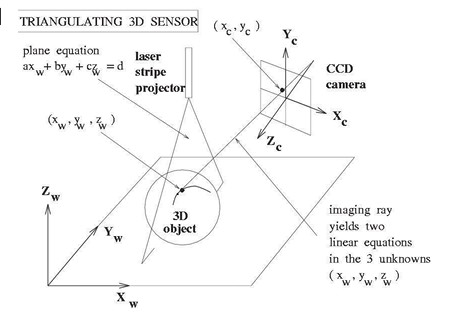
* **Purpose:** Used to measure depth or 3D shape of objects.
* **Method:** A plane of light (or laser stripe) is projected onto the object’s surface. The bright line it creates is captured by a camera.
* **3D Coordinates:** Computed from the image points and the known geometry of the system (camera + projector setup).
* **Scanning:** Moving mirrors can sweep the light across the whole scene to capture more detail.
* **Flexibility:** Many variations of triangulation exist.

---

#### Explanation

Triangulation works by forming a triangle between the projector, the object, and the camera. By knowing the geometry of the setup (e.g., angles and distances) and observing where the projected light appears in the camera image, the exact 3D position of points on the object can be calculated. This technique is widely used in 3D scanners to build digital models of real-world objects.

---

#### Example (from the slide)

* The **laser stripe projector** sends out a plane of light.
* The **camera** observes how this stripe bends over the object’s surface.
* Geometry equations are then solved to recover the 3D coordinates.

---

#### ✅ Takeaway

*Triangulation converts a 2D camera view and known geometry into precise 3D shape information.*

#### Stop & Ponder

Where could triangulation-based scanning be more useful: in industrial quality control, or in autonomous vehicles? Why?

### Kinect 28
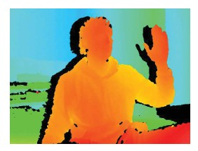
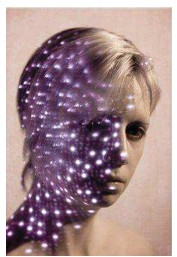
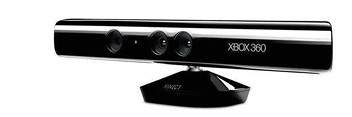

* **Projection:** Projects a known pseudo-random speckle pattern in near-infrared (NIR) light.
* **Camera:** A CMOS IR camera records how this pattern appears on the scene.
* **Calibration:** The system is pre-calibrated between projector and camera, so their geometry is known.
* **Depth calculation:** Triangulation is done by comparing each observed speckle with its reference position in the projected pattern.
* **Result:** Produces a dense depth map of the scene.

---

#### Explanation

The Kinect works like a structured-light 3D scanner. Instead of scanning a single stripe like in classic triangulation, it projects thousands of infrared dots at once. The IR camera sees how these dots are shifted on objects, and triangulation turns this shift into depth information. This enables Kinect to capture the full 3D shape of a scene in real time, which is why it became popular for gaming and gesture recognition.

---

#### Example (from the slide)

* Top-right: a projected infrared dot pattern on a face.
* Bottom-right: the resulting dense depth map, where colors represent distances.
* Bottom: the actual Kinect device, combining projector + IR camera.

---

#### ✅ Takeaway

*Kinect uses infrared speckle projection and triangulation to capture a full 3D depth map in real time.*

#### Stop & Ponder

How might Kinect’s dense depth maps be useful outside gaming—such as in robotics or healthcare?

### LIDAR 28
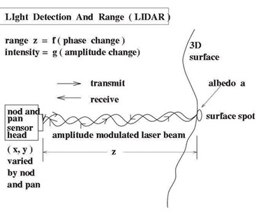

* **Definition:** LIDAR (Light Detection And Range) measures the distance (depth) to points on a 3D surface.
* **How it works:**

  * A laser beam (amplitude modulated) is transmitted to a spot on the surface.
  * The reflected signal is captured by the sensor.
* **Distance measurement:** Based on the change in phase between the transmitted and received signals.
* **Limitation:** Mechanical steering of the laser beam makes traditional LIDAR relatively slow.

---

#### Explanation

LIDAR is like a laser ruler that measures how far away objects are. It sends out laser pulses, waits for them to bounce back, and measures the phase shift to calculate distance. By scanning across many directions, LIDAR builds a full 3D map of the environment. It’s widely used in autonomous vehicles, drones, and mapping. The main drawback is speed, since the laser beam is mechanically steered across the scene, although newer solid-state versions are much faster.

---

#### Example (from the slide)

* The diagram shows how a laser beam is transmitted, reflected from a surface, and received back at the sensor.
* The phase shift encodes the distance (range).
* Intensity variations (amplitude changes) give extra information about surface reflectivity.

---

#### ✅ Takeaway

*LIDAR measures distance by comparing the phase of transmitted and reflected laser signals, creating precise 3D maps.*

#### Stop & Ponder

Why do you think autonomous vehicles often combine LIDAR with cameras and radar, instead of using only one sensor type?

### Time-of-flight cameras 29

* **Scannerless LIDAR** – no moving mirrors or mechanical scanning.
* Measures the **time it takes** for light to travel from the camera to the object and back.
* Calculates depth for every pixel at once, producing a **full 3D image**.
* **Fast acquisition** – captures depth in real time.

---

#### Explanation

Time-of-flight (ToF) cameras work like a stopwatch for light. They send out light pulses (or continuous modulated light) and measure how long it takes for the light to return from each point in the scene. Because the speed of light is constant, this time directly gives the distance. Unlike mechanical LIDAR, ToF cameras capture the whole scene instantly, making them well-suited for applications like gaming (Xbox Kinect), gesture recognition, robotics, and AR/VR.

---

#### Example (from the slide)

* **SwissRanger SR4000** and **Kinect for Xbox One** are examples of ToF cameras.
* The images show:

  * **Intensity image**: like a normal grayscale picture.
  * **Range image**: depth information, with colors showing distance.
* Diagrams show two methods: **pulse runtime** (time measurement) and **continuous wave** (phase shift measurement).

---

#### ✅ Takeaway

*Time-of-flight cameras measure distance for every pixel at once, giving fast and complete 3D depth maps without moving parts.*

#### Stop & Ponder

What kinds of applications benefit most from real-time 3D capture, and why would ToF be chosen over traditional LIDAR?

