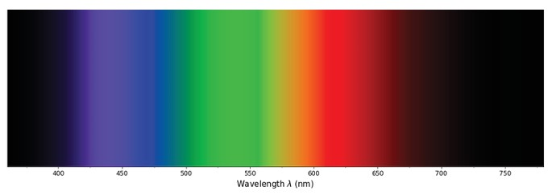
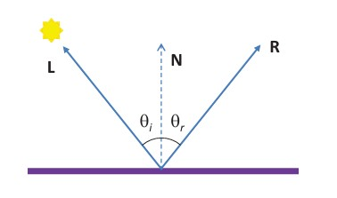
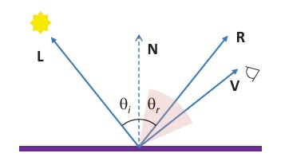
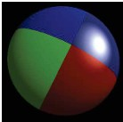
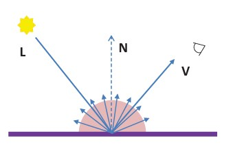

## 8  Light Physics s. 29–31

### Light 30

* Light is a form of **electromagnetic radiation**, just like radio waves, microwaves, or X-rays.
* The **visible light spectrum** is the narrow band our eyes can detect.
* Humans can see wavelengths from about **360 nm (violet)** to **780 nm (red)**.

---

#### Explanation

Light is energy that travels as electromagnetic waves. While the electromagnetic spectrum is huge (from very long radio waves to very short gamma rays), the human eye can only detect a small portion called **visible light**. This range corresponds to the colors we perceive: violet at the short-wavelength end, then blue, green, yellow, orange, and red at the long-wavelength end. Cameras and computer vision systems often mimic this sensitivity, but some can also capture non-visible wavelengths (infrared, ultraviolet).

---

#### Example (from the slide)

* The figure shows the visible spectrum, with wavelengths marked in nanometers.
* **Short wavelengths (\~400 nm)** look violet/blue.
* **Middle wavelengths (\~500–600 nm)** look green/yellow.
* **Long wavelengths (\~700 nm)** look orange/red.

---

#### ✅ Takeaway

*Visible light is just a small slice of the electromagnetic spectrum, ranging from about 360–780 nm.*

#### Stop & Ponder

How might cameras that detect light beyond the visible spectrum (like infrared) be useful in real-world applications?

### Light sources 30

* **Two types of light sources**:

  * **Illuminating sources**: emit their own electromagnetic waves (e.g., sun, bulbs).
  * **Reflecting sources**: reflect incident light (e.g., dyes, paints).

* **Illuminating sources**

  * The perceived color depends on the wavelengths they emit.
  * **Additive rule**: colors combine by adding their emitted spectra.
  * Examples: sunlight, light bulbs, TV or computer monitors.

* **Reflecting sources**

  * The perceived color depends on which wavelengths are absorbed and which are reflected.
  * **Subtractive rule**: mixing reflectors subtracts wavelengths; the color we see comes from what is left unabsorbed.
  * Examples: pigments, dyes, and paints.

---

#### Explanation

Light can either come directly from a source (like the sun or a lamp) or be reflected off an object (like paint or fabric). Illuminating sources add light together — the more wavelengths they emit, the whiter the light. Reflecting sources subtract — they absorb certain wavelengths, and the remaining ones define the visible color. That’s why mixing paints works differently than mixing colored lights.

---

#### Example (from the slide)

* **Illuminating**: A TV screen emits red, green, and blue light, and our eyes add them to perceive different colors.
* **Reflecting**: A red apple looks red because it reflects red wavelengths and absorbs most others.

---

#### ✅ Takeaway

*Light can come from sources that emit (additive) or reflect (subtractive), and this explains why mixing lights and mixing paints behave so differently.*

#### Stop & Ponder

Why do stage lights mix to white when all colors are combined, but mixed paints turn dark or muddy?

### Reflection, Transmission, and Absorption 30

* **Three ways light interacts with matter**:

  1. **Reflection** – light bounces off the surface of an object.
  2. **Transmission** – light passes through the material.
  3. **Absorption** – light energy is taken in and usually converted into heat.

* **Scattering (diffusion)**: In both reflection and transmission, light may scatter in many directions instead of following a straight path.

---

#### Explanation

When light meets an object, it can either bounce back (reflection), go through (transmission), or be absorbed and turned into another form of energy, such as heat. For example, a mirror reflects light, glass transmits it, and dark clothing absorbs it (making you feel warm in the sun). Reflection and transmission are not always perfect—light often scatters, creating effects like frosted glass or matte surfaces.

---

#### Example (real-world)

* Reflection: You see yourself in a mirror.
* Transmission: Sunlight passes through a window.
* Absorption: A black car heats up in summer sun.
* Scattering: Fog scatters car headlights in many directions.

---

#### ✅ Takeaway

*Light can bounce, pass through, or be absorbed—and scattering makes these processes less “perfect.”*

#### Stop & Ponder

Why do we use frosted glass for bathroom windows instead of clear glass?

### Specular reflection 31

* **Law of Reflection**:

  * The *light vector* **L**, the *reflection vector* **R**, and the *surface normal* **N** all lie in the same plane.
  * The **angle of reflection** (θᵣ) equals the **angle of incidence** (θᵢ).

* **Surface type**: Occurs on smooth surfaces such as polished metal or mirrors.

* **Name**: Called **specular reflection** (or regular reflection).

* **Reflectance**: Ratio of reflected radiant power to incident radiant power.

---

#### Explanation

Specular reflection is the type of reflection you see in mirrors or calm water surfaces. The rule is simple: the angle at which light hits the surface equals the angle at which it bounces off. Because the surface is smooth, the light rays stay organized, forming a clear reflection. Reflectance tells us how much of the incoming light is reflected compared to how much arrives.

---

#### Example (from diagram)

* Light ray **L** hits the surface.
* **N** is the perpendicular (normal) to the surface.
* The outgoing ray **R** leaves at the same angle θᵢ = θᵣ.
* This explains why a mirror reflects your face clearly rather than scattering it.

---

#### ✅ Takeaway

*In specular reflection, the angle in equals the angle out—perfect for smooth, shiny surfaces.*

#### Stop & Ponder

Why can you see yourself in a mirror but not in a rough wall, even though both reflect light?

### Specular reflection  (Shiny Highlights) 32

* **Polished surfaces** create bright reflections called *specular highlights*.
* Reflected light leaves the surface in a **tight cone** around the reflection direction.
* The reflected energy has the **same wavelength composition** as the incoming light (so the highlight color depends on the light source, not the surface).
* Intensity of reflection can be modeled with:

$I_s = k_s ( \mathbf{R} \cdot \mathbf{V} )^s I_L$

where:

* $k_s$: specular reflectance (how reflective the surface is)
* $s$: shininess (higher values = tighter highlight)
* $\mathbf{R}$: reflection vector
* $\mathbf{V}$: view vector (towards the observer)
* $I_L$: light source intensity

---

#### Explanation

Specular reflection explains why shiny objects like polished metal, glass, or a glossy ball have bright “shiny spots.” These highlights depend on the viewing angle and light direction. The color of the highlight usually comes from the **light source** (e.g., a white lamp produces a white spot on a red ball).

---

#### Example (with diagram)

* On the sphere image, the colored patches appear glossy with bright white spots (highlights).
* These highlights move as the light or observer moves, unlike diffuse reflection which stays constant.

---

#### ✅ Takeaway

*Specular reflection creates shiny highlights that depend on both the light source and the viewing angle.*

#### Stop & Ponder

Why do glossy photos show a white “glare” spot, even if the object itself is colored?

### Diffuse reflection 32

* In **diffuse reflection**, light scatters in many directions due to irregularities inside the material.
* Typical of **rough, non-metallic surfaces** (e.g., paper, cloth, matte paint).
* A common model is **Lambertian reflectance**, where light is reflected **equally in all directions** of a hemisphere centered at the surface.
* The **albedo** of a surface is the ratio of total reflected illumination to total received illumination (a measure of reflectivity).

---

#### Explanation

Unlike shiny surfaces (specular), rough materials scatter light so that the brightness looks the same from all viewing angles. This makes diffuse reflection very important in computer vision because it allows for consistent appearance regardless of viewpoint. Albedo gives a numerical measure of how reflective the surface is overall.

---

#### Example (diagram connection)

* In the figure, light $L$ hits the surface, and the scattered rays go out evenly across the hemisphere.
* No bright highlight appears (unlike specular reflection).
* The viewer $V$ sees the same brightness no matter where they stand.

---

#### ✅ Takeaway

*Diffuse reflection spreads light evenly, making surfaces look the same brightness from any viewpoint.*

#### Stop & Ponder

Why are matte-painted objects easier to photograph than glossy ones?

---

(to be added **Lambert’s cosine law formula** to show brightness depends on the angle of incoming light, not the viewer)

