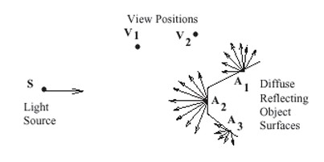
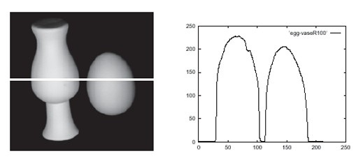

## 9a  Shading & Human Vision (part 1) s. 32–34
### Radiation from one light source 33

* Consider a **single point light source** far away from the surface.
* The intensity of light received by a surface element is proportional to the dot product:

  $$

  N \cdot L
  $$

  where **N** is the surface normal and **L** is the light direction.
* A simple model for diffuse reflection intensity is:

$$
I_d = k_d (N \cdot L) I_L
$$

where $k_d$ approximates the **albedo** (reflectivity) and $I_L$ is the light source intensity.

* Key question: *How does brightness differ at points $A_1, A_2, A_3$ when observed from viewpoints $V_1$ and $V_2$?*

---

#### Explanation

This model is based on **Lambert’s cosine law**: brightness depends only on the angle between the light source and the surface normal, not on the viewer’s position.
That means points $A_1, A_2, A_3$ will have different brightness depending on their orientation relative to the light source, but their appearance will be the same from **any viewpoint**.

---

#### Example (diagram connection)

* The diagram shows a light source $S$ shining on points $A_1, A_2, A_3$.
* From both $V_1$ and $V_2$, the brightness of each point depends only on $N \cdot L$, not the viewing angle.
* This explains why diffuse surfaces look equally bright no matter where you stand.

---

#### ✅ Takeaway

*For diffuse reflection, brightness depends on the light direction, not the viewing direction.*

#### Stop & Ponder

Why do matte-painted objects keep their brightness consistent from all angles, while glossy objects don’t?

---

### Diffuse reflection: example 33

* The image shows **Lambertian objects** (a vase and an egg-like shape).
* Diffuse reflection means that brightness is determined only by the angle between the light and the surface normal, not the viewing direction.
* The graph shows the **intensity values across the highlighted horizontal row** in the image.
* Notice how the brightness rises and falls smoothly depending on the object’s shape and orientation relative to the light.

---

#### Explanation

In Lambertian reflection, each point on the surface reflects light equally in all directions. The intensity curve on the right confirms this: bright regions correspond to areas where the surface faces the light more directly, while dark regions correspond to surfaces turned away from the light.

---

#### Example (diagram connection)

* The highlighted white line across the vase and egg indicates where the intensity values were sampled.
* On the graph, two peaks match the two illuminated surfaces: the left peak is the vase’s side, and the right peak is the egg.
* The dip between them corresponds to the shadowed gap.

---

#### ✅ Takeaway

*Lambertian (diffuse) reflection produces brightness patterns that directly follow the surface orientation to the light.*

#### Stop & Ponder

If diffuse reflection looks the same from all viewpoints, why do the **shadows and object shapes** still appear three-dimensional to us?

### Viewing colored objects 34

* **Diffuse (Lambertian) reflection**

  * The reflected color depends on both the **illumination** (light source color) and the **surface properties**.
  * Example: a clay pot appears reddish because it reflects mostly red light.

* **Specular reflection**

  * On **dielectric (non-metallic) surfaces**, highlights (shiny spots) take on the **color of the light source**.
  * On **metallic surfaces**, highlights instead appear in the **color of the metal** itself.
  * Example: a polished metal pot reflects as silver, while a red pepper’s shiny spot looks white (same as the light source).

---

#### Explanation

When we look at objects, we see a **mix of diffuse and specular components**. The diffuse component gives the object its “intrinsic color” (like red clay or green leaves), while specular reflections add highlights that depend either on the light source color (dielectrics) or on the material’s own color (metals).

---

#### Example (images)

* Left: a **clay pot** shows diffuse reflection, its red color comes from the surface absorbing other wavelengths.
* Middle: a **metal pot** shows specular reflection, the highlight is silvery like the metal itself.
* Right: vegetables show both—diffuse colors from the surface plus specular highlights from the light source.

---

#### ✅ Takeaway

*Object color comes from a combination of diffuse reflection (surface + illumination) and specular reflection (light source or metal).*

#### Stop & Ponder

Why do metallic surfaces look so different from plastics, even if both are shiny?

---

### Combinations 34

* A complete reflection model usually combines **diffuse** and **specular** reflections.
* In real scenes, there are often **multiple light sources** and many surfaces reflecting light back and forth.

  * Tracking every reflection is too complex, so we use the concept of **ambient light**.
* **Ambient light**: background illumination present everywhere, caused by multiple light sources and interreflections.
* The intensity of ambient reflection can be approximated as:

$I_a = k_a I_L$

where:

* $k_a$ = **ambient reflection coefficient**

* $I_L$ = intensity of the incoming light

* Some objects not only reflect light but also **emit light** with intensity $I_e$.

---

#### Explanation

To realistically simulate how objects appear, we can’t just model direct reflections from a single light. Light bounces around a scene in complex ways. To simplify, we assume an **ambient term** that adds a base level of illumination everywhere. This helps avoid completely black shadows and makes scenes look more natural.

---

#### Example (conceptual)

* A room with several lamps: even corners not directly lit still appear dimly visible because of **ambient light**.
* A computer screen or lamp is an example of an object that **emits** light ($I_e$) in addition to reflecting.

---

#### ✅ Takeaway

*Realistic lighting combines direct (diffuse + specular) reflections with ambient and sometimes emitted light.*

#### Stop & Ponder

Why do 3D graphics models almost always include an ambient light term, even though it’s a simplification of reality?

---

There is **“connection to computer graphics”** (Lambert, Phong, ambient, etc.), this forms the basis of rendering models.

