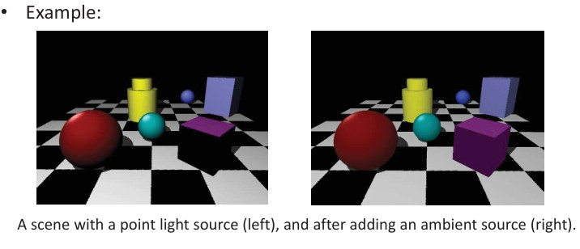
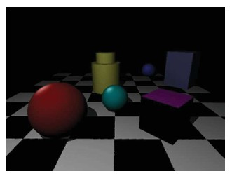
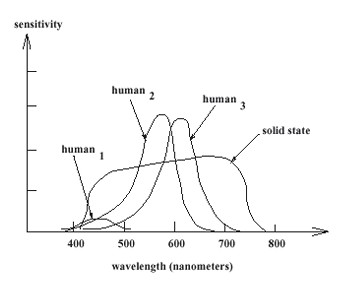

## 9b  Shading & Human Vision (part 2) s. 35–37
### Shading \* 35

* **Shading**: technique used to show depth in 3D models or drawings by using different levels of light and darkness.
* One common method is the **Phong shading model**, which combines:

  * **Emission** ($I_e$) → light emitted by the object itself
  * **Ambient reflection** ($I_a$) → background illumination
  * **Diffuse reflection** ($I_d$) → light scattered in all directions (Lambertian)
  * **Specular reflection** ($I_s$) → sharp highlights from shiny surfaces

The formula is:

$$
I = I_e + I_a + I_d + I_s
$$

Or written in detail:

$$
I = I_e + (k_a + k_d \, \max(0, \mathbf{N}\cdot \mathbf{L})) I_L + k_s (\mathbf{R}\cdot \mathbf{V})^s I_L
$$

where:

* $k_a, k_d, k_s$ = material coefficients (ambient, diffuse, specular)
* $\mathbf{N}$ = surface normal
* $\mathbf{L}$ = light direction
* $\mathbf{R}$ = reflection vector
* $\mathbf{V}$ = view direction
* $s$ = shininess factor

---

#### Explanation

Shading brings realism into 3D scenes. The Phong model is widely used in graphics because it’s simple but captures three key light effects: ambient background glow, matte diffuse reflection, and shiny specular highlights. This makes objects look more three-dimensional and realistic.

---

#### Example

* Left image: only a **point light source** → strong shadows and dark regions.
* Right image: **ambient light added** → darker areas brighten, making details visible.

---

#### ✅ Takeaway

*Shading combines different light effects (ambient, diffuse, specular) to give 3D objects realistic depth and appearance.*

#### Stop & Ponder

Why is it important to add an **ambient term** in rendering models, even if it doesn’t exist in reality?

---

compare Lambert, Phong, and Blinn-Phong models, to see how shading approaches evolved.

### Darkening with distance \* 35

* Light intensity **decreases with distance**: the further an object is from the light source, the less light it receives.
* This follows the **inverse-square law**: intensity falls off with the square of the distance.
* In shading models, the diffuse and specular terms are scaled as:

$$
\frac{I_d + I_s}{d^2}
$$

where $d$ = distance to the light source.

---

#### Explanation

In real-world lighting, objects farther from a lamp look darker because the light spreads out as it travels. Computer graphics mimic this by dividing light contributions by the square of the distance. This makes scenes look much more realistic than if all objects received the same light, no matter how far they are.

---

#### Example

* Near objects (like the red sphere) appear bright.
* Farther objects (like the purple cube in the back) appear dim because less light reaches them.

---

#### ✅ Takeaway

*Light intensity decreases rapidly with distance: double the distance, quarter the brightness.*

#### Stop & Ponder

How might this principle affect **photography indoors** versus **outdoors in sunlight**?

---
todo: **mini-summary of light attenuation laws** (inverse-square, linear, exponential in fog) later on to see the variations used in graphics.

### What is color? 36

* **Color** is a characteristic of visual perception.

* It has **three main attributes**:

  * **Brightness** – how light or dark the color appears
  * **Hue** – what we call the color (red, green, blue, etc.)
  * **Saturation** – how vivid or dull the color looks

* **Perceived color depends on**:

  * The **spectral distribution** of the light stimulus
  * The **size, shape, and surroundings** of the colored area
  * The **adaptation state** of the observer’s eyes (e.g., coming from bright sunlight into a dim room)
  * The observer’s **experience and context** (previous situations and expectations)

* **Color perception varies across individuals**

  * To standardize, a **“standard observer”** is defined to represent the average human response.

---

#### Explanation

Color is not just a property of objects—it’s a combination of physical light wavelengths and how our visual system interprets them. The same stimulus can look slightly different to different people or under different conditions. That’s why industries like imaging, printing, and displays rely on standardized models of the “average human observer.”

---

#### ✅ Takeaway

*Color is both a physical property of light and a perceptual experience shaped by the observer.*

#### Stop & Ponder

Why do two people sometimes disagree on whether a shirt is “blue” or “green”? How might this matter in **computer vision or design applications**?

---

todo: **illustrate the three attributes (hue, saturation, brightness) with a simple diagram** 

### Why specify color *numerically* ? 36

* **Accurate color reproduction is valuable**

  * Many brands rely on exact colors for identity (e.g., McDonald’s “golden arches”).

* **Color names are limited and subjective**

  * English recognizes only a few common names (white, black, red, blue, etc.).
  * Each has **many shades** that are hard to describe with words alone.
  * Other languages may have **more or fewer categories**.
  * People often **disagree on naming colors** (e.g., teal vs. blue vs. green).

* **Digital imaging makes the problem larger**

  * Libraries of art, online images, and digital media require precise reproduction.
  * The challenge: *How do we ensure everyone sees the same color?*

---

#### Explanation

Human language is too imprecise for consistent color communication. While one person calls a color “blue,” another may call the same shade “greenish.” Commercial industries and digital systems solve this by specifying colors *numerically* (e.g., RGB, HEX, or CIE Lab values), which removes ambiguity.

---

#### ✅ Takeaway

*Numerical color definitions ensure consistent reproduction across people, devices, and industries.*

#### Stop & Ponder

How might **miscommunication in color** affect industries like fashion, printing, or online shopping?

---

todo: **visual example of color specification systems** (like RGB cube vs. HEX codes vs. CIE Lab)

### Human photoreceptors 37

* **Rods**: detect intensity (light/dark, night vision).
* **Cones**: detect color (responsible for color vision).
* **Fovea**: a tiny central region (≈1–2° of visual angle) packed with cones but no rods.

  * Provides the sharpest vision and best color sensitivity.
* **Peripheral vision**: fewer cones and more rods → better motion/light detection but poorer detail and color.

---

#### Explanation

Our eyes contain two main types of photoreceptors: rods and cones. Cones allow us to see color and fine details, especially in the fovea, the small central part of the retina. Rods are more sensitive to low light but only give grayscale information. That’s why your night vision is mostly black-and-white and why colors fade in dim lighting. Peripheral vision relies heavily on rods, so it detects motion well but has low detail.

---

#### Example

The chart shows how **cones peak in the fovea** while **rods dominate in the periphery**. The blind spot (optic disk) has no receptors at all.

---

#### ✅ Takeaway

*Cones = color & detail (center vision), rods = light sensitivity (periphery).*

#### Stop & Ponder

Why do you think **stars at night** are easier to see when you look slightly to the side instead of directly at them?

---

a **student exercise question** , compare vision in daylight vs. nighttime.

### Two types of light-sensitive receptors 37

* **Cones**

  * Cone-shaped
  * Less sensitive to low light
  * Operate in bright light
  * Enable **color vision**

* **Rods**

  * Rod-shaped
  * Highly sensitive to light
  * Operate mainly at night (low-light conditions)
  * Provide **grayscale vision** (no color)

---

#### Explanation

The human retina contains two main receptor types: **cones** and **rods**.

* **Cones** are responsible for sharp, detailed **color vision**, but they only work well in daylight or bright conditions.
* **Rods** are far more sensitive to dim light, letting us see in the dark, but they only detect shades of gray.

This is why in darkness we lose color perception — only rods are active.

---

#### Example

In the diagram:

* Left: a cone (for color vision in bright light).
* Right: a rod (for night/low-light grayscale vision).

---

#### ✅ Takeaway

*Cones let us see colors in bright light; rods let us see in dim light but without color.*

#### Stop & Ponder

Why do you think **colors disappear at night** while shapes and brightness are still visible?

---

### Sensitivity of receptors 38

* **Receptors respond selectively** to certain wavelengths; some are more sensitive than others.
* **Three types of cones** in the human eye (often labeled *human₁–human₃*):

  * **Short-wavelength cones (S-cones):** sensitive to **blue**
  * **Medium-wavelength cones (M-cones):** sensitive to **green**
  * **Long-wavelength cones (L-cones):** sensitive to **red**
* The **brain fuses signals** from nearby cones to produce the perception of continuous color.
* Only **three receptor types** are needed to perceive the entire visible spectrum.
* **Solid-state sensors** (like camera chips) can extend sensitivity beyond human vision, e.g. into the infrared.

---

#### Explanation

Human color vision is **trichromatic**: we don’t have a receptor for every wavelength, but instead combine inputs from just three cone types. This is why we can reproduce colors with mixtures of red, green, and blue light.

In contrast, **cameras** or other sensors may detect wavelengths outside human vision — useful in night vision or remote sensing.

---

#### Example

In the graph:

* Human₁, Human₂, Human₃ = sensitivities of blue, green, and red cones.
* “Solid state” = typical camera sensor response curve, extending into the infrared.

---

#### ✅ Takeaway

*Our eyes only need three cone types to perceive millions of colors, but artificial sensors can detect beyond our natural limits.*

---

#### Stop & Ponder

If **only three receptor types** are needed for full color perception, why do you think adding a **fourth (or more) spectral sensor** in a camera (e.g. for infrared) is still valuable?

### Trichromatic theory 38

* Human eyes have **three types of cones**: sensitive to **red**, **green**, and **blue** light.
* **Trichromatic theory**: nearly all perceivable colors can be produced by mixing three suitably chosen **primary colors**.
* Let $C_k$ ($k = 1,2,3$) represent the primary colors, and let a given test color be $C$.

$$
C = \sum_{k=1}^{3} T_k C_k
$$

* Here, $T_k$ are the **amounts (weights)** of the primary colors, called **tristimulus values**.
* The **color matching problem**: given the primaries and a target color $C$, determine the tristimulus values $T_k$.

---

#### Explanation

Our visual system reduces the complexity of light spectra into just three signals (from the three cone types). This is why displays use **RGB primaries** to reproduce a wide range of colors — they exploit trichromatic vision.

Mathematically, any visible color can be described as a **linear combination** of three primaries, with weights given by the tristimulus values.

---

#### Example

* A **yellow** color on a screen is created by combining red and green light with appropriate tristimulus values, even though there is no “yellow wavelength” being emitted.
* The brain interprets the weighted mixture as yellow.

---

#### ✅ Takeaway

*Color perception can be mathematically reduced to three values (tristimulus values), making it possible to reproduce colors consistently in displays and imaging systems.*

---

#### Stop & Ponder

If most colors can be reproduced by **three primaries**, why do some printing systems (like CMYK) or cameras (with extra sensors beyond RGB) use **four or more channels**?

