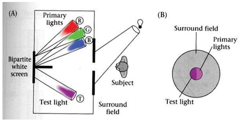
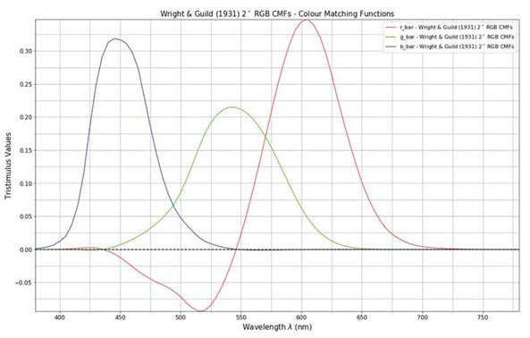
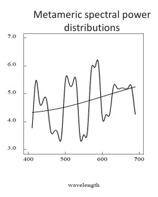
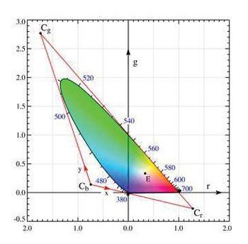

## 10a  Color Models & Matching (part 1) s. 38–40

###  Color matching experiments 39

* **Goal**: determine what **different spectral radiances** (light spectra) can produce the **same visual response** in human observers.

---

#### Experiment Setup

* A **bipartite white screen** is shown to the observer:

  * One side shows a **test light** of unknown spectrum.
  * The other side shows a mixture of **primary lights** (commonly red, green, blue).
* The observer **adjusts the weights (intensities)** of the primaries until the two sides **appear identical**.

---

#### Key Assumptions

* Viewing conditions are **simple**: the test light alone determines perception.
* Surrounding context, adaptation effects, and complex visual scenes are **ignored** for the experiment.

---

#### Outcome

* If the observer can match the test light with a combination of three primaries, then the test light is represented as a **linear combination of tristimulus values**.
* This forms the basis of **colorimetry** and explains why **different spectra** can look the same (metamerism).

---

#### ✅ Takeaway

*Color matching experiments provide the foundation for the mathematical description of color perception (tristimulus theory). They show that perception depends on cone responses, not on the exact physical spectrum.*

---

#### Stop & Ponder

If two lights look identical to us but have **different spectra** (metamers), how might that affect applications like **machine vision** or **medical imaging**, where physical accuracy of the spectrum may matter more than human perception?

### CIE RGB Color Matching Functions 39

* **CIE (Commission Internationale de l’Éclairage)** defined a standard **RGB color space** based on experimental **color matching data**.
* This system specifies how mixtures of three **monochromatic primaries** can reproduce any perceived color.

---

#### Monochromatic Primaries

* The chosen primaries were:

  * **435.8 nm (blue)**
  * **546.1 nm (green)**
  * **700 nm (red)**

---

#### Color Matching Functions

* The graph shows **tristimulus values** (amounts of R, G, B primaries) needed to match a monochromatic test light at each wavelength.

* Each curve corresponds to a **matching function**:

  * $\overline{r}(\lambda)$ for red
  * $\overline{g}(\lambda)$ for green
  * $\overline{b}(\lambda)$ for blue

* These functions describe how sensitive the standardized RGB system is across the visible spectrum.

---

#### Important Notes

* Some values in the functions are **negative**: this means that for certain test lights, you cannot match them with just additive mixtures of the primaries—you must add one primary to the test light side of the experiment.
* This limitation led to the development of the more practical **CIE XYZ color space**, where all matching functions are non-negative.

---

#### ✅ Takeaway

*The CIE RGB color matching functions provide a mathematical link between **physical light spectra** and **human color perception**, forming the foundation for standardized colorimetry.*

---

#### Stop & Ponder

If the CIE RGB functions sometimes require **negative values**, what does that tell us about the limitations of using only **three primaries** to represent human vision? Would adding a fourth primary (like in some display technologies) make the representation more accurate?

### Metamers 40

* **Definition**:
  *Metamers* are pairs of lights that appear the same to a human observer (perceptually identical) but have **different physical spectra**.

---

#### Why does this happen?

* Human color vision is based on the responses of **three cone types** (red, green, blue sensitive).
* If two different spectral distributions produce the **same cone excitations**, the observer cannot distinguish them → they appear as the **same color**.

---

#### Key Points

* **Perceptual match ≠ physical match**:

  * *Match light*: constructed from a combination of primaries.
  * *Test light*: can be any arbitrary spectrum.
* The observer judges them as identical if receptor excitations are equal.

---

#### Example

* Two lights, one a **narrow-band wavelength** and the other a **mixture of several wavelengths**, may look identical.
* Printers and displays exploit this: by mixing only **three primaries**, they reproduce a wide range of perceived colors, even though the physical spectra differ from natural light sources.

---

#### ✅ Takeaway

*Metamers highlight a fundamental limitation of human vision: our eyes reduce the infinite information in spectra to just three numbers (cone responses), so different spectra can “collapse” into the same perceived color.*

---

#### Stop & Ponder

Metamers are common in everyday life. For example, a “yellow” seen on a monitor (red + green light) is physically different from the spectral yellow emitted by a laser pointer—but your eye cannot tell them apart.

👉 Can you think of practical cases where metamerism might be a **problem** (e.g., in art restoration, textile manufacturing, or medical imaging)?

### Grassmann’s Laws 40

Grassmann’s laws describe the **mathematical rules of color matching**—how different lights can be combined or scaled while still producing the same perceived color.

---

#### 1. **Transitivity (Consistency)**

* If two test lights can be matched with the same set of weights, then they match each other.

$$
A = u_1P_1 + u_2P_2 + u_3P_3, \quad  
B = u_1P_1 + u_2P_2 + u_3P_3 \quad \Rightarrow \quad A = B
$$

---

#### 2. **Scaling (Proportionality)**

* If we scale the test light, then the matches also scale by the same amount.

$$
A = u_1P_1 + u_2P_2 + u_3P_3, \quad  
kA = (ku_1)P_1 + (ku_2)P_2 + (ku_3)P_3
$$

---

#### 3. **Additivity (Superposition)**

* If we mix two test lights, then mixing their matches will also match the result.

$$
A = u_1P_1 + u_2P_2 + u_3P_3, \quad  
B = v_1P_1 + v_2P_2 + v_3P_3
$$

$$
A + B = (u_1+v_1)P_1 + (u_2+v_2)P_2 + (u_3+v_3)P_3
$$

---

#### ✅ Key Insight

Grassmann’s laws show that **color perception is linear in the tristimulus values**. This makes color science mathematically tractable and allows us to model human color perception with vector algebra.

---

#### Stop & Ponder

Why is **linearity** so important?
Because it allows technologies like cameras, monitors, and printers to reproduce colors reliably using only a few primaries—knowing that the **mixing rules will hold true for human perception**.

👉 Can you think of cases where these laws might **break down** (e.g., very bright light, afterimages, or color illusions)?

### Trichromatic Theory (Mathematical Formulation) 41

The **trichromatic theory** provides a quantitative way to describe colors using three primaries. It formalizes how an arbitrary spectrum is perceived as a mixture of three numbers: the **tristimulus values**.

---

#### 1. **Tristimulus Values**

Given:

* Color matching functions $m_i(\lambda)$ (for primaries)
* Unknown color spectrum $C(\lambda)$

We compute:

$$
T_i = \int C(\lambda) m_i(\lambda) \, d\lambda, \quad i = 1,2,3
$$

These are the **tristimulus values**.

---

#### 2. **Mixing Luminance and Chrominance**

* $T_1, T_2, T_3$ combine **brightness (luminance)** and **color (chrominance)**.
* To separate chrominance from brightness, we normalize them.

---

#### 3. **Chromaticity Coordinates**

Defined as:

$$
t_k = \frac{T_k}{T_1 + T_2 + T_3}, \quad k = 1,2,3
$$

with the property:

$$
t_1 + t_2 + t_3 = 1
$$

* These coordinates describe **color regardless of intensity**.
* Commonly, only two values (e.g. $t_1, t_2$) are needed, since the third follows automatically.

---

#### ✅ Key Insight

* Tristimulus values capture **full color + brightness**.
* Chromaticity coordinates isolate **pure color information** (hue + saturation).

---

#### Stop & Ponder

Why is it useful to normalize into chromaticity?
👉 Because two objects can appear to have the **same color** (chrominance) even if one is brighter than the other. Chromaticity lets us compare colors independent of illumination strength.

(this connects to the **CIE chromaticity diagram (xy plot)**, which is the practical visualization of these coordinates)

### Normalized RGB Coordinates 41

Color values can be normalized to remove intensity information, leaving only the **chromaticity**.

---

#### 1. **Normalization with Intensity**

Given RGB values:

$$
I = \frac{R + G + B}{3}
$$

The normalized components are:

$$
r = \frac{R}{R + G + B}, \quad g = \frac{G}{R + G + B}, \quad b = \frac{B}{R + G + B}
$$

---

#### 2. **Constraint**

Because normalization divides by the sum, we have:

$$
r + g + b = 1
$$

Thus, only **two values are independent** (e.g. $r, g$). The third follows:

$$
b = 1 - r - g
$$

---

#### 3. **Chromaticity Diagram (rg-plane)**

* Normalized color coordinates ($r, g$) can be plotted in **2D**.
* The **outer curved boundary** = *spectral locus* (monochromatic light at different wavelengths, shown in nanometers).
* Any visible color lies **inside this boundary**.

---

#### ✅ Key Insight

* **Intensity information is factored out** → only the "color quality" remains.
* This makes it possible to compare colors independently of brightness.
* It directly connects to the **chromaticity diagram**, widely used in colorimetry.

---

💡 Question to reflect:
If two colors have the same $r, g$ but different intensities $I$, how will they appear to the human eye?

👉 They will look like the **same color**, but one will appear **brighter/dimmer**.

