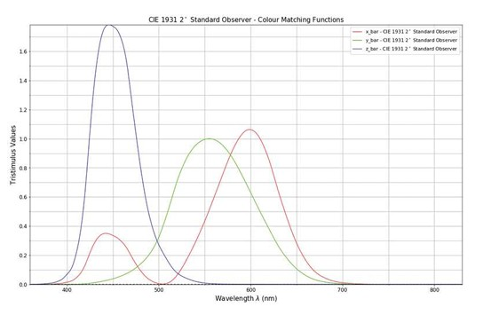
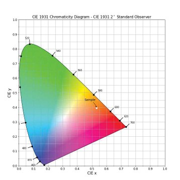
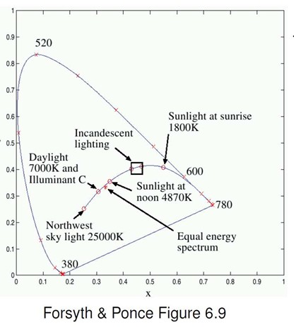
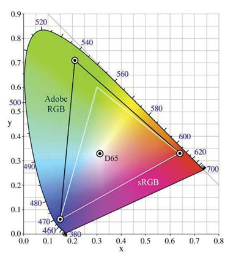
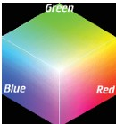
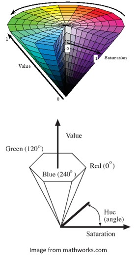
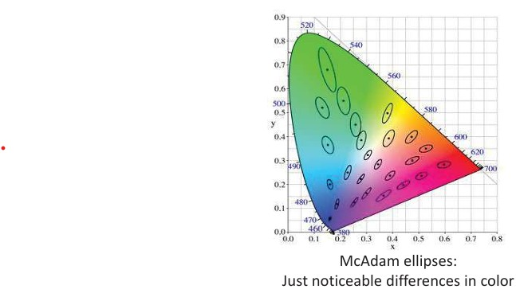
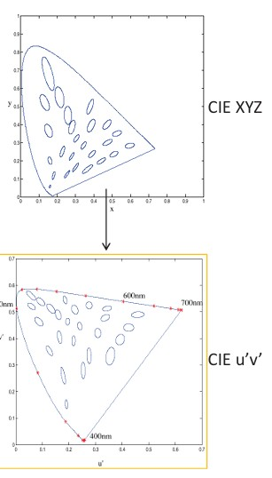

## 10b  Color Models & Matching (part 2) s. 41–43

### CIE XYZ Color Space 42

The **CIE 1931 XYZ color space** was one of the first mathematically defined color spaces. It became the foundation of modern color science.

---

#### 1. **Historical Background**

* Established by the **CIE (Commission Internationale de l’Éclairage)** in **1931**.
* Based on human visual perception experiments (color matching).
* Replaced earlier RGB models by ensuring **all values are positive**.

---

#### 2. **Color Matching Functions**

Defined as $\bar{x}(\lambda), \bar{y}(\lambda), \bar{z}(\lambda)$:

* They describe how much of each imaginary primary (X, Y, Z) is needed to match a monochromatic wavelength $\lambda$.
* Unlike real RGB primaries, these functions were **mathematically constructed** to avoid negative values.
* The **Y function** was chosen to correspond to human **luminance sensitivity** (brightness perception).

---

#### 3. **Tristimulus Values**

Any color with spectral distribution $C(\lambda)$ can be represented as:

$$
X = \int C(\lambda)\bar{x}(\lambda) d\lambda, \quad 
Y = \int C(\lambda)\bar{y}(\lambda) d\lambda, \quad 
Z = \int C(\lambda)\bar{z}(\lambda) d\lambda
$$

* **X, Y, Z** = tristimulus values (the coordinates of color in this space).
* These values represent **all visible colors**.

---

#### 4. **Advantages**

* All positive coordinates → no “imaginary” light needed.
* Standard observer defined → allows reproducibility across experiments and industries.
* Forms the basis of derived spaces: CIE xyY, CIE LAB, CIE LUV.

---

✅ **Key Insight:**
The **CIE XYZ space** is not intuitive for humans but is a **universal mathematical foundation** for color representation and comparison.

---

### CIE XYZ Color Space (Extended Explanation) 42

The **CIE 1931 XYZ color space** is the foundation of all modern colorimetry, created to standardize how colors are represented mathematically.

---

#### 1. **Background**

* Defined by the **CIE (Commission Internationale de l’Éclairage)** in **1931**.
* Based on experiments with human observers performing **color matching tasks**.
* Provides a universal way to describe color independent of display devices.

---

#### 2. **Chromaticity Coordinates (Projection)**

Since XYZ is 3D, it is often reduced to 2D for visualization:

$$
x = \frac{X}{X+Y+Z}, \quad y = \frac{Y}{X+Y+Z}
$$

* This projection yields the **CIE 1931 Chromaticity Diagram**.
* The diagram shows **all visible chromaticities** (color hues and saturations, without brightness).
* The curved outer boundary = **spectral locus**, corresponding to pure monochromatic wavelengths.

---

#### 3. **Linear Mapping Between XYZ and RGB**

The CIE XYZ space can be converted into device-dependent RGB values using a linear transformation:

$$
\begin{bmatrix} R \\ G \\ B \end{bmatrix} 
= 
\begin{bmatrix} 
0.41847 & -0.15866 & -0.082835 \\
-0.091169 & 0.25243 & 0.015708 \\
0.00092090 & -0.0025498 & 0.17860 
\end{bmatrix}
\begin{bmatrix} X \\ Y \\ Z \end{bmatrix}
$$

* Different RGB systems (sRGB, AdobeRGB, etc.) use different transformation matrices.
* XYZ acts as a **universal connector** between color spaces.

---

#### 4. **Why XYZ is Useful**

* All visible colors can be represented.
* Coordinates are **positive**, unlike the older RGB space.
* The **Y component** is directly tied to perceived **luminance** (brightness).
* Standardization enables consistent color reproduction across devices (monitors, printers, cameras).

---

✅ **Key Insight:**
The **CIE 1931 XYZ color space** bridges human perception and device representation, making it the **reference model** for all modern color spaces (sRGB, Lab, etc.).

---

### Color Temperature 43

The concept of **color temperature** connects physics (black-body radiation) with perceived color in lighting and imaging.

---

#### 1. **Spectral Locus**

* The **horseshoe-shaped curve** in the CIE diagram shows all possible **monochromatic light colors** (pure spectral colors, each wavelength between \~380–780 nm).
* Any visible color can be represented as a mixture of these.

---

#### 2. **Black-Body Locus**

* The **black-body locus** (curved line through the diagram) represents the colors of an **ideal heated black-body radiator** at different temperatures (measured in **Kelvin, K**).
* Examples:

  * **1800K** → reddish (sunrise/sunset).
  * **4870K** → neutral white (sunlight at noon).
  * **7000K** → bluish (overcast daylight).
  * **25000K** → very blue (clear sky in shade).

---

#### 3. **Color Temperature Definition**

* **Color temperature** of a light source = temperature of a black-body whose color matches the source.
* Expressed in **Kelvin (K)**.

---

#### 4. **Common Illuminants**

* **Incandescent light (\~2800K)**: warm yellowish-white.
* **Daylight (\~5500–6500K)**: neutral to slightly blue.
* **Northwest sky (\~25000K)**: very blue.

---

#### 5. **Equal Energy Spectrum (EES)**

* A reference white point where all wavelengths contribute equally.
* Located at the **center of the diagram** (flat spectrum light).

---

✅ **Key Insight:**

* **Lower color temperatures** (<4000K) appear warm (reddish).
* **Higher color temperatures** (>6000K) appear cool (bluish).
* This is widely used in photography, computer vision, and display calibration for **white balance correction**.

---

### RGB Color Spaces 43

Color spaces define **how colors are represented and reproduced** across devices (monitors, printers, cameras). Different RGB color spaces cover different portions of the visible spectrum.

---

#### 1. **CIE RGB**

* Early color space based on experiments with human vision.
* Defines primaries mathematically but not widely used in practice.

---

#### 2. **CIE XYZ**

* Established in **1931 by CIE** as a perceptually uniform color space.
* Serves as a **reference space** for all other color models.
* Uses positive color matching functions $\overline{x}(\lambda), \overline{y}(\lambda), \overline{z}(\lambda)$.

---

#### 3. **sRGB** (Standard RGB)

* **Most widely used** RGB color space.
* Standard for **monitors, web, and consumer devices**.
* Optimized for typical lighting (D65 white point, \~6500K).
* Smaller gamut compared to Adobe RGB.

---

#### 4. **Adobe RGB**

* Developed for **printing and professional graphics**.
* Has a **wider gamut** than sRGB, especially in greens and cyans.
* Better for tasks requiring high color fidelity (photography, prepress).

---

#### 5. **Comparison in Diagram**

* The **horseshoe shape** is the full range of human-perceivable colors (CIE xy chromaticity diagram).
* **Triangles** inside represent RGB spaces:

  * **sRGB triangle** = smaller, fits most displays.
  * **Adobe RGB triangle** = larger, extends further into greens.

---

✅ **Key Insight:**

* **sRGB** → good for **screens and general use**.
* **Adobe RGB** → good for **printing and professional imaging**.
* **CIE XYZ** → universal **reference model**.

---

### HSV Color Space 44

The **HSV model** represents colors in a way that is often closer to how humans perceive and describe them, compared to RGB.

---

#### Components:

1. **Hue (H)**

   * Represents the **color type** (e.g., red, green, blue).
   * Encoded as an **angle** (0°–360°) around the color wheel.

     * 0° → Red
     * 120° → Green
     * 240° → Blue

---

2. **Saturation (S)**

   * Measures the **intensity or purity** of the color.
   * 0 = completely unsaturated (gray/white),
   * 1 = fully saturated (pure color).

---

3. **Value (V)** (Brightness)

   * Represents the **lightness/darkness** of the color.
   * 0 = black,
   * 1 = full brightness of the chosen hue.

---

#### Key Properties:

* **Nonlinear model**: Better reflects **human perception** of colors than the linear RGB model.
* **Topology of colors**: Encodes hue as a circular angle → captures color continuity naturally.
* **Physically meaningful**: Easier for artists, designers, and in computer vision tasks like color segmentation.

---

#### Visual Representations:

* **Hexagon & Circle diagrams**: Show hue as angle, saturation as distance from center.
* **Cone/Pyramid models**: Show value (brightness) vertically, with saturation and hue spreading outward.

---

✅ **Summary:**
HSV separates **color (Hue)** from **intensity (Value)** and **purity (Saturation)**, making it **intuitive for humans** and **useful in computer vision**, unlike raw RGB.

---

### Distances in color space / uniform color spaces 44 - 45
* Are distances between points in a color space perceptually 
meaningful

* Are distances between points in a color space perceptually meaningful?
* Not necessarily: **CIE XYZ is not a uniform color space**, so magnitude of differences in coordinates are poor indicators of color “distance.”
* Example: **McAdam ellipses** show just noticeable differences in color.

### Uniform color spaces 45

###  Distances in color space / uniform color spaces 44 - 45

* Are distances between points in a color space perceptually meaningful?
* Not necessarily: **CIE XYZ** is *not* a uniform color space.

  * Magnitude of differences in coordinates is a poor indicator of perceived color “distance”.
  * **McAdam ellipses** illustrate regions of just-noticeable differences, which are not circular.

---

* Attempt to correct this limitation by **remapping color space** so that just-noticeable differences are contained by circles → distances more perceptually meaningful.

* **Examples:**

  * CIE u′v′
  * CIE Lab

---

