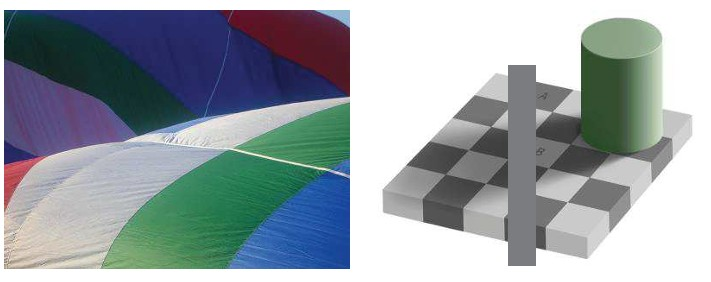
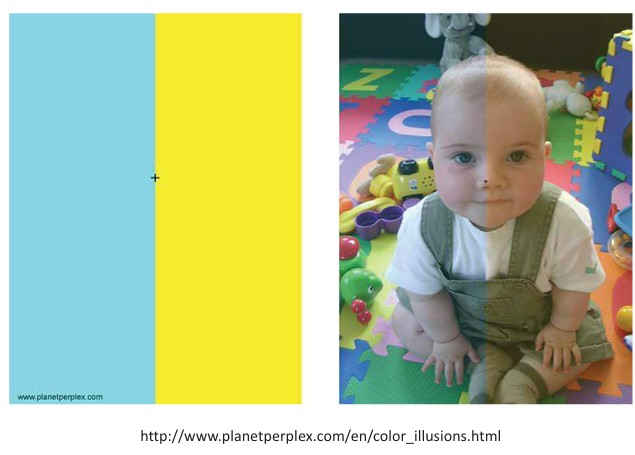
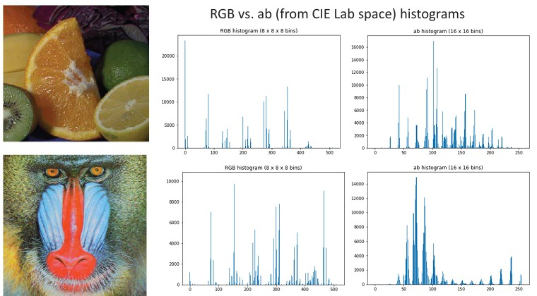

## 11  Color Constancy & Machine Vision s. 44–49

### Color constancy 46

“Hot air balloon fabric” / “Checker shadow illusion”

**Key points:**

* The brain keeps object colors looking **the same** even when lighting changes.
* Example: a red shirt looks red in sunlight, shade, or indoors.
* This stability helps us **recognize objects reliably** in everyday life.

**Explanation:**
Even though the light shining on an object may vary (yellowish indoor light vs. bluish daylight), our brain adjusts the perceived color. This way, we don’t get confused about what things are — apples stay red, grass stays green, no matter the lamp or time of day.

**Example from picture:**

* Left: fabric panels keep their colors under different lighting.
* Right: a gray square looks different in shadow vs. light, but the brain interprets it as the same color.

**Takeaway:**
👉 *Your brain corrects for lighting so objects look consistently colored.*

**Reflection prompt:**
🔎 *Think of a fruit (like a banana). How does it always look yellow whether you see it outside, in your kitchen, or at the store?*

### Chromatic adaptation 46

**Key points:**

* Our visual system **adapts** to the color of the light it is exposed to.
* After some time, colors may appear **shifted or skewed**.
* This is the brain’s way of keeping the world looking stable under different lighting conditions.

**Explanation:**
When you spend time under a certain type of light (like bluish daylight or yellow indoor light), your eyes and brain adjust. This adjustment makes colors look more “normal,” even though the actual light hitting your eyes has changed. It’s like your brain is rebalancing the picture so objects still look familiar.

**Example from picture:**

* Left: two colored areas demonstrate how our system adapts differently to yellow vs. blue.
* Right: the same baby’s face looks cooler on one side and warmer on the other, depending on the light.

**Takeaway:**
👉 *Your brain constantly “recalibrates” color to match the lighting environment.*

**Reflection prompt:**
🔎 *Have you noticed how white walls look different under daylight, fluorescent lamps, or candlelight? How does your brain keep calling them “white”?*

---

### Role of experience 47

**Key points**

* Color perception is shaped by both physics of light and brain processing.
* The eye–brain system combines incoming light with prior experience.
* Humans use color to recognize objects, materials, food, places, and even time of day.
* The same scene can look very different when colors are altered.

**Explanation**
Our experience influences how we interpret colors. The brain doesn’t just passively register wavelengths—it actively compares, adjusts, and interprets them based on past encounters. That’s why we can quickly recognize a tiger in natural colors but struggle if its colors are distorted.

**Example from picture**
The two tiger images show the same scene but coded with different colors. One looks natural and recognizable, while the other feels strange and harder to interpret.

**Takeaway**
*Color perception is not just about light—it’s also shaped by our brain and experience.*

**Reflection prompt**
👉 How might color experience affect how people from different cultures interpret the same image?

---

### Beyond the visible light 47
Got it — here’s the refined, student-friendly version of your slide:

---

### Beyond the visible light

**Key points**

* Machines can detect radiation outside human vision.
* Examples:

  * Ultraviolet (UV), X-rays, infrared (IR), and radio waves.
* Spectral cameras go beyond 3 channels (RGB):

  * **Multispectral imaging** → a few channels.
  * **Hyperspectral imaging** → hundreds of channels.
* Devices can convert invisible signals into visible ones, like X-ray machines or IR weather satellites.

**Explanation**
Humans only see a small slice of the electromagnetic spectrum (visible light). Machines, however, can extend our vision to much shorter or longer wavelengths, letting us detect things like heat, radiation, or atmospheric changes. Imaging systems can split light into many more channels than our eyes can, revealing details invisible to us.

**Takeaway**
*Machines let us “see” beyond the human visual spectrum.*

**Reflection**
👉 Think: How could hyperspectral imaging be useful in medicine, farming, or space research?

### Color in machine vision 48

**Key points**

* Machines do not perceive color like humans.
* In machine vision, color is useful because each pixel provides multiple measurements (R, G, B, etc.).

  * Helps classify objects without relying on complex spatial patterns.
* Color distributions can summarize image content:

  * Lose spatial details.
  * More robust to shifts, rotation, scaling, and partial occlusion.
* Scatter plots help visualize color data.
* Color histograms are widely used in image retrieval and recognition.

**Explanation**
While human vision blends color perception with context and experience, machines rely on numerical color measurements. By looking at how colors are distributed across an image, systems can classify or compare objects more easily, even if their position or orientation changes.

**Takeaway**
*Color features in machine vision make object recognition simpler and more robust.*

**Reflection prompt**
👉 How would you decide whether to use **spatial features** (shapes, edges) or **color features** for your project?

### Scatter plot: example \* 48

**Key points**

* Scatter plots show how pixel values are distributed in different color spaces.
* Depending on the number of channels, plots can be:

  * **3D plots** (e.g., RGB, HSV).
  * **2D plots** (e.g., normalized rg, HS).

**Explanation**
An image can be represented not just as pixels, but as points in a color space. For example, an orange image will cluster differently in RGB, HSV, or normalized color coordinates. These plots help us analyze and compare color distributions in images.

**Example from picture**

**Takeaway**
*Scatter plots visualize how colors spread in different spaces.*

### Color histogram 49

**Key points**

* A color histogram shows how colors are distributed in an image.
* The image colors are grouped into bins $b_i$, where $i = 1, \dots, N$.
* Each bin counts how many pixels fall into that color range:

  $$
  h(b_i) = |\{(r, c) \mid I(r,c) \in b_i\}|
  $$

* Grayscale histograms are a special case:

  $$
  h(i) = |\{(r, c) \mid I(r,c) = i\}|
  $$

* Histograms can be made per channel (R, G, B) and then combined.
* Normalization is possible by dividing by the total number of pixels:

  $$
  h'(b_i) = \frac{h(b_i)}{\sum h(b_i)}
  $$

**Explanation**
Color histograms provide a compact way to describe the “palette” of an image, without caring about where the pixels are located. They are often used in image retrieval, classification, and recognition because they are simple but powerful features.

**Takeaway**
*Color histograms summarize the distribution of colors in an image, ignoring spatial layout.*

**Reflection prompt**
👉 If two images have similar histograms but look visually different, what kind of information is missing?

---

### Color histogram: example

**Key points**

* Histograms can be built in different color spaces (e.g., RGB or CIE Lab).
* The plots show how often certain color values occur in the image.
* Different images produce very different histogram patterns.
* Choosing the right color space (RGB vs. Lab) can highlight different features.

**Explanation**
The example shows how two very different images (fruit vs. baboon) generate distinct histograms. The RGB histograms reflect the raw pixel color distribution, while the Lab **ab** histograms separate out chromaticity information (color without brightness). This demonstrates why color histograms are a flexible tool for comparing and recognizing images.

**Example from picture**

* Fruit image → peaks corresponding to orange, green, and yellow colors.
* Baboon image → strong peaks in blue and red channels, matching the face colors.

**Takeaway**
*Color histograms provide a compact fingerprint of an image’s colors, useful for comparison and recognition.*

**Reflection prompt**
👉 If you were building an image retrieval system (like Google Images), would you use RGB histograms or Lab histograms — and why?

---

📷 Insert:

---

