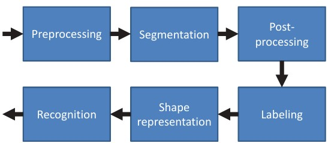
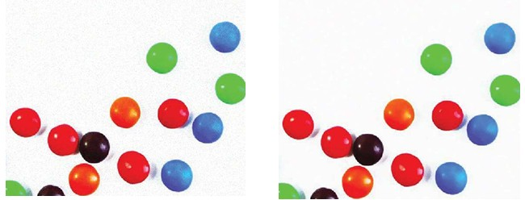
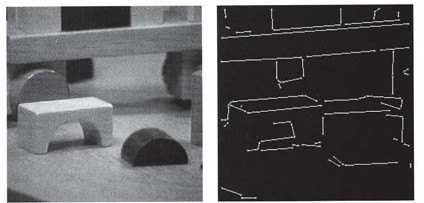
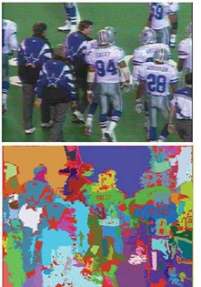
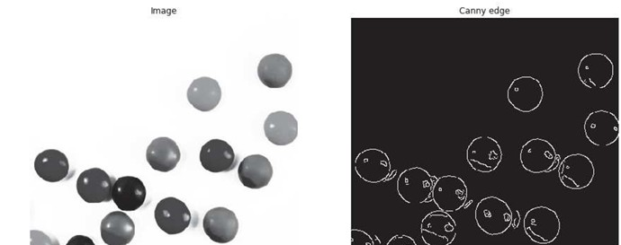
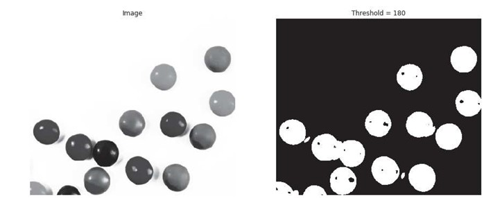
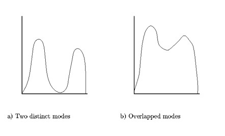
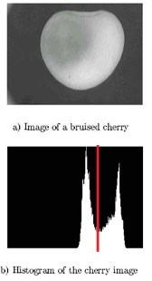
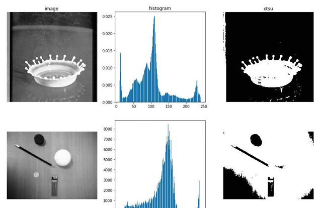

## 12  Segmentation Basics s. 50–53
### Pipeline 50

**Key points**

* A conventional binary image analysis pipeline processes an image in several stages.
* Typical steps include:

  1. **Preprocessing** – clean and prepare the image.
  2. **Segmentation** – separate objects from the background.
  3. **Post-processing** – refine the segmentation results.
  4. **Labeling** – assign IDs to connected regions (objects).
  5. **Shape representation** – describe object shape in a usable form.
  6. **Recognition** – classify or identify objects based on features.

**Explanation**
Binary image analysis breaks down into a sequence of well-defined steps. Each step transforms the image closer to a structured form that computers can use for recognition. Think of it like preparing ingredients before cooking: cleaning, cutting, sorting, and then cooking into a final dish.

**Example from picture**
The diagram shows a block pipeline, where the image is gradually transformed from raw pixels (left) to object recognition (right).

**Takeaway**
*Image analysis is a step-by-step pipeline, where each stage builds on the previous one.*

**Reflection prompt**
👉 Which step of the pipeline do you think is the most challenging — preprocessing, segmentation, or recognition — and why?

---

📷 Insert:

---

### Preprocessing* 51

**Key points**

* Images often contain useful patterns mixed with unwanted variations (e.g., noise).
* Preprocessing aims to:

  * Remove uninteresting parts (noise).
  * Enhance meaningful structures.
* Example: noisy image vs. filtered image.

**Explanation**
Preprocessing is like cleaning up your data before analysis. In images, this usually means removing random variations or distortions so the important patterns stand out more clearly. Filtering methods (like bilateral filtering) smooth noise while keeping edges sharp, making objects easier to detect in later steps.

**Example from picture**

* Left: noisy image, where details are harder to see.
* Right: after bilateral filtering, the balls are clearer, making further analysis easier.

**Takeaway**
*Preprocessing cleans the image so the important information stands out.*

**Reflection prompt**
👉 Why might removing too much noise risk losing important details?

---

📷 Insert:

### Segmentation 51

**Key points**

* Segmentation = dividing an image into meaningful regions.
* Goal: group pixels that belong together (based on color, brightness, edges, or texture).
* Examples:

  * Extracting line segments from an image of toy blocks.
  * Splitting an image into regions of nearly constant color.

**Explanation**
Segmentation is like cutting a picture into puzzle pieces so that each piece corresponds to one meaningful part of the image. This step is essential for telling objects apart and focusing on the parts of the scene that matter for recognition.

**Example from picture**

* Left: blocks segmented by edges.
* Right: football players segmented into regions of similar color.

**Takeaway**
*Segmentation splits an image into meaningful regions for further analysis.*

**Reflection prompt**
👉 How might segmentation errors affect later steps like recognition?

---

📷 Insert:

---

### Identifying regions 52
part of the **Segmentation** step, focusing on what makes regions “good.” 

**Key points**

* Good regions should:

  * Be uniform in some property (color, brightness, or texture).
  * Have simple interiors (not many small holes).
  * Be different from neighboring regions.
  * Have smooth, accurate boundaries.
* Meeting all these requirements is challenging and often needs advanced methods.

**Explanation**
When we split an image into regions, we want those regions to make sense. For example, a region representing the sky should look smooth and not be broken into many small parts. Similarly, objects next to each other (like a person and the background) should be clearly separated. Creating such “clean” regions is difficult because real-world images are messy.

**Takeaway**
*Good regions are uniform, simple, distinct, and have smooth boundaries — but achieving all this is hard.*

**Reflection prompt**
👉 Why might messy or overlapping regions make recognition harder later in the pipeline?

### Edge detection \* 52

**Key points**

* Finds the boundaries of objects in an image.
* Edges show where brightness or color changes quickly.
* Results are often noisy or broken into fragments.
* Example: detecting circles in an image with the Canny edge detector.

**Explanation**
Edge detection highlights the “outlines” of objects, like tracing the border of a ball or a leaf. While it’s a powerful way to find object boundaries, real images often introduce noise (extra edges) or gaps (missing parts of edges). This makes edge detection a useful but imperfect step in image analysis.

**Example from picture**
On the left, we see gray circles in the image. On the right, edge detection draws white outlines around them — but the outlines are not always smooth or complete.

**Takeaway**
*Edge detection outlines objects, but the results are often noisy and incomplete.*

**Reflection prompt**
👉 How could we clean up noisy or broken edges so they become more useful for later steps like recognition?

---

📷 Insert:

### Thresholding gray-scale images \* 53
We’re still in the **Segmentation** stage of the pipeline.

**Key points**

* Thresholding is the simplest method for segmentation.
* Converts a gray-scale image into a binary image (black & white).
* Works by setting a cutoff (threshold) value:

  * Pixels brighter than the threshold → white
  * Pixels darker → black
* Main challenge: choosing the right threshold value.

**Explanation**
Thresholding splits an image into two groups: foreground and background. For example, separating coins from the table they’re on. It’s quick and easy but depends heavily on selecting a good threshold — too low or too high, and objects can disappear or merge with the background.

**Example from picture**
On the left: original gray-scale balls.
On the right: after thresholding, they become solid white blobs on a black background.

**Pipeline step**
This is part of **Segmentation**: dividing the image into meaningful regions.

**Takeaway**
*Thresholding is a simple way to separate objects, but success depends on picking the right threshold.*

**Reflection prompt**
👉 What happens if the background and objects are very similar in brightness? Can thresholding still work well?

---

📷 Insert:

---

### The use of histograms for threshold selection 53
we’re still in the **Segmentation** stage, focusing on thresholding.

---

### Using histograms for threshold selection

**Key points**

* Histograms show how pixel brightness values are distributed.
* Thresholds can be chosen automatically by detecting **peaks** (bright/dark areas) and **valleys** (separating regions).
* Works best when the histogram is **bimodal** (two clear groups of pixels).
* Example: separating bruised vs. healthy areas on fruit.

**Explanation**
Instead of guessing the threshold, we can use the histogram of an image. If there are two peaks, one for dark pixels (e.g., shadow, bruises) and one for bright pixels (e.g., background, healthy surface), the valley between them is a natural threshold. This makes segmentation more reliable and less arbitrary.

**Pipeline step**
This belongs to **Segmentation → Thresholding**. Histograms help in deciding *where* to place the cutoff.

**Example from pictures**

* Left: two simple histogram cases

  * (a) clear peaks (easy threshold)
  * (b) overlapping peaks (harder threshold)
* Right: bruised cherry — histogram shows two peaks, red line marks the threshold separating bruised vs. normal areas.

**Takeaway**
*Histograms help automate threshold choice by showing natural cutoffs in brightness values.*

**Reflection prompt**
👉 What happens if the histogram does not have two clear peaks?

---

📷 Insert:
Left examples:

Right example (cherry):

---

### Otsu’s method 54
we’re still in the **Segmentation → Thresholding** part of the pipeline. 

**Key points**

* Otsu’s method is an **automatic way** to choose a threshold.
* It works by finding the threshold **t** that best separates pixel values into two groups (dark and light).
* The method minimizes the **variance within each group** (making pixels in a group as similar as possible).
* The algorithm checks all possible thresholds and picks the one with the lowest within-group variance.
* Can also be extended to use **multiple thresholds** for more than two regions.

**Explanation**
Imagine dividing students into two groups based on height. The best cutoff is where each group is as consistent as possible. Otsu’s method does the same for pixel brightness — it finds the threshold that separates dark and light regions most clearly. This makes it very popular for **automatic image segmentation**, since no manual guesswork is needed.

**Pipeline step**
This belongs to **Segmentation → Thresholding**. Otsu’s method improves thresholding by making it automatic and robust.

**Math (compact)**
The method minimizes the within-class variance:

$$
\sigma_w^2(t) = q_1(t)\sigma_1^2(t) + q_2(t)\sigma_2^2(t)
$$

where $q_1, q_2$ are probabilities of each class (dark/light),
$\mu_1, \mu_2$ are their mean values, and $\sigma_1^2, \sigma_2^2$ are their variances.

**Takeaway**
*Otsu’s method finds the “best cut” in the histogram automatically, making thresholding easier and more reliable.*

**Reflection prompt**
👉 Why is Otsu’s method especially useful when you don’t know the lighting conditions in advance?

---

### Otsu’s method: example \* 54
we’re continuing in the **Segmentation → Thresholding** stage of the pipeline.

**Key points**

* Otsu’s method automatically finds the best threshold for separating dark and light regions.
* The method analyzes the **histogram** of pixel intensities to locate the optimal cutoff.
* Result: objects become clearly separated from the background.
* Works well when the histogram has two distinct peaks (bimodal).

**Explanation**
In the examples above, the grayscale images are converted into histograms that show how many pixels have certain brightness values. Otsu’s method identifies the best split point between the two peaks. On the right, you see the segmented binary images, where the objects (crown splash, pen, and round objects) are separated from the background automatically.

**Pipeline step**
This belongs to **Segmentation → Thresholding**, showing a practical application of Otsu’s method.

**Example from picture**

* **Top row**: Water splash image → histogram → binary image after Otsu’s method.
* **Bottom row**: Desk objects → histogram → binary segmentation result.

**Takeaway**
*Otsu’s method can turn grayscale images into clean binary masks by choosing the threshold automatically.*

**Reflection prompt**
👉 What might happen if the histogram doesn’t have two clear peaks? Would Otsu’s method still work well?

**Picture reference**: 

---

 
