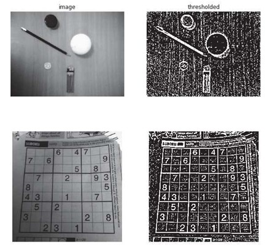
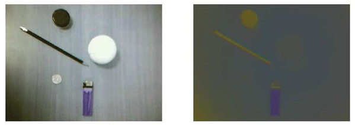
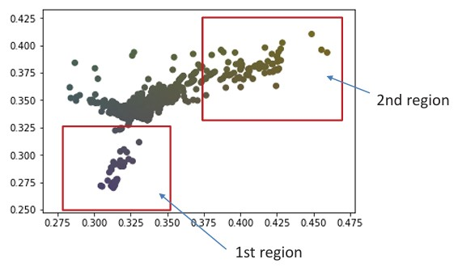
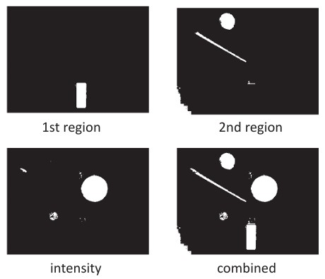
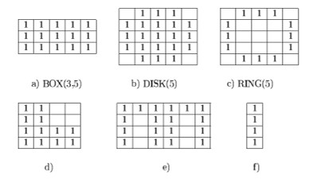

## 13  Advanced Thresholding & Color Segmentation s. 54–56

### Adaptive thresholding 55
Still in the **Segmentation → Thresholding** stage of the pipeline.

**Key points**

* Global thresholding works only if lighting is **uniform**.
* When lighting is uneven, **adaptive thresholding** is better.
* A threshold is calculated **separately for each pixel** based on its local neighborhood.
* Common approach: weighted average (e.g., Gaussian kernel).

**Explanation**
Unlike global methods such as Otsu’s, adaptive thresholding doesn’t rely on one fixed cutoff. Instead, it looks at a local window around each pixel and decides the threshold relative to its neighbors. This makes it especially useful for images with shadows, bright spots, or uneven lighting.

**Math**
The local threshold is:

$$
T(x,y) = \sum_{i,j} w(i,j) f(x+i, y+j) - C
$$

* $f(x,y)$: the image
* $w(i,j)$: weights of a kernel (e.g., Gaussian)
* $C$: a constant offset

**Pipeline step**
This belongs to **Segmentation → Thresholding** and is an extension of simple/global thresholding methods.

**Takeaway**
*Adaptive thresholding adjusts to local lighting, making it robust when illumination is not uniform.*

**Reflection prompt**
👉 Can you think of an example image (like a scanned document with shadows) where global thresholding would fail but adaptive would work well?

### Adaptive thresholding: example \* 55
we’re still in **Segmentation → Thresholding**, now showing **adaptive thresholding in action**.

**Key points**

* Adaptive thresholding works well when **lighting is uneven**.
* Each pixel’s threshold is set by looking at its **local neighborhood**.
* This keeps important details visible even with shadows or gradients in brightness.

**Explanation**
In the examples, notice how the original images (left) have uneven lighting:

* The desk image has shadows across the surface.
* The Sudoku puzzle has darker and lighter regions due to folds and lighting.

With **adaptive thresholding** (right), the algorithm adjusts locally, producing clear outlines of objects or digits. This makes it easier for further steps like recognition or feature extraction.

**Pipeline step**
This is part of **Segmentation → Thresholding**, focusing on cases where global methods (like Otsu’s) fail.

**Takeaway**
*Adaptive thresholding makes segmentation robust against shadows and non-uniform lighting.*

**Reflection prompt**
👉 Why might adaptive thresholding be especially useful for document analysis (e.g., scanning old papers or receipts)?

**Figure**

---

<!--Do you want me to also prepare a **summary comparison slide** of **Global vs Otsu vs Adaptive thresholding** (like a quick teaching chart), or keep them separate as we’ve done?
-->
### Color segmentation \* 56-57
we’re still in **Segmentation**, now focusing on **color-based segmentation**

**Key points**

* For color images, both **intensity** and **color** can be used.
* Segmentation can be done in **RGB space** or other color spaces (e.g., HSV, Lab).
* Normalized color spaces often highlight objects better than raw intensity.
* Example: In normalized RGB, some objects stand out more clearly than in the original image.

**Explanation**
Segmentation doesn’t have to rely only on brightness. By using color, we can separate objects that might otherwise blend into the background if they have similar intensity. For instance, the pencil and the lighter are much more distinct when represented in normalized RGB space compared to the plain intensity image.

**Pipeline step**
This belongs to **Segmentation**, focusing on the use of **color cues** rather than just grayscale thresholds.

**Takeaway**
*Color segmentation allows objects with similar brightness but different colors to be separated more easily.*

**Reflection prompt**
👉 In which real-world applications might color segmentation be more useful than grayscale segmentation (e.g., food sorting, medical imaging)?

**Figure**

---

<!--Do you want me to also add **short "pipeline progress markers"** at the top of each slide (like `Step: Segmentation → Color segmentation`) so students always see where they are in the process?
-->
Perfect — here’s the teaching-ready version with a clear marker for where we are in the pipeline:

---

### Color Segmentation (using scatter plots)

**Pipeline step:** Segmentation → Color segmentation

**Key points**

* Scatter plots and histograms help identify thresholds for separating regions.
* In the **rg color space**, clusters of points correspond to different color groups.
* Example: Two regions are identified in the scatter plot (1st region: lower left, 2nd region: upper right).

**Explanation**
Instead of guessing thresholds directly from the image, we can use color scatter plots. Each pixel’s color is plotted as a point in rg-space, and clusters naturally form. By drawing boundaries around clusters, we can segment objects that belong to different color groups.

**Takeaway**
*Scatter plots reveal natural groupings of colors, making segmentation easier.*

**Reflection prompt**
👉 How could scatter plots help in automatically detecting fruit ripeness or product defects?

**Figure**

---
<!--
Do you also want me to **add the pipeline step name into the slide title** (e.g., *“Segmentation: Color segmentation (scatter plots)”*) so that students instantly see both the topic and where they are in the pipeline?
-->
Got it — here’s the rewritten teaching-ready version for this slide, with the pipeline step clearly indicated:

---

### Color Segmentation (with intensity)

**Pipeline step:** Segmentation → Color segmentation (with intensity)

**Key points**

* Color segmentation can be combined with **intensity segmentation**.
* This makes it possible to separate multiple objects that differ both in **color** and **brightness**.
* Example: separate objects into regions by color, intensity, or both.

**Explanation**
When we look only at color, some objects may still overlap in brightness. Similarly, using only intensity can miss objects with similar brightness but different colors. By combining **both features** (color + intensity), segmentation becomes more powerful and can detect a wider variety of objects in the same image.

**Takeaway**
*Using both color and intensity gives more complete segmentation.*

**Reflection prompt**
👉 In what situations do you think combining color and intensity would be essential? (Hint: Think of medical imaging or product inspection.)

**Figures**

---

### Binary image morphology 57

**Pipeline step:** Post-processing → Morphological filtering

**Key points**

* Morphology deals with the **form and structure** of regions in an image.
* Morphological operations are based on **set operations**.
* Inputs:

  * Binary image **B**
  * Structuring element **S** (a small binary pattern).
* Structuring elements can vary in shape (box, disk, ring, etc.) and control how the operation modifies the image.

**Explanation**
Morphological operations are used after segmentation to refine binary images. They can smooth edges, remove noise, or emphasize shapes depending on the chosen structuring element. Think of it as using a small “stamp” (the structuring element) to probe and reshape the objects in the image.

**Takeaway**
*Morphology helps clean up and reshape binary images by using structuring elements.*

**Reflection prompt**
👉 Why might different structuring elements (e.g., disk vs. box) be useful for different kinds of objects?

**Figure**

 
