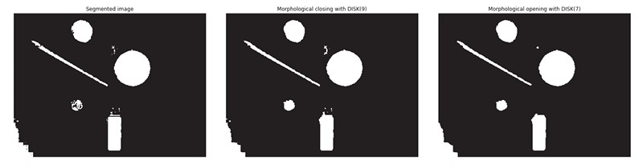
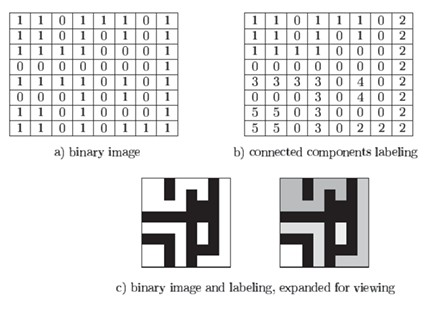
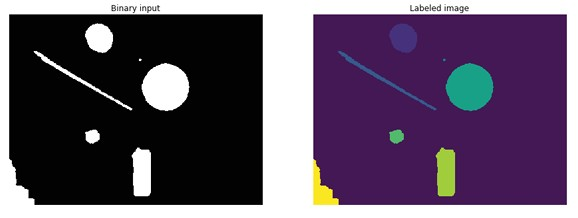
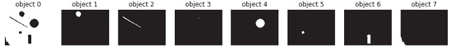
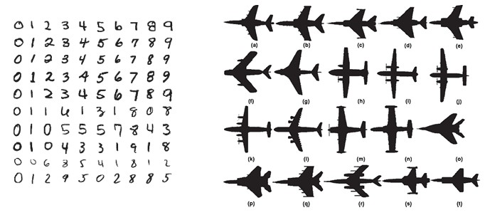
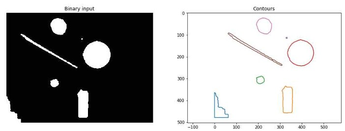

## 14  Morphology & Connected Components s. 57–59

### Basic operations 58

**Pipeline step:** Post-processing → Morphological filtering

**Key points**

* Morphology uses a **structuring element (S)** to reshape binary images.
* **Translation**: move a set of pixels by a vector.
* **Dilation**: grows or expands objects.
* **Erosion**: shrinks or reduces objects.
* **Closing**: dilation followed by erosion (fills small holes, smooths boundaries).
* **Opening**: erosion followed by dilation (removes small noise, keeps overall shape).

**Explanation**
These are the fundamental tools in binary image morphology. Imagine placing a small shape (structuring element) over the image and sliding it around. Depending on the operation, the image either expands (dilation), shrinks (erosion), or gets smoothed (closing/opening). These are often combined to clean up segmented images.

**Takeaway**
*Dilation grows objects, erosion shrinks them; opening removes noise, closing fills gaps.*

**Reflection prompt**
👉 If you had an image with lots of tiny white specks (noise), which operation would you apply first — opening or closing? Why?

### Morphological filtering: example \* 58

**Pipeline step:** Post-processing → Morphological filtering

**Key points**

* Morphological filtering applies shape-based operations to clean up binary images.
* **Closing** fills small holes inside objects and connects nearby regions.
* **Opening** removes small noise and smooths object boundaries.
* These operations are often applied **sequentially** for best results.

**Explanation**
In practice, after segmentation, objects often contain noise (small dots) or gaps in their boundaries. By using closing followed by opening, we make the objects more complete and easier to recognize. It’s like polishing the segmented image to make it more reliable for the next steps in the pipeline.

**Takeaway**
*Closing fills gaps, opening removes noise — together they make cleaner shapes.*

**Reflection prompt**
👉 Why do you think applying closing *before* opening works better than the other way around in many cases?
**Figure**

---

<!--Want me to also add a **short visual metaphor** for these operations (e.g., “closing = spreading clay to fill cracks, opening = sanding to remove small bumps”), to make it even more student-friendly?
-->
### Connected component labeling 59

**Pipeline step:** Labeling (after post-processing)

**Key points**

* A **connected component** is a group of pixels that share the same value (e.g., 1 for foreground) and are connected to each other.
* **Connected component labeling (CCL):** assigns a unique label to each group so we can identify individual objects.
* Different algorithms exist, but the idea is the same: scan the image and group connected pixels together.
* Result: each object/region gets its own ID (label).

**Explanation**
Connected component labeling is how the computer distinguishes one object from another in a binary image. Imagine painting each distinct blob with a different color — that’s essentially what labeling does, but with numbers instead of colors. This is a key step before counting, measuring, or recognizing objects.

**Example from picture**

* Binary image → all foreground pixels are 1.
* After labeling → each distinct group is assigned a different number (2, 3, 4, …).
* This way, we can separate multiple shapes in the same image.

**Takeaway**
*Labeling turns raw foreground pixels into distinct, countable objects.*

**Reflection prompt**
👉 Why is labeling necessary before we can measure the size or position of objects in an image?
**Figure**

---
<!--
Do you want me to **simplify the math-style definition of connectivity** (the sequence of neighboring pixels) into something more intuitive for students, like “pixels are neighbors if they touch each other horizontally, vertically, or diagonally”?
-->
### Connected component labelling: example \* 59

**Pipeline step:** Labeling

**Key points**

* From the binary input, we can detect **8 separate objects**.
* Each object gets a unique label (number or color).
* Labeled images can be displayed with different colors to visualize distinct objects.
* Objects can also be shown **individually**, making it easier to measure or analyze them one by one.

**Explanation**
Labeling doesn’t just mark all foreground pixels as “1.” Instead, it assigns a unique ID to each object, like giving every student in a classroom a name tag. This allows us to count, separate, and study each object individually — which is critical in machine vision tasks such as counting cells, detecting parts, or analyzing regions.

**Example from picture**

* Binary input and labeled image:
  
* Individual labeled objects:
  

**Takeaway**
*Labeling transforms one big foreground mask into distinct, identifiable objects.*

**Reflection prompt**
👉 In what real-world applications would it be useful to analyze **each object separately** rather than as one group?

---

### Shape representations 60

**Pipeline step:** Shape representation

**Key points**

* After segmentation and labeling, we want to represent each object in a **compact way**.
* A good representation should make objects **uniquely recognizable** (e.g., “this is a 7, that’s a plane”).
* Shape representations can handle variations in scale, orientation, or small distortions.

**Explanation**
Think of shape representation like creating a “fingerprint” for each object in the image. Just like every person has a unique fingerprint, every object should have a description that makes it distinguishable from others, even if it appears at a different angle or size.

**Example from picture**

* Digits and airplane silhouettes show how the same category of object can appear in many variations, yet needs to be recognized as the same type.
  

**Takeaway**
*Shape representations turn raw blobs into meaningful, identifiable objects.*

**Reflection prompt**
👉 What features (like corners, outlines, or proportions) would you choose to describe shapes so they stay recognizable even if rotated or resized?

---
<!--
Want me to also start explicitly **contrasting “raw binary image vs. shape representation”** when we hit recognition next, so students see the clear progression in the pipeline?

-->
### Contour \* 60

**Pipeline step:** Shape representation

**Key points**

* Instead of using all pixels of an object, we can describe it just by its **contour (outline)**.
* Contours capture the essential boundary while reducing data size.
* Features like area, perimeter, or shape descriptors can then be extracted from the contour.

**Explanation**
Contours work like drawing the outline of an object instead of coloring it in. This makes it easier to measure its size, shape, or complexity, while ignoring unnecessary details inside the object.

**Example from picture**

* On the left: binary objects.
* On the right: their contours traced in different colors.
  

**Takeaway**
*Contours give a compact and efficient way to describe object shapes.*

**Reflection prompt**
👉 When would you prefer to use a contour description instead of analyzing the full object area?

---
<!--
Want me to also **compare contour vs full-region description** briefly on the next shape slides (like moments, skeletons), so students see the trade-offs?

-->

