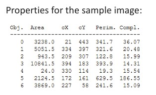

## 15a  Shape Representation (part 1) s. 60
### Basic region properties \* 61

**Pipeline step:** Shape representation

**Key points**

* Regions can be described with simple geometric properties:

  * **Area (A):** total number of pixels in the region.
  * **Centroid (r̄, c̄):** the “center of mass” of the region.
  * **Perimeter length (|P|):** the length of the boundary.
  * **Complexity (C₁):** relates perimeter to area, showing how irregular a shape is.

**Explanation**
These basic measurements let us quickly describe and compare objects. For example, circles have small complexity, while jagged shapes have larger complexity. This helps distinguish between smooth and irregular objects.

**Example from picture**
Table shows the properties (area, centroid, perimeter, complexity) for each detected object in a sample binary image.

**Takeaway**
*Area, centroid, perimeter, and complexity provide a compact but powerful description of shapes.*

**Reflection prompt**
👉 Which property (area, centroid, perimeter, complexity) would be most useful if you wanted to recognize **letters**? What about **coins**?

---
<!--
Want me to also add **a small formula summary block** (like a "math cheat sheet" box) for these region properties so students can reference it quickly later?

-->
### Spatial moments 61

**Pipeline step:** Shape representation

**Key points**

* Spatial moments describe the **shape and distribution** of pixels within a region.
* Second-order spatial moments capture how the object’s pixels are spread around the centroid:

  * **Row moment (μᵣᵣ):** variation along rows.
  * **Column moment (μ꜀꜀):** variation along columns.
  * **Mixed moment (μᵣ꜀):** correlation between rows and columns.

**Explanation**
Moments are like “statistics” of the shape. Just as mean and variance summarize a dataset, spatial moments summarize an object’s geometry. They help measure orientation, elongation, and how symmetric an object is.

**Math (second-order moments)**

$$
\mu_{rr} = \frac{1}{A} \sum_{(r,c)\in R}(r-\bar{r})^2
$$

$$
\mu_{rc} = \frac{1}{A} \sum_{(r,c)\in R}(r-\bar{r})(c-\bar{c})
$$

$$
\mu_{cc} = \frac{1}{A} \sum_{(r,c)\in R}(c-\bar{c})^2
$$

**Takeaway**
*Moments provide a compact way to describe an object’s orientation and spread.*

**Reflection prompt**
👉 Imagine you’re analyzing handwritten numbers. Which moments do you think would help distinguish between “1” and “0”?

---
<!--
Do you want me to **also include a “cheat sheet box” of formulas** at the end of all the *shape representation* slides (area, perimeter, moments, etc.), so students have one consolidated summary?

-->

