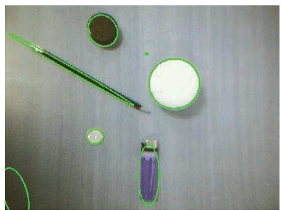
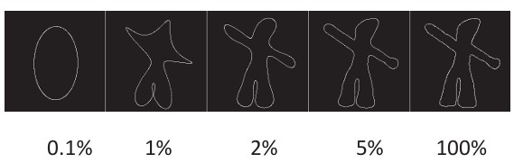
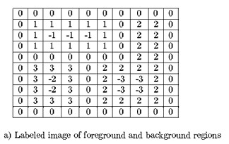
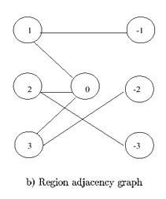

## 15b  Shape Representation (part 2) s. 61–62
### Ellipse fitting \* 62

**Pipeline step:** Shape representation
**Main phase:** Recognition

**Key points**

* Objects in an image can be **approximated by ellipses** using their spatial moments.
* The ellipse equation is based on second-order moments:

  $$
  \mu_{cc}r^2 - 2\mu_{rc}rc + \mu_{rr}c^2 = a
  $$

  where

  $$
  a = 4(\mu_{rr}\mu_{cc} - \mu_{rc}^2)
  $$

* First, the object is centered at the origin.
* This provides a **compact geometric description** of the object’s size, orientation, and spread.

**Explanation**
Ellipse fitting uses the spread of pixels (from the spatial moments) to estimate an ellipse that best matches the object. This is useful because ellipses can describe many real-world shapes (e.g., coins, wheels, eyes). Even irregular objects can be simplified into an ellipse for analysis.

**Example from picture**
Objects like the **cup, lighter, and coin** are outlined with ellipses, showing how shape fitting reduces complexity.

**Takeaway**
*Ellipse fitting provides a simple geometric model to represent objects for recognition.*

**Reflection prompt**
👉 If you had to recognize fruits on a table, when would ellipse fitting work well, and when might it fail?

---
<!--
Want me to also **add a quick “pipeline map” box** (like a mini flow diagram) to each of these slides, so students always see where they are in the bigger process?

-->
### Fourier descriptor 62

**Pipeline step:** Shape representation
**Main phase:** Recognition

**Key points**

* The boundary of an object can be represented using its **pixel coordinates** $(x[m], y[m])$.
* These coordinates can be written as a **complex number**:

  $$
  z[m] = x[m] + jy[m]
  $$

* The **Fourier Descriptor (FD)** applies the **Discrete Fourier Transform (DFT)** to these values:

  $$
  Z[k] = \frac{1}{N}\sum_{m=0}^{N-1} z[m] e^{-j 2\pi m k / N}
  $$

* The first few coefficients of $Z[k]$ already capture the **overall shape**.
* More coefficients = finer detail, fewer coefficients = smoother approximation.

**Explanation**
The Fourier descriptor reduces the complexity of an object’s contour by keeping only the most important frequency components. This means shapes can be **compared, recognized, and stored efficiently**.

**Example from picture**

* With **0.1% coefficients**, only the rough outline is visible.
* With **1–5% coefficients**, the figure gets more detail.
* With **100%**, we recover the full shape.

**Takeaway**
*Fourier descriptors allow us to represent and recognize complex shapes using just a few numbers.*

**Reflection prompt**
👉 If you wanted to distinguish between letters like **O** and **Q**, how many coefficients do you think you’d need?

---
<!--
Would you like me to **also keep a short “math-light” version** (with fewer formulas) alongside these, so students who are less math-oriented can still follow the concept?

-->
### Region adjacency graphs 63

**Pipeline step:** Region adjacency representation
**Main phase:** Labeling

**Key points**

* Sometimes it’s not enough to know the properties of a single region — we need to know how regions **relate to each other**.
* Two regions are **adjacent** if a pixel from one touches a pixel from the other.
* A **Region Adjacency Graph (RAG)** represents this:

  * **Nodes** = regions in the image.
  * **Edges** = connections between regions that are adjacent.
* This is useful in many image analysis tasks, such as **merging small regions** or **tracking neighboring objects**.

**Explanation**
Instead of thinking only in terms of pixels, a RAG lets us work at the **region level**. This is a compact and powerful way to describe relationships in an image.

**Example from picture**

* (a) A labeled image with different foreground and background regions.
* (b) The corresponding **region adjacency graph**, where each circle represents a region and edges show adjacency.

**Takeaway**
*RAGs turn an image into a network of regions, making it easier to understand their spatial relationships.*

**Reflection prompt**
👉 If two adjacent regions are always touching, how could a RAG help us **merge fragmented parts** of the same object?

---
<!--
Do you want me to **add mini “why it matters” notes** (like “used in medical imaging to merge tissues” or “used in remote sensing to group land areas”) for each slide, or should I keep it more general and neutral?

-->
