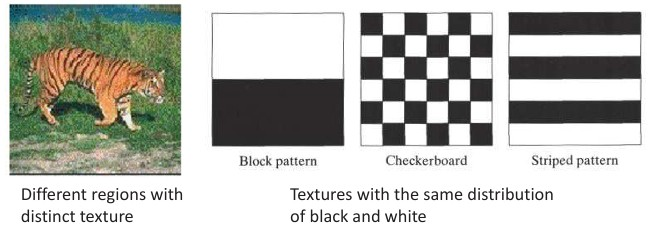
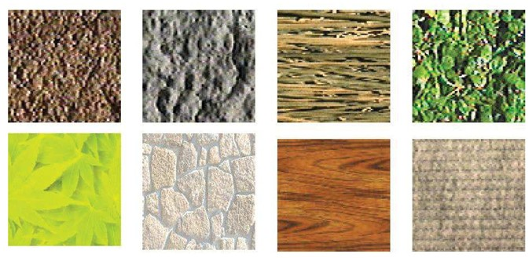
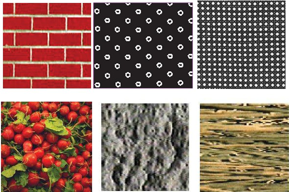
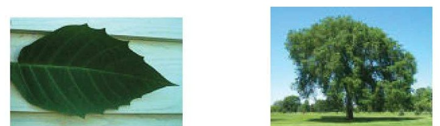
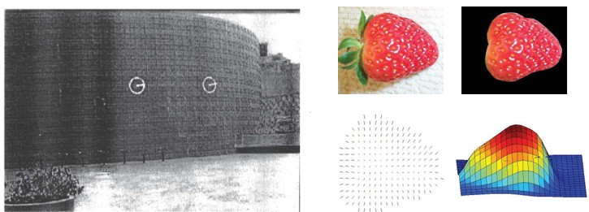

## 16  Texture Concepts s. 63–65

### What is texture? 64
Got it 👍 Here’s the student-friendly version for this new theme:

---

### What is texture?

**Pipeline step:** Feature extraction
**Main phase:** Recognition

**Key points**

* Besides color, **texture** is a very common property used in machine vision.
* Texture describes the **spatial arrangement** of colors or intensities in an image (how values are distributed and repeated).
* Natural scenes often contain strong textures:

  * Examples: sand, stones, grass, leaves, bricks.
* Texture gives important cues for distinguishing **different regions or materials**, even if they share the same average color.

**Explanation**
Color tells us *what* is present, while texture tells us *how* it is arranged. This makes texture especially useful for recognizing surfaces, patterns, and repeated structures.

**Example from picture**

* A tiger against grass: regions with very different textures.
* Block, checkerboard, and striped patterns: same colors, but textures differ by arrangement.

**Takeaway**
*Texture is about patterns, not just colors. It provides powerful features for recognition when color alone is not enough.*

**Reflection prompt**
👉 Can you think of a case where two objects have the **same color** but can be separated by their **texture**?

---
<!--
Do you want me to **keep adding these reflection prompts** at the end of each slide, or just stick with the Key points + Takeaway format?

-->
### What defines a texture? 64
Perfect — since this one is more of a **heading/introductory slide**, let’s keep it short and simple:

---

### What defines a texture?

**Pipeline step:** Feature extraction
**Main phase:** Recognition

**Key points**

* A **texture** is defined by the **visual patterns** in a surface.
* These patterns may come from:

  * Repeated structures (bricks, tiles, fabric).
  * Natural variations (leaves, rocks, wood grain).
* Textures can be **smooth, rough, regular, or irregular**, but they always describe *how surface elements are arranged*.

**Takeaway**
*Texture is not a single property like color, but the overall **pattern** of variation across a surface.*

---

<!--
Want me to make the **next texture slides more detailed again (with explanation + example + takeaway)**, or keep them short like this one until the content gets heavier?
-->
<!--
### Regular vs. random patterns 65

### Scale: objects vs. texture 65
### Texture-related tasks 66
### Shape from texture 66
-->

### Texture: Basics and Tasks

* Textures can be **regular** (structured patterns like bricks or checkerboards) or **random** (natural surfaces such as fruits, wood, or stone).
* The boundary between **object** and **texture** often depends on **scale**: for example, a tree can appear as a textured surface when seen close-up (leaves), but as a single object when seen from afar.
* **Texture-related tasks** include:

  * **Shape from texture**: estimating surface orientation or 3D shape from how patterns deform.
  * **Segmentation/classification**: grouping image regions with consistent textures.
  * **Synthesis**: generating new textures or images from examples.
* **Shape from texture** relies on analyzing **deformation** of repeated texture elements to infer surface geometry, as seen in cylindrical structures or curved fruit surfaces.

**Pictures**

* Regular vs random patterns
  

* Scale: object vs texture
  

* Shape from texture
  

