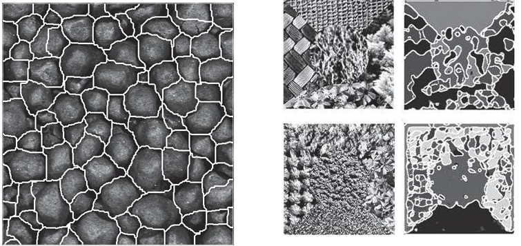
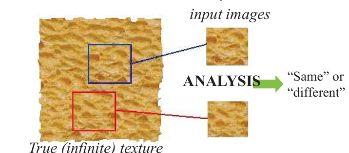
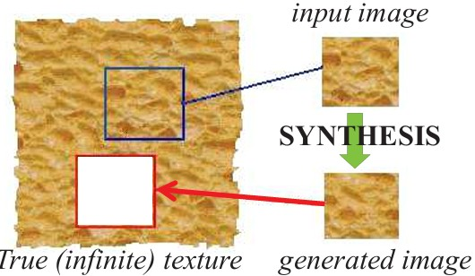
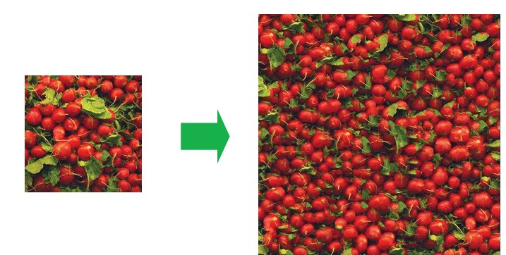
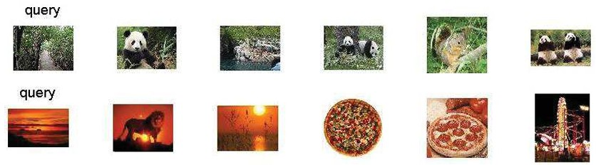
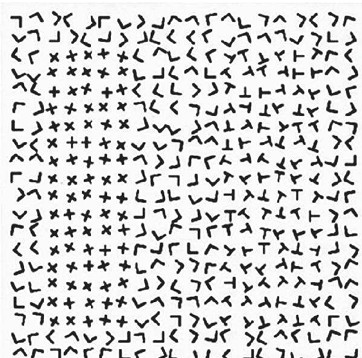

## 17  Texture Analysis & Synthesis s. 66–68

After understanding what texture is and how it can be used, we move to **texture analysis and synthesis**. This part of the pipeline focuses on segmenting textures, analyzing their properties, synthesizing new examples, and comparing textures with other cues such as color.

---

### **Texture segmentation** *(Segmentation phase)*

Texture segmentation aims to divide an image into distinct regions based on their texture properties.

---

### **The goal of texture analysis** *(Recognition phase – texture comparison)*

Texture analysis answers the question: are two regions made of the same “stuff”? By comparing texture features, we can decide whether areas are “same” or “different.”

---

### **The goal of texture synthesis** *(Post-processing / Synthesis phase)*

While analysis checks for similarity, synthesis aims to generate new textures. From a finite sample of some texture, the goal is to synthesize other samples from that same distribution, assuming the initial patch is large enough.

---

### **Texture synthesis in practice** *(Post-processing / Applications)*

Given a small input sample, we can generate larger texture fields. Applications include virtual environments, hole-filling in images, and realistic surface texturing.

---

### **Color vs. texture** *(Recognition phase – feature comparison)*

Images with similar color distributions may still differ in texture. Texture provides a complementary cue to color in image understanding.

---

### **Psychophysics of texture** *(Recognition phase – human perception)*

Some textures are distinguishable at a glance, through **preattentive perception**, without focused scrutiny. This highlights the human visual system’s efficiency in processing texture cues.

---

### **Takeaway & Reflection**

* Texture is a powerful visual cue that complements intensity and color.
* It enables **segmentation**, **recognition**, and even **generation** of new visual content.
* **Reflective question:** How might texture features improve systems like **medical imaging**, where subtle differences in texture could signal important diagnostic information?

---
<!--
Do you want me to also **standardize all future grouped sections** to always end with a *Takeaway & Reflective Question* like this?

### Texture segmentation 67

### The Goal of Texture Analysis 67

### The Goal of Texture Synthesis 68

### Texture synthesis 68

### Color vs. texture 69
### Psychophysics of texture 69
-->

