## 18  Statistical Texture Representation s. 69–75

*(How can we represent texture statistically in computer vision?)*

> **Preview:** In this section, we explore how textures can be represented using small building blocks (textons), statistical summaries, and powerful tools like filter banks. By the end, you’ll see how raw pixel patterns can be turned into feature vectors and histograms that a computer can compare.

---
### Textons – the “atoms” of texture

* Texture can be analyzed in terms of small, fundamental elements called **textons**.
* Textons are like the micro-structures in an image — tiny building blocks that our visual system picks up pre-attentively.
* Humans often visually identify these repeating structures to decide what the basic units are.

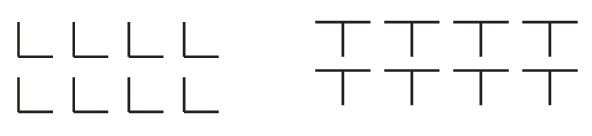

---

### Texture representation: finding local patterns

* To use textures in computer vision, we must represent them **quantitatively**.
* Textures are composed of **repeated local patterns**.
* Approach:

  * Find the patterns (e.g., with filters resembling spots, bars, patches).
  * Compute statistics (mean, standard deviation, histograms) describing these responses.

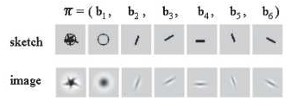

---

### Texture representation: example (filters & statistics)

* An image is divided into **small windows**.
* Filters (like derivative filters) are applied to capture patterns.
* For each window, we compute **summary statistics** (like average filter responses).

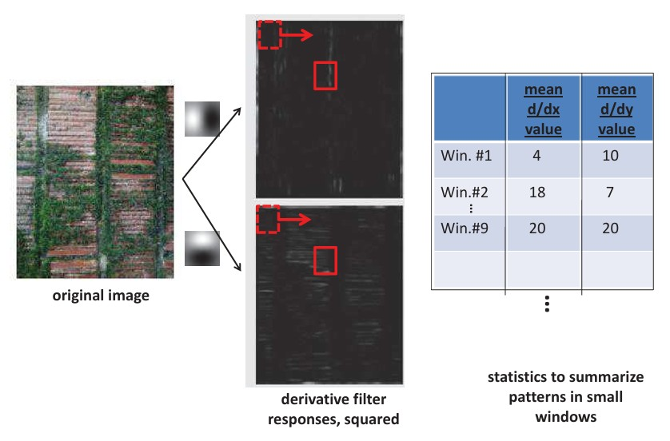

---

### Texture representation: example (clustering responses)

* Filter responses from many windows can be plotted in feature space.
* Clustering reveals groups:

  * Windows with horizontal edges.
  * Windows with vertical edges.
  * Windows with little structure.
  * Windows with both.

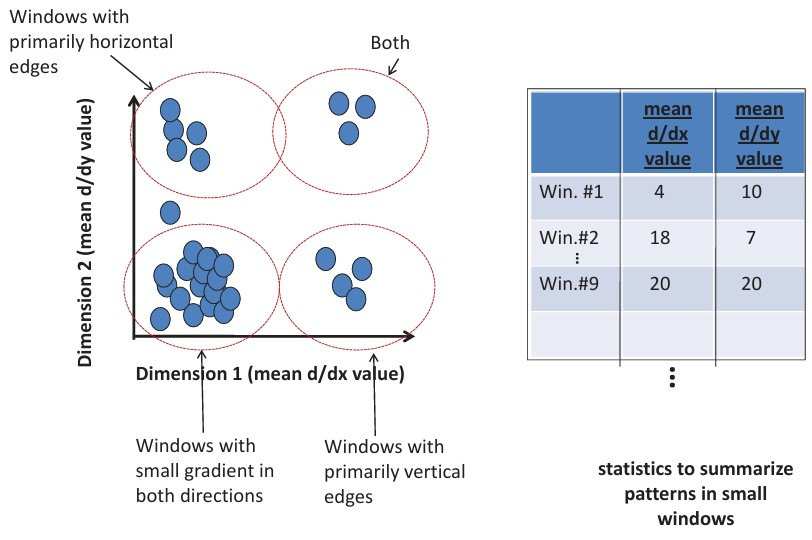

---

### Texture representation: example (assigning texture types)

* Windows are assigned to clusters (“texture types”).
* The image can then be visualized as a map of texture categories.

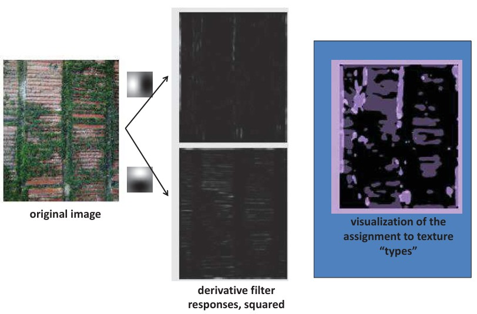

---

### Texture representation: window scale

* Window size matters! Too small → misses global structure; too large → loses fine detail.
* Scale selection: pick a window size where the description of texture stabilizes.

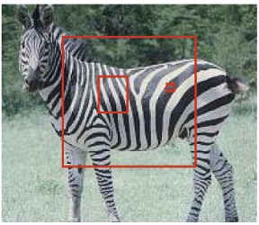

---

### Filter banks

* Instead of just two filters, we can use a **filter bank**: a collection of many filters.
* Each filter captures a different pattern (orientation, scale, type of structure).
* This creates a higher-dimensional feature space for texture.

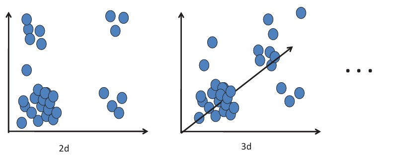

---

### d-dimensional features

* With more filters, each image patch is described by a **d-dimensional vector**.
* We can then measure nearness/farness in this feature space to compare textures.

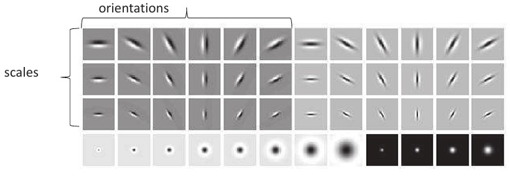

---

### Filter banks: scales and orientations

* Filter banks usually contain filters at **multiple scales** and **orientations**.
* This ensures robustness to variations in size and direction of patterns.

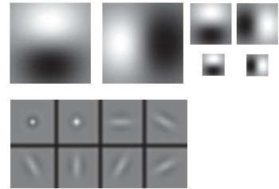

---

### Different kinds of filter banks

* **Gaussian derivatives**: capture edges and blobs.
* **Spots and oriented bars** (Malik & Perona 1990).
* **Gabor filters**: popular because they mimic properties of the human visual system.

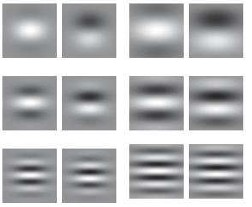

---

### Texture representation using filter banks

* **Pipeline**:

  1. Input image →
  2. Filter bank →
  3. Vector quantization →
  4. Statistics →
  5. Descriptor
* Filter responses are **quantized** into labels or bins.
* The final descriptor could be a histogram of occurrences.

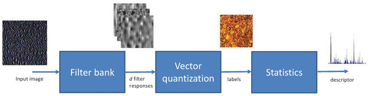

---

### Filter banks: example

* Input image is processed with Gabor filters.
* Each pixel is assigned a label depending on which filter responses are active.
* Final descriptor is a histogram summarizing the distribution of labels.

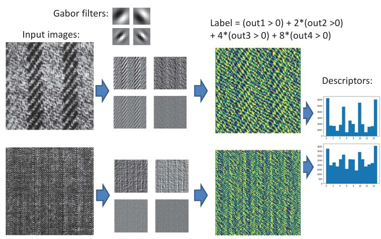

---

### ✅ Takeaway

Statistical texture representation breaks an image down into small windows, extracts filter responses, and then summarizes them with statistics or histograms. By using filter banks, we can describe textures in a rich, multi-dimensional way that captures both local detail and global variation.

### ❓ Stop to Think

If you were designing a vision system to distinguish **fabric patterns** (e.g., denim vs. silk), what filters would you include in your filter bank, and why?

### 📦 Recap

By the end of this section, you should understand:

* What textons are and why they matter.
* How textures can be represented statistically using local patterns.
* The role of window size and scale in texture analysis.
* How filter banks capture texture information across scales and orientations.
* How descriptors like histograms summarize texture features for comparison.

---

Would you like me to also **suggest a short 2–3 sentence summary box** at the very top of each group (like a “preview” before diving into details), so students know what to expect?
