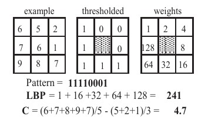
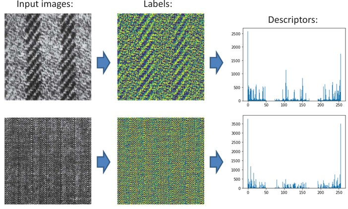

## 19a  Texture Features (part 1) s. 75

### Local Binary Pattern (LBP)

Local Binary Patterns (LBP) are one of the most popular and effective texture descriptors.

* For each pixel **p**, its 8 neighbors are compared to p.
* If a neighbor’s value is greater than or equal to p, it is assigned 1, otherwise 0.
* These binary results are concatenated into an **8-bit code**, which is then interpreted as a number.

This way, textures can be represented as a **histogram of these codes** over a region.

LBP can also be combined with a **contrast measure (C)** for richer descriptions.
This combination makes LBP effective for face recognition and other tasks where texture carries essential information.

---

### LBP: Example

The example shows how LBP is applied to textures:

1. **Input images** are processed to compute local binary codes.
2. These codes are represented as **labels**.
3. Histograms (descriptors) summarize how frequently each pattern occurs.

This representation captures the local texture structure efficiently and makes it possible to distinguish between different surface appearances.

---

### ✅ Takeaway

LBP is a **simple yet powerful texture feature**: it transforms pixel neighborhoods into binary codes, then histograms summarize the overall texture. This makes it widely used in real-world tasks like face recognition and material classification.

---

### ❓ Stop to Think

Why might representing textures as binary patterns (LBP) be **more robust** than just using raw pixel intensities?
Think about what happens if brightness changes, or if the texture is slightly noisy.

<!--
### Local Binary Pattern (LBP) 76

### LBP: example \* 76
-->

