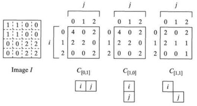

## 19b  Texture Features (part 2) s. 76–77

### Co-occurrence Matrix

A **co-occurrence matrix** is a 2D array **C** where both rows and columns represent possible image values (like gray tones).

* Each entry **C(i, j)** tells how many times pixel value *i* co-occurs with value *j* in a given spatial relationship.
* A displacement vector **d = (dr, dc)** defines how far in rows and columns we look to check this relationship.
* For example, we can compute three different co-occurrence matrices from the same gray-tone image depending on the displacement.

### Features from Co-occurrence Matrices

From co-occurrence matrices, we can compute powerful **texture features** that describe how pixels are distributed. Some common ones are:

* **Energy** – measures uniformity, higher when distribution is peaky.
          
  $$
  Energy = \sum_i \sum_j N_d[i,j]^2
  $$

* **Entropy** – randomness or unpredictability in textures.

  $$
  Entropy = -\sum_i \sum_j N_d[i,j] \log_2 N_d[i,j]

  $$

* **Contrast** – emphasizes intensity differences.

  $$

  Contrast = \sum_i \sum_j (i-j)^2 N_d[i,j]

  $$

* **Homogeneity** – higher when pixels are similar in value.

  $$

  Homogeneity = \sum_i \sum_j \frac{N_d[i,j]}{1+|i-j|}

  $$

* **Correlation** – measures relationships between pixel values.

  $$

  Correlation = \frac{\sum_i \sum_j (i-\mu_i)(j-\mu_j) N_d[i,j]}{\sigma_i \sigma_j}

  $$

where μ and σ are means and standard deviations of row/column sums.

The key challenge is: **choosing the displacement vector d** so that meaningful relationships are captured.
Two common variations of the matrix:

* **Normalized co-occurrence matrix** (values scaled).
* **Symmetric co-occurrence matrix** (counts both directions).

---

### ✅ Takeaway

Co-occurrence matrices help move from **raw pixel values** to **quantitative texture features** like energy, contrast, and homogeneity. These features are useful for classification and recognition tasks in computer vision.

### ❓ Stop to think

If you were analyzing satellite images of farmland, which texture feature (e.g., contrast, entropy, homogeneity) do you think would best capture differences between fields of different crops? Why?

<!--
### Co-occurrence matrix 77

### Features from co-occurrence matrices 77
-->
