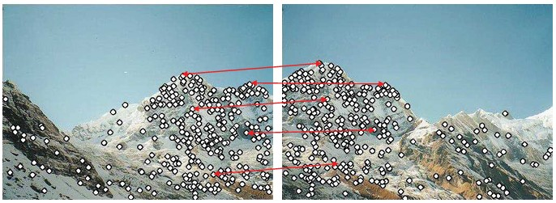
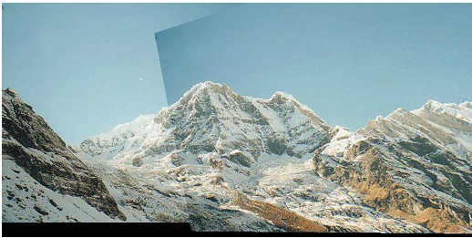
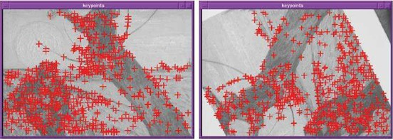
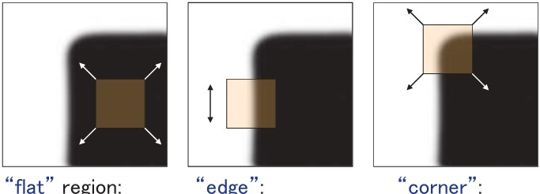

## 20a Why Local Features & Corner Detection (part 1) s. 78–79

### Why Local Features?

Local features are often needed in image matching tasks.

* First, feature points are detected in both images.
* Then, corresponding pairs are found between them.

This process allows us to identify common structures even when images are taken from different viewpoints.

---

### Alignment

Once the corresponding pairs of local features are matched, the image pair can be aligned. This alignment step is crucial for stitching, comparison, or further analysis.

---

### Finding Corners

Corners are one of the most important types of local features.

* A key property is that, in the region around a corner, the image gradient has two or more dominant directions.
* This makes corners both repeatable and **distinctive** — properties that are very useful for robust feature matching.

---

### Corners as Distinctive Interest Points

We should be able to easily recognize a corner by looking through a small window.

* In a **flat region**, shifting the window in any direction causes almost no change in intensity.
* Along an **edge**, shifting the window in the edge direction produces little change, but shifting across it gives a strong change.
* At a **corner**, shifting in *any direction* causes a large change. This makes corners reliable points of interest.

---

### ✅ Takeaway

Corners serve as stable, distinctive markers in images, making them highly valuable for tasks like matching, alignment, and object recognition.

### 💡 Stop to Think

Why do you think corners are more reliable than edges or flat regions when aligning images? How might noise or blur affect corner detection?

