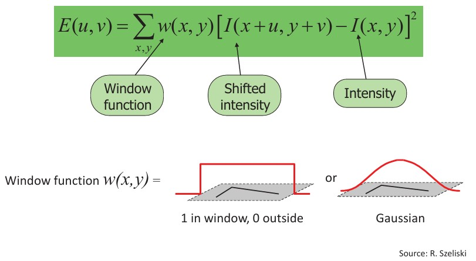
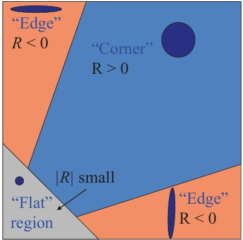
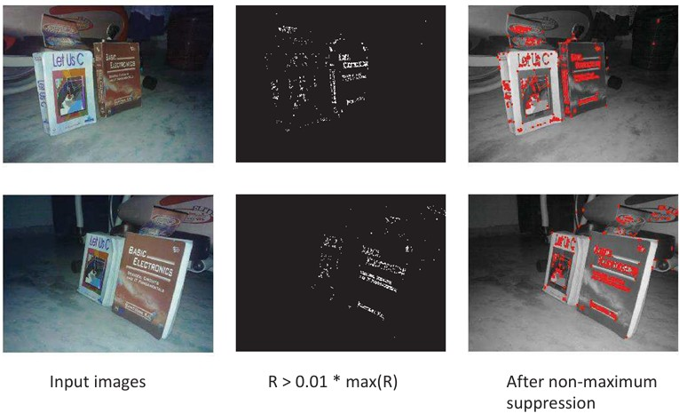

## 20b  Why Local Features & Corner Detection (part 2) s. 80–81

<!--

### Harris Detector formulation 80 81

###  Corner response function 81 

### Harris detector: example \* 82

### Scale Invariant Detection 82
-->

### Preview

In the previous part, we saw why corners are useful as distinctive points in images. Now we introduce the **Harris corner detector**, a foundational method for automatically finding such points. The Harris detector builds on changes in pixel intensity when a small window is shifted, and uses mathematics to decide whether a region is flat, an edge, or a corner.

---

### Harris Detector: Change of Intensity

The Harris detector measures how much the intensity of a window changes when shifted by a small amount $[u,v]$.

* The function $E(u,v)$ sums these changes, weighted by a **window function**.
* Two common window functions:

  * **Box window**: all pixels inside get weight 1, outside 0
  * **Gaussian**: smoothly weights pixels, emphasizing the center

---

### Harris Detector: Matrix Formulation

This intensity change can be approximated with a matrix formulation:

$$

E(u,v) \approx [u \ v] M \begin{bmatrix} u \\ v \end{bmatrix}
$$

Where $M$ is a **2×2 structure tensor** computed from image derivatives:

$$
M = \sum_{x,y} w(x,y) 
\begin{bmatrix} 
I_x^2 & I_x I_y \\ 
I_x I_y & I_y^2 
\end{bmatrix}
$$

This matrix captures local gradient information in the x and y directions.

---

### Corner Response Function

The corner "strength" is measured by:

$$
R = \det(M) - \alpha \, \text{trace}(M)^2
$$

* $R > 0$: likely a **corner**
* $R < 0$: likely an **edge**
* $|R|$ small: **flat** region

The parameter $\alpha$ (typically 0.04–0.06) balances sensitivity.

---

### Harris Detector in Action

* **Input images** → compute $R$ values
* Threshold: keep points with $R > 0.01 \cdot \max(R)$
* **Non-maximum suppression** ensures only the strongest corner points remain

The result: a set of **distinctive, repeatable corner features** suitable for matching across images.

---

### ✅ Takeaway

* The **Harris detector** is one of the most widely used methods for corner detection.
* It identifies regions where intensity changes significantly in **multiple directions**, making them distinctive.
* The matrix $M$ and response $R$ provide a mathematical way to classify **flat, edge, and corner** regions.

---

### ❓ Stop to Think – Reflection

Why do you think corners are more robust for matching images than flat areas or edges?
(Hint: think about **uniqueness** and how features can be reliably matched in different views.)

---

