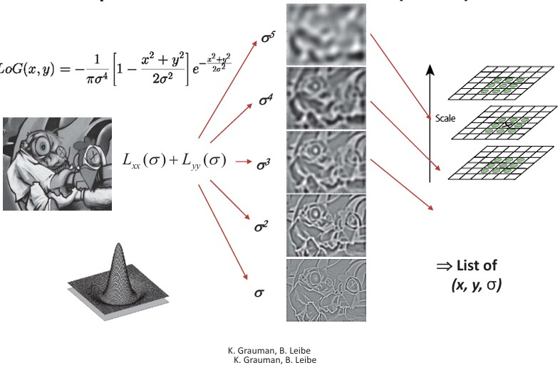
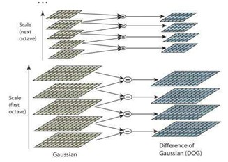
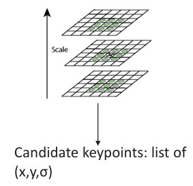
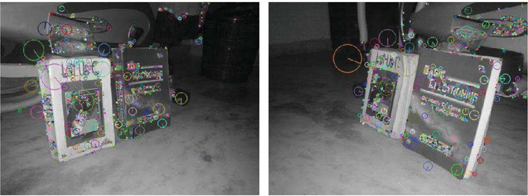
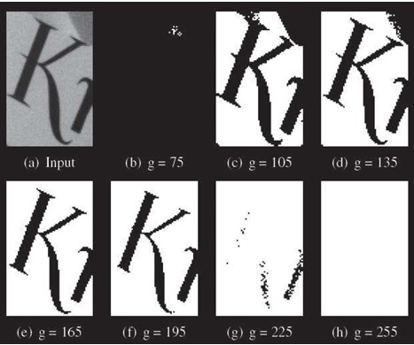
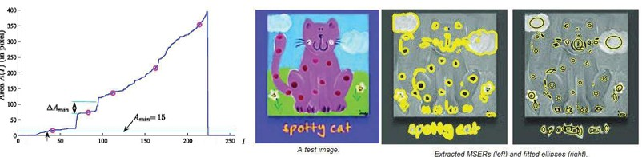
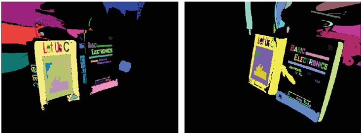
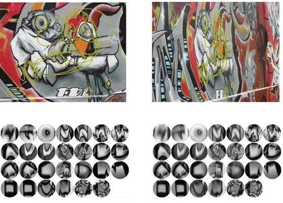

## 21  Scale-Invariant Detection & MSER s. 83–86 (82–85)

### 🔍 Preview

In this section, we’ll explore how to detect image features that remain consistent across different zoom levels or lighting conditions. We’ll look at two approaches:

* **Scale-Invariant Detection** using LoG and DoG.
* **Region-based detection** using MSER.

These methods form the foundation for matching and recognizing images under real-world changes.

---

### Why Scale-Invariant Detection?

* We want to match images of the same scene even if taken at very different zoom levels (scales).
* The goal is to detect the *same* interest points in both images, regardless of scale.
* The solution: search for maxima of suitable functions in both **scale** and **space**.

*Example: interest points change when zooming, unless scale invariance is handled.*

---

### Laplacian-of-Gaussian (LoG)

* A classic approach for detecting blobs in images across scales.
* Convolve the image with a Laplacian-of-Gaussian filter at multiple scales.
* Results are stored as points defined by location and scale: **(x, y, σ)**.

*Illustration of Laplacian-of-Gaussian across scales.*

---

### Key Point Localization with DoG

* Difference of Gaussians (DoG) is an efficient approximation of LoG.
* Algorithm:

  * Detect maxima in scale-space using DoG.
  * Discard points with low contrast (thresholding).
  * Eliminate unstable edge responses.

*DoG used for scale-space keypoint detection.*

---

### DoG Example

* Features visualized with circles where radius corresponds to detected scale.
* Orientation arrows show gradient-based directionality.

*Detected blobs at different scales shown as circles.*

---

### Maximally Stable Extremal Regions (MSER)

* MSER detects stable, blob-like regions of nearly uniform intensity.
* Regions remain stable across a wide range of thresholds.
* Good for areas with clear contrast against background.

*MSER regions shown as colored blobs.*

---

### MSER Computation

* For each threshold, compute connected regions.
* Track region properties (e.g., area size) across thresholds.
* Stable regions = regions whose properties change little across thresholds.
* Ellipse fitting can make results affine-invariant.

*Illustration of MSER computation and stability.*

---

### MSER: Example (Colored Regions)

* MSER regions detected and visualized in color.
* Highlights intensity-stable regions in the image.

*MSER colored regions example.*

---

### MSER: Example (Ellipse Fitting)

* MSER regions can be fitted with ellipses.
* Makes descriptors more robust to affine transformations.

*Ellipse fitting applied to MSER regions.*

*MSER ellipses across different image regions.*

---

### ✅ Takeaway

* Scale-invariant detection finds consistent points across zoom levels.
* **LoG/DoG**: blob detection at multiple scales.
* **MSER**: stable regions robust to intensity changes.

---

### 💡 Stop to Think – Reflection Question

How might scale-invariant features like DoG or MSER be useful in real-world applications such as **object recognition** or **augmented reality**, where camera zoom or lighting often changes?

---

### 🔄 Recap

We learned:

* Why scale invariance matters in feature detection.
* LoG and DoG detect blobs at multiple scales.
* MSER detects stable regions under threshold changes.

Together, these techniques allow recognition of the *same objects* across very different imaging conditions.

---

<!--
### Laplacian-of-Gaussian (LoG) 83

### Key point localization with DoG 83

### Key point localization: example \* 84

### Maximally Stable Extremal Regions (MSER) 84

### MSER computation 85

### MSER: example \* 85

### MSER: example 86
-->
