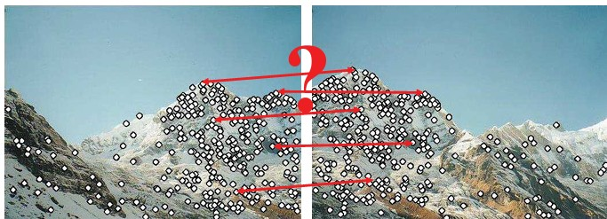
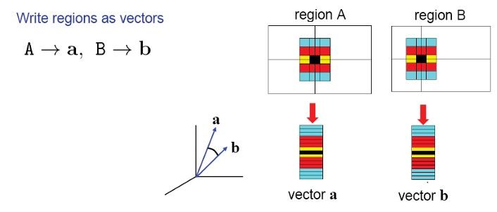
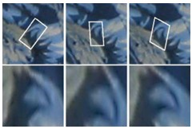
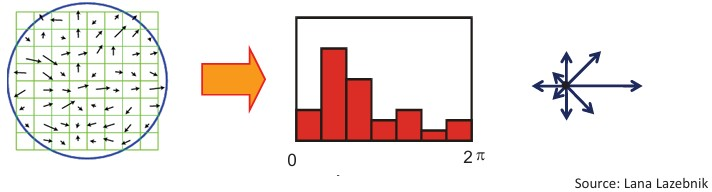
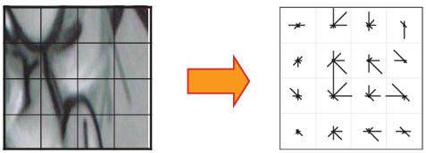
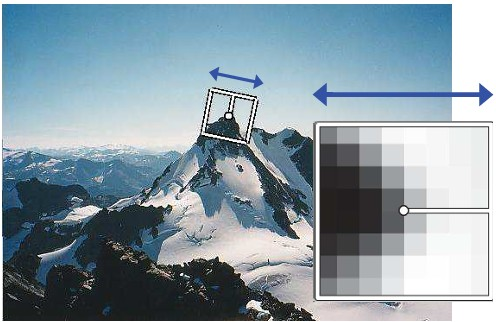
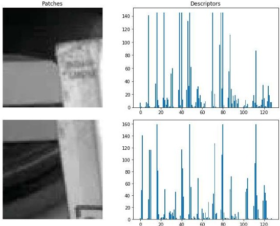

## 22 Local Descriptors s. 86–88

Local descriptors provide a way to **represent detected keypoints** so that they can be matched reliably across different images. They need to be **invariant** (stable under changes like scale, rotation, lighting) and **distinctive** (able to tell points apart).

---

### Local descriptors: motivation

We already know how to **detect points**. The next challenge is:

* How do we **describe** them for matching?
* A good descriptor should be:

  1. **Invariant** (robust to transformations)
  2. **Distinctive** (unique enough to avoid false matches)

*Keypoints detected in two images. The question: how do we describe them so that matches are consistent?*

---

### Describing regions as vectors

* The simplest descriptor is a **list of intensities within a patch**.
* Patches from two regions can be written as vectors **a** and **b**, then compared.

*Regions A and B represented as intensity vectors.*

---

### Feature descriptors with histograms

* Problem: small shifts in patches can drastically affect matching.
* Solution: use **histograms of gradients** instead of raw pixels.

  * More robust to noise and small shifts.

*Small shifts change the patch alignment.*

*Histograms of gradient orientations provide a more stable representation.*

---

### Feature descriptors: SIFT

* **Scale Invariant Feature Transform (SIFT)** is a widely used local descriptor.
* Computation steps:

  * Divide patch into **4×4 sub-patches** (16 cells).
  * For each cell, compute histogram of **gradient orientations** (8 bins).
  * Total descriptor = **16 × 8 = 128 dimensions**.

*SIFT: patch divided into 16 cells, each with a gradient orientation histogram.*

---

### Rotation Invariant Descriptors

* To handle rotations, compute the **dominant gradient direction**.
* Rotate the patch according to this direction, producing a **canonical orientation**.

*Rotation-invariant representation: patches rotated to a consistent orientation.*

---

### Example: Rotation Invariance

*Patch orientation aligned with dominant gradient direction.*

---

### Example: SIFT in practice

*Examples of image patches and their 128-dimensional SIFT descriptors.*

---

### ✅ Takeaway

Local descriptors like **SIFT** transform raw patches into robust and distinctive numerical signatures. These make it possible to match points even under scale, rotation, and lighting changes.

---

### ❓ Stop to Think

Why do you think **raw pixel values** are poor descriptors compared to **histograms of gradients**?

---

### Comparing Descriptors

1. **Raw patches (intensities)**

   * Easy to compute.
   * Very sensitive to noise, lighting, and small misalignments.
   * Not invariant to scale or rotation.

2. **Histograms of gradients**

   * More robust to small shifts.
   * Capture **directional changes** in intensity rather than absolute pixel values.
   * Still somewhat sensitive to rotation and scale.

3. **SIFT (Scale Invariant Feature Transform)**

   * Adds robustness by:

     * Dividing patch into subregions (spatial layout preserved).
     * Using gradient orientation histograms (robust to lighting).
     * Normalizing by dominant orientation (rotation invariant).
     * Using multi-scale detection (scale invariant).
   * Produces distinctive **128-dimensional descriptors**.
   * Much better for reliable matching across images.

---

### ✅ Takeaway (extended)

* **Raw patches → too fragile**
* **Histograms → more stable**
* **SIFT → robust, invariant, distinctive**

That’s why SIFT (and later variants like SURF, ORB) became the standard choice for local feature description.

---

Would you like me to **include such comparison blocks systematically** in future groups (where a “method progression” is shown, like raw → improved → state-of-the-art)?

<!--
Would you like me to also **contrast SIFT with simpler descriptors** (like raw patches or histograms alone) to make the progression clearer for students?

### Local descriptors 86 -87
### Feature descriptors 87

### Feature descriptors: SIFT 88

### Rotation Invariant Descriptors 88

### Rotation Invariant Descriptors 89

### SIFT: example \* 89
-->
