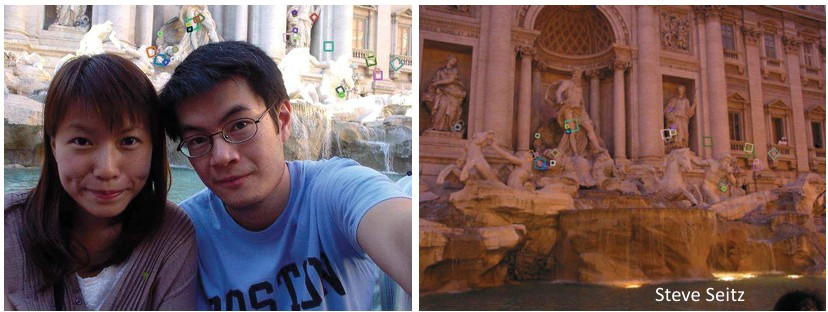
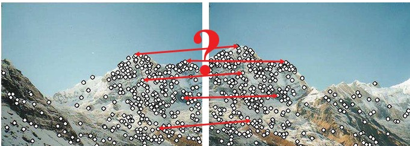
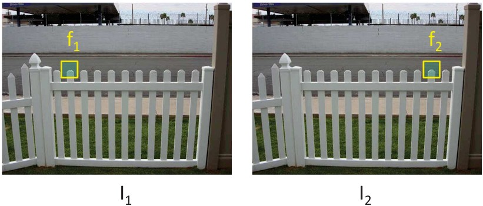
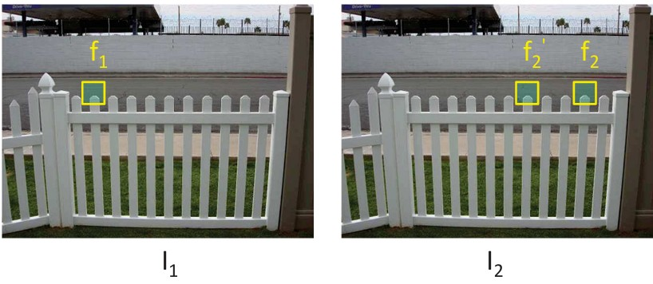

## 23  Descriptor Variants & Matching s. 89–92

### Robustness of SIFT

SIFT (Scale Invariant Feature Transform) is a highly robust matching technique:

* Handles viewpoint changes (up to \~60° out of plane).
* Works under significant illumination changes (day vs. night).
* Efficient—can run in real time.
* Widely available implementations.

*Example of SIFT robustness under different conditions (viewpoint, lighting).*

---

### Other Local Descriptors

Several alternatives and extensions to SIFT include:

* **SURF** – faster than SIFT.
* **BRIEF** – binary descriptor.
* **BRISK** – scalable invariant keypoints.
* **ORB** – oriented FAST and rotated BRIEF.
* **GLOH** – gradient location and orientation histogram.
* **KAZE** – nonlinear scale space approach.

*List of commonly used local descriptors beyond SIFT.*

---

### Feature Matching

To match features between images:

1. Define a distance function to compare descriptors.
2. Test against all features in the other image and select the one with minimum distance.

*Finding correspondences between two images by comparing local features.*

---

### Feature Distance – Simple Approach

* **L₂ (SSD) distance**: measures direct difference between two descriptors.
* Risk: can give high scores to ambiguous matches.

*Example of feature distance calculation using SSD.*

---

### Feature Distance – Improved Approach

* **Ratio distance test**:

  $$
  \frac{||f_1 - f_2||}{||f_1 - f'_2||}
  $$

* Ensures that the best match is significantly better than the second-best.
* Helps avoid ambiguous matches.

*Ratio test reduces false matches by comparing top candidates.*

---

### Example of SIFT Matching

* Uses ratio distance < 0.75 as a threshold.
* Produces reliable correspondences even across challenging conditions.

*SIFT feature matches shown with lines between corresponding points.*

---

### Recap

* **SIFT** remains a standard due to robustness against scale, rotation, and illumination.
* Other descriptors (SURF, BRIEF, ORB, etc.) trade off speed, accuracy, and compactness.
* Feature matching requires careful distance metrics to avoid ambiguity.
* The **ratio test** is widely used to improve reliability of matches.

---

### Stop to Think 💡

* Why might a **binary descriptor** (like BRIEF or ORB) be preferred in a mobile or embedded application compared to SIFT?
* In what kinds of tasks might you accept more ambiguous matches if it meant much faster computation?

---

<!--
### Feature descriptors: SIFT 90
### Other local descriptors 90
### Feature matching 91
### Feature distance 91
### Feature distance 92
### Feature matching: example \* 92
-->

