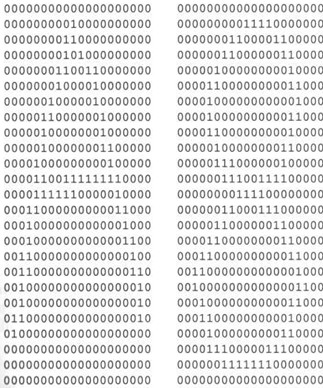

## 24  Pattern Recognition Basics s. 93–95

### Preview

This section introduces the foundations of **pattern recognition** in computer vision. We will see why it is needed, how it connects to **machine learning**, and what **supervised classification** looks like in practice.

---

### Pattern Recognition

In computer vision, we often need to make a decision about the content of an image.

* Example: **handprinted character recognition**, where an input pattern (pixel values) must be assigned to a label (character).
* More generally, pattern recognition is the assignment of a label to a given input value.
* Two common forms:

  * **Classification** – assign discrete labels (e.g., cat vs. dog).
  * **Regression** – predict continuous values (e.g., age estimation).
* Pattern recognition always involves some form of **learning** from data.

*Example of binary pixel patterns representing characters.*

---

### Machine Learning for Pattern Recognition

Pattern recognition relies on **machine learning** techniques.

* **Supervised learning**: learn from labeled data where the correct output is known.
* **Unsupervised learning (clustering)**: discover structure in data without labels.
* **Semi-supervised learning**: use both labeled and unlabeled data to improve learning.
* **Reinforcement learning**: learn how to act by receiving feedback from the environment in the form of rewards or penalties.

Each of these approaches offers different strengths depending on the problem setting.

---

### Supervised Classification

The most common pattern recognition approach in computer vision is **supervised classification**.

* Requires a **training set** of feature vectors with known class labels.
* Performance is tested on a separate **test set** to evaluate generalization.
* Popular classification algorithms include:

  * Nearest centroid
  * Nearest neighbors
  * Bayesian classifiers
  * Decision trees
  * Support Vector Machines (SVMs)
  * Neural networks

These methods form the core of many practical vision systems, from face recognition to medical image analysis.

---

### Recap

* Pattern recognition assigns labels to input data.
* Machine learning provides different strategies: supervised, unsupervised, semi-supervised, and reinforcement learning.
* Supervised classification is the most widely used in computer vision, with methods like SVMs and neural networks at the forefront.

---

### Stop to Think

* Can you think of a task in your daily life (outside of images) where **pattern recognition** is happening?
* What might be the **features** and **labels** in that example?

---

<!--
### Pattern recognition 93
### Machine learning 94
### Supervised classification 94
-->

Perfect 👍 Thanks for clarifying.
Here’s the **rewritten Part 1** following your new instructions:

---

Perfect — here’s the **rewritten and expanded Group 25a** with all the math, pictures, and student-friendly explanations integrated:

---

