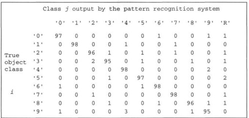
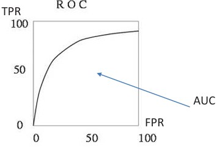
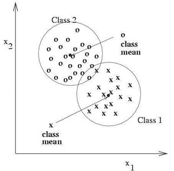
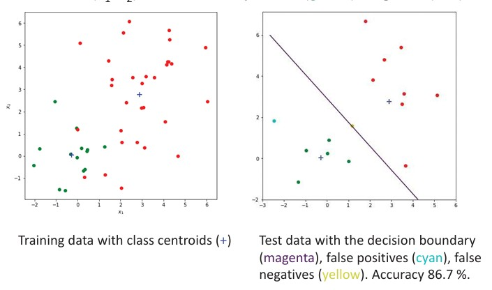
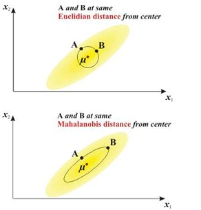

## 25a Nearest Centroid & NN Classification (part 1) s. 96–98

### Evaluating Classifier Performance

Before diving into classifiers, we need ways to **measure how well they work**.

* **Confusion matrix**: records how many times true classes are predicted correctly or incorrectly.
* For binary classification, we talk about:

  * **TP (True Positive):** correctly predicted positives
  * **TN (True Negative):** correctly predicted negatives
  * **FP (False Positive):** negative cases wrongly predicted as positive (false alarm)
  * **FN (False Negative):** positive cases missed (false dismissal)

*Example of a confusion matrix for digit recognition.*

*Binary classification outcomes (TP, TN, FP, FN).*

---

### Key Performance Metrics

From the confusion matrix we can define several useful metrics:

* **True Positive Rate (TPR, Recall, Sensitivity):**

$$
TPR = \frac{TP}{TP + FN}
$$

* **True Negative Rate (TNR, Specificity):**

$$
TNR = \frac{TN}{TN + FP}
$$

* **False Positive Rate (FPR):**

$$
FPR = \frac{FP}{FP + TN} = 1 - TNR
$$

* **False Negative Rate (FNR):**

$$
FNR = \frac{FN}{TP + FN} = 1 - TPR
$$

* **Precision (PRE):**

$$
PRE = \frac{TP}{TP + FP}
$$

* **Accuracy (ACC):**

$$
ACC = \frac{TP + TN}{TP + TN + FP + FN}
$$

*Formulas for key metrics used in evaluating classifiers.*

---

### ROC and Precision–Recall

* **ROC curve (Receiver Operating Characteristic):** plots TPR vs. FPR at different decision thresholds.
* **AUC (Area Under Curve):** overall measure of performance.

*ROC curve: TPR vs. FPR, with AUC as a performance indicator.*

* **Precision–Recall tradeoff:** useful in cases where positives are rare (imbalanced data).
* **F1 score:** harmonic mean of precision and recall.

$$
F_1 = 2 \cdot \frac{Precision \cdot Recall}{Precision + Recall}
$$

*Precision vs. Recall with an example of image retrieval.*

---

### Nearest Centroid Classification

* Each class has a **centroid** (mean feature vector).
* A new data point is classified to the class whose centroid it is closest to.

Pros:

* Very simple and fast.
* Works well if classes are compact and far apart.

Cons:

* Sensitive if classes overlap.
* Euclidean distance may not be enough if data is stretched or correlated.

*Nearest centroid example: class means (+), decision boundary (magenta), false positives (cyan), false negatives (yellow). Accuracy ≈ 86.7%.*

---

### Mahalanobis Distance

* Euclidean distance treats all feature dimensions equally.
* **Mahalanobis distance** adapts to the data distribution by considering correlations:

$$
D_M(x) = \sqrt{(x - \mu)^T \Sigma^{-1} (x - \mu)}
$$

where:

* $\mu$ = class mean vector

* $\Sigma$ = covariance matrix of the class

* If $\Sigma = I$, Mahalanobis reduces to Euclidean distance.

*Comparison: Euclidean vs. Mahalanobis distance — Mahalanobis accounts for data spread and orientation.*

---

### Recap

* Performance of classifiers is measured using metrics from the **confusion matrix**.
* ROC and Precision–Recall curves show different tradeoffs.
* **Nearest centroid classification** provides a simple baseline.
* **Mahalanobis distance** improves classification when features are correlated or stretched.

---

### 🛑 Stop to Think

Suppose we train a nearest centroid classifier on an **imbalanced dataset** (95% negatives, 5% positives).

* How would **accuracy** behave?
* Which metrics (Precision, Recall, FPR, FNR) would give a more realistic picture of performance?

---
<!-->
✅ This integrates **all the slides, formulas, and visuals** into one coherent student-friendly explanation.

Do you want me to continue using this same **math-friendly but simplified teaching style** for the rest of Theme 7?

Perfect — I see, you want to **extend Group 25b (Nearest Centroid & NN Classification, part 2)** with the extra slide (your image `101a.jpg`, “Texture classification: example”).

Here’s the updated **student-friendly version** of Part 2, now including that texture classification example:
-->
---

