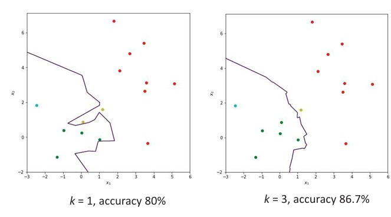
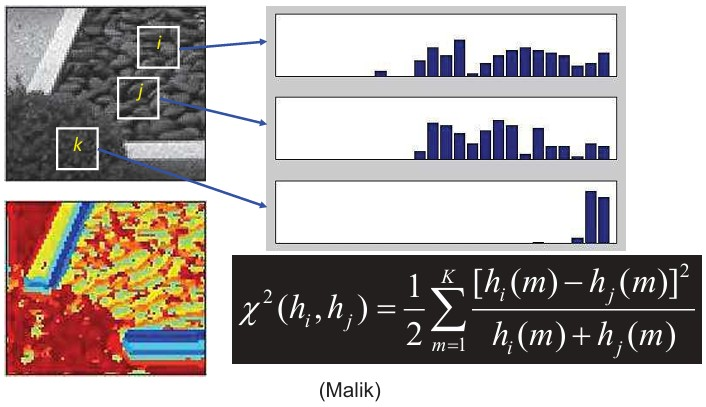
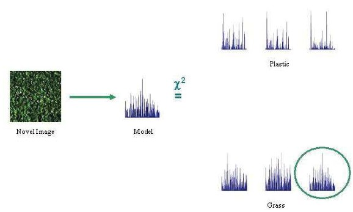

## 25b Nearest Centroid & NN Classification (part 2)

### Preview

In the previous section, we saw how nearest centroid and distance-based approaches classify data.
This part focuses on **nearest neighbors (NN)**, where decisions are made by comparing samples directly. We will also look at how histograms are used to represent features and how to measure similarity between them. Finally, we’ll see how these methods apply to **texture classification**.

---

### Classification using the nearest neighbors

The **nearest neighbor rule** assigns an unknown sample **x** to the class of its closest training sample.

* It works even when classes overlap or have irregular shapes.
* It doesn’t require any assumptions about the data distribution—only training data.
* For more robust classification, we use **k-nearest neighbors (k-NN):**

  * Look at the *k* closest training samples.
  * Choose the class with the majority.
  * Helps smooth out noisy decisions, especially when classes overlap.

Many distance measures can be used: Euclidean, Mahalanobis, or histogram-based.

*Illustration: The green sample (“?”) could be classified differently depending on the neighbors considered.*

---

### Nearest neighbors: example

The figure below shows training and test data.

* **Left (k = 1):** The decision boundary is jagged, accuracy 80%.
* **Right (k = 3):** The boundary is smoother, accuracy improves to 86.7%.

This shows that increasing *k* can improve robustness, though too large a *k* may oversimplify decisions.

---

### Histogram-based distances

When features are represented as **histograms** (e.g., color distributions, textures), we need ways to measure similarity.

1. **L1 distance (Manhattan distance):**

$$
L_{1}(H_{1}, H_{2}) = \sum_{i=1}^{n} | H_{1}[i] - H_{2}[i] |
$$

2. **Log-likelihood statistics:**

$$
L(H_{1}, H_{2}) = - \sum_{i=1}^{n} H_{1}[i] \ln H_{2}[i]
$$

3. **Intersection:**

$$
D(H_{1}, H_{2}) = \sum_{i=1}^{n} \min(H_{1}[i], H_{2}[i])
$$

Histograms are usually **normalized** so their sum is 1 before comparison.

* Small values = similar histograms.
* Larger values = greater difference.

---

### Chi-square distance between texton histograms

For texture analysis, a common similarity measure is the **Chi-square distance**:

$$
\chi^2(h_i, h_j) = \frac{1}{2} \sum_{m=1}^K \frac{(h_i(m) - h_j(m))^2}{h_i(m) + h_j(m)}
$$

* Compares histogram bins by squared difference.
* Normalization prevents large bins from dominating.

*Illustration: Texton histograms (patterns from image patches) are compared. Chi-square distance helps decide how similar textures are.*

---

### Texture classification: example

Let’s see how this works in practice:

1. Take a **novel image** (e.g., grass).
2. Compute its **histogram of features** (texture model).
3. Compare it with stored histograms of known classes (plastic, grass, etc.) using Chi-square distance.
4. Assign the image to the class with the closest histogram match.

*Example: The unknown sample is classified as “grass” because its histogram best matches the stored grass model.*

---

### Recap

* **Nearest neighbors** (NN, k-NN) classify samples based directly on their similarity to training data.
* Larger *k* can stabilize classification, but too large may reduce accuracy.
* **Histograms** are useful representations of textures, colors, and patterns.
* Several distance measures exist: L1, log-likelihood, intersection, Chi-square.
* Texture classification can be performed by comparing histograms of texture features.

---

### 🛑 Stop to Think

If you were designing a system to recognize different types of surfaces (e.g., wood, metal, grass), why might histogram-based comparisons work better than raw pixel comparisons?

