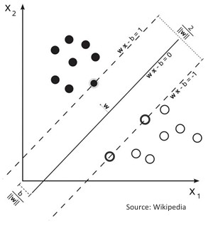
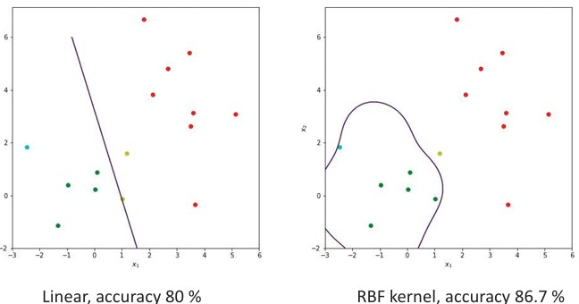

## 26a  Distance Measures & SVM (part 1) s. 100
<!--
### Texture classification: example 101

### Support vector machine 101
### SVM: example \* 102
-->

---

### Preview

In this section, we explore **Support Vector Machines (SVMs)**, a powerful method for classification that has become one of the most widely used tools in computer vision. We will see how SVMs separate classes using hyperplanes, how kernels allow nonlinear boundaries, and what this looks like in practice.

---

### Support vector machine

A **Support Vector Machine (SVM)** is a machine learning method that separates two classes of data by constructing a **hyperplane**.

* The hyperplane is chosen to **maximize the margin**, i.e., the distance between the closest points of the two classes (called *support vectors*).
* The larger the margin, the better the generalization to unseen data.

Mathematically, given training data with features **x** and labels $y_i \in \{-1, 1\}$, the SVM tries to solve:

$$
\min_{w, b} \ \frac{1}{2} \|w\|^2
$$

subject to:

$$
y_i (w \cdot x_i - b) \geq 1
$$

Here:

* **w** is the normal vector of the hyperplane.
* **b** is the bias term shifting the hyperplane.
* The constraint ensures each sample is on the correct side of the margin.

*Illustration of a linear SVM: the separating hyperplane (solid line) maximizes the distance to the nearest data points (support vectors).*

SVMs can also handle **nonlinear class boundaries** by using a **kernel function**, which maps the input data into a higher-dimensional space where linear separation is possible. Popular kernels include polynomial and Radial Basis Function (RBF).

---

### SVM: example

Here we see how SVM works in practice:

* **Left plot**: A linear SVM separates the classes with a straight line. The accuracy here is about **80%**, which is good but not perfect because the data is not linearly separable.
* **Right plot**: Using a **RBF kernel**, the SVM can form a curved boundary that better captures the complex class structure. The accuracy improves to **86.7%**.

This shows the strength of kernels: they let SVMs adapt to complicated patterns while still maintaining the principle of maximizing the margin.

---

### Recap

* **SVMs** create a hyperplane that separates data into two classes while maximizing the margin.
* The optimization balances finding a separating line (or plane) and keeping the margin wide.
* **Kernels** extend SVMs to nonlinear problems by projecting data into higher dimensions.
* In practice, linear kernels are fast but limited, while nonlinear kernels (like RBF) are more flexible.

---

### Stop to Think 💭

Why might it sometimes be better to use a **linear SVM** instead of a nonlinear kernel, even if the nonlinear version gives slightly higher accuracy?

---

Would you like me to **also include a short note about how SVM compares with k-nearest neighbors (from the last group)**, so students can connect the methods?

