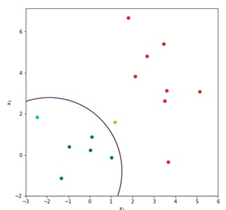
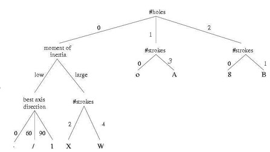
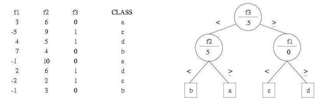
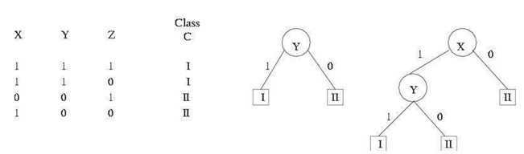

## 27a  Bayesian & Tree Classifiers (part 1) s. 102–104
<!--
### Bayesian classifier 102

### Bayesian classifier: example \* 103

### Decision trees 103

### Binary decision tree 104

### Binary decision tree (cont.) 104
### Automatic construction of a decision tree 105
### Automatic construction of a decision tree (cont.) 105
-->

### Preview

In this section, we explore two important families of classifiers: **Bayesian classifiers**, which are grounded in probability theory, and **decision trees**, which split data into branches based on feature values. You’ll see how Bayesian reasoning allows us to handle uncertainty in classification, while trees provide a simple and interpretable way to organize decisions.

---

### Bayesian classifier

A **Bayesian classifier** decides the most likely class for an object based on the observed features. It uses **Bayes’ Rule** to compute the *a posteriori* probability of each class:

$$
P(y_i | \mathbf{x}) = \frac{p(\mathbf{x}|y_i) P(y_i)}{p(\mathbf{x})} = \frac{p(\mathbf{x}|y_i) P(y_i)}{\sum_j p(\mathbf{x}|y_j) P(y_j)}
$$

Here:

* **x** = the feature vector (the measurements we have).
* $p(\mathbf{x}|y_i)$ = class conditional distribution (how likely those features are if the class is $y_i$).
* $P(y_i)$ = prior probability (our belief about the class before seeing the data).
* $p(\mathbf{x})$ = unconditional distribution of the features.

Because $p(\mathbf{x})$ is the same for all classes, it can be ignored when making a decision. The classifier just picks the class $y_i$ that maximizes:

$$
p(\mathbf{x}|y_i) P(y_i)
$$

A special case is the **Naive Bayes classifier**, which assumes that all features are independent. In that case:

$$
P(\mathbf{x} | y_i) = P(x_1 | y_i) \, P(x_2 | y_i) \, P(x_3 | y_i) \dots
$$

This assumption is rarely true in real life, but Naive Bayes often works surprisingly well in practice.

---

### Bayesian classifier: example

A common version is the **Gaussian Naive Bayes classifier**, which assumes that each feature follows a Gaussian distribution for a given class.

$$
P(x_i | y) = \frac{1}{\sqrt{2\pi \sigma_y^2}} \exp \left( - \frac{(x_i - \mu_y)^2}{2\sigma_y^2} \right)
$$

Here, $\mu_y$ and $\sigma_y$ are the mean and standard deviation for class $y$. The prior $P(y_i)$ is also learned from the training data.

Using our dataset, this classifier achieves about **86.7% accuracy**. In the plot, the decision boundary is shown as a curve that separates the two classes.

---

### Decision trees

A **decision tree** is a compact and interpretable classifier. It splits the space of all possible feature values into regions by asking simple **questions about features** at each node.

* Each **node** represents a feature.
* Each **branch** corresponds to a possible value or range of that feature.
* **Leaf nodes** give the final class decision.

Decision trees are powerful because they allow **feature extraction and classification to be combined**. Instead of using all features at once, the tree looks at them step by step, narrowing down the possibilities.

Example: in handwritten character recognition, one node might check “number of holes,” another might check “moment of inertia,” and so on.

---

### Binary decision tree

A **binary decision tree** is a special case where each node only has two branches (yes/no or left/right). At each node:

* A **feature** is compared to a **threshold**.
* The decision determines whether to go left or right.

This continues until a leaf node is reached, which represents a class.

Example: the diagram shows a binary decision tree where features $f_1, f_2, f_3$ are used to decide between four possible classes (a, b, c, d).

---

### Recap

* **Bayesian classifiers** use probability theory to find the most likely class for an observation. Naive Bayes assumes features are independent, but often works well.
* **Gaussian Naive Bayes** models each feature as normally distributed.
* **Decision trees** classify step by step by splitting data based on feature values.
* **Binary decision trees** are the simplest form, where each split is a yes/no question.

---

### Stop to Think 💡

When would you prefer a **probabilistic approach** like Naive Bayes over a **rule-based approach** like decision trees? What are the trade-offs in terms of interpretability, assumptions, and flexibility?

---

Would you like me to continue with **27b (tree classifier examples)** right away so this section flows smoothly into the practical demonstrations?

